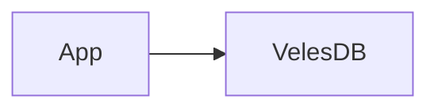
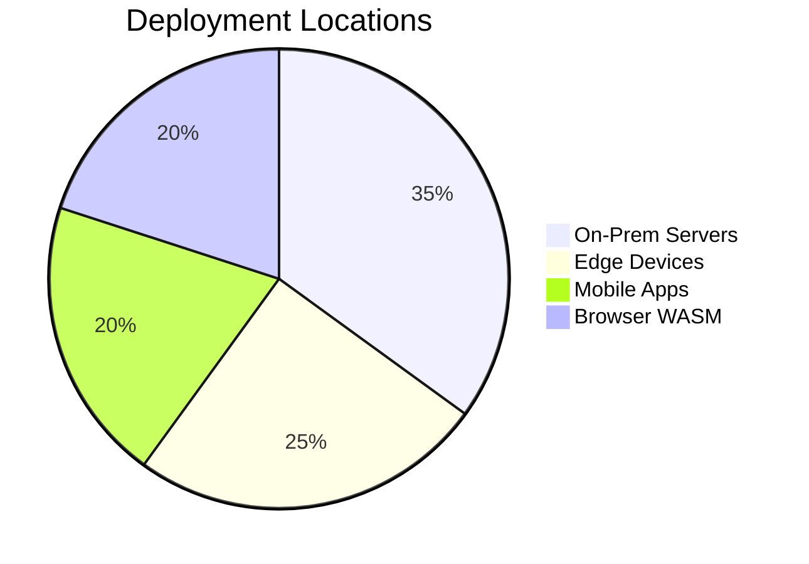
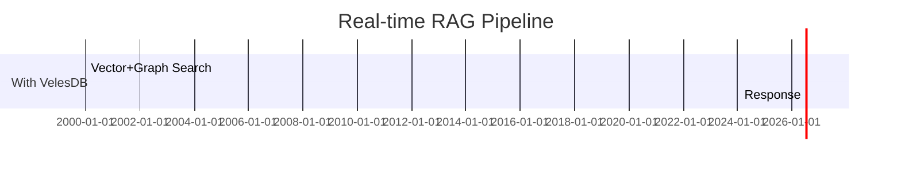
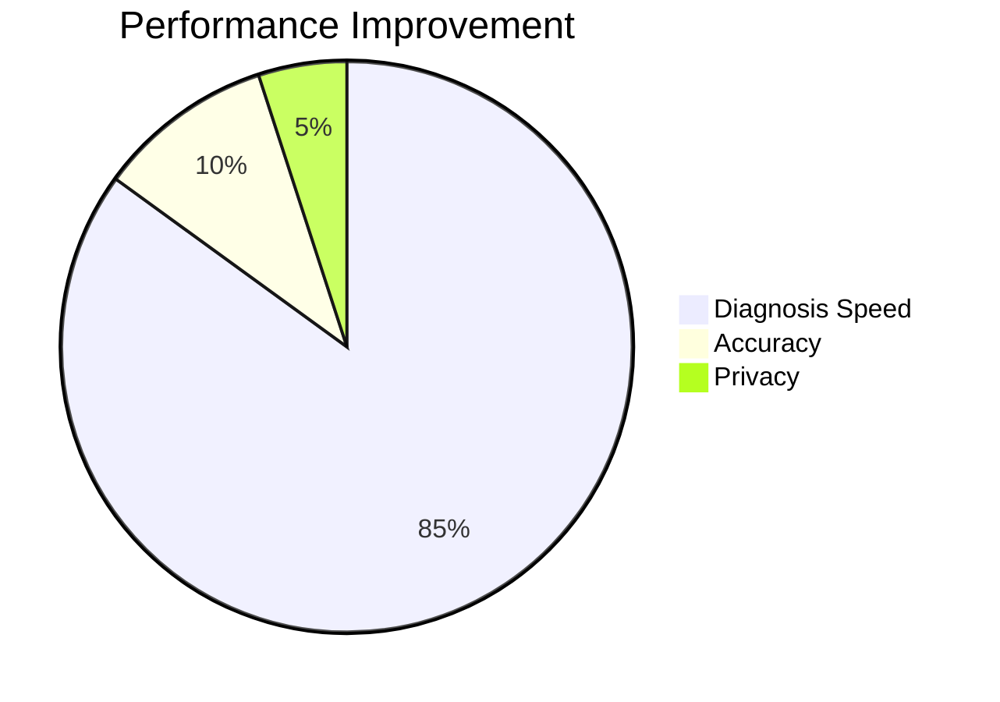

<p align="center">
  
</p>

<h1 align="center">🐺 VelesDB</h1>

<h3 align="center">
  🧠 <strong>The Local Knowledge Engine for AI Agents</strong> 🧠<br/>
  <em>Vector + Graph Fusion • 57µs Search • Single Binary • Privacy-First</em>
</h3>

---

## 🌍 Full Ecosystem / Écosystème Complet

VelesDB is designed to run **where your agents live** — from cloud servers to mobile devices to browsers.

| Domain      | Component                          | Description                              | Install                     |
|-------------|------------------------------------|------------------------------------------|----------------------------|
| **🦀 Core** | [velesdb-core](crates/velesdb-core) | Core engine (HNSW, SIMD, VelesQL)        | `cargo add velesdb-core`   |
| **🌐 Server**| [velesdb-server](crates/velesdb-server) | REST API (11 endpoints, OpenAPI)         | `cargo install velesdb-server` |
| **💻 CLI**  | [velesdb-cli](crates/velesdb-cli)   | Interactive REPL for VelesQL             | `cargo install velesdb-cli` |
| **🐍 Python** | [velesdb-python](crates/velesdb-python) | PyO3 bindings + NumPy                    | `pip install velesdb`      |
| **📜 TypeScript** | [typescript-sdk](sdks/typescript) | Node.js & Browser SDK                    | `npm i @wiscale/velesdb`   |
| **🌍 WASM** | [velesdb-wasm](crates/velesdb-wasm) | Browser-side vector search               | `npm i @wiscale/velesdb-wasm` |
| **📱 Mobile** | [velesdb-mobile](crates/velesdb-mobile) | iOS (Swift) & Android (Kotlin)           | [Build instructions](#-mobile-build) |
| **🖥️ Desktop** | [tauri-plugin](crates/tauri-plugin-velesdb) | Tauri v2 AI-powered apps               | `cargo add tauri-plugin-velesdb` |
| **🦜 LangChain** | [langchain-velesdb](integrations/langchain) | Official VectorStore                   | `pip install langchain-velesdb` |
| **🦙 LlamaIndex** | [llamaindex-velesdb](integrations/llamaindex) | Document indexing                     | `pip install llama-index-vector-stores-velesdb` |
| **🔄 Migration** | [velesdb-migrate](crates/velesdb-migrate) | From Qdrant, Pinecone, Supabase        | `cargo install velesdb-migrate` |

---

## 🎯 Use Cases

| Use Case                      | VelesDB Feature                     |
|-------------------------------|-------------------------------------|
| **RAG Pipelines**             | Sub-ms retrieval                    |
| **AI Agents**                 | Embedded memory, local context      |
| **Desktop Apps (Tauri/Electron)** | Single binary, no server needed     |
| **Mobile AI (iOS/Android)**   | Native SDKs with 32x memory compression |
| **Browser-side Search**       | WASM module, zero backend           |
| **Edge/IoT Devices**          | 15MB footprint, ARM NEON optimized  |
| **On-Prem / Air-Gapped**      | No cloud dependency, full data sovereignty |

---

## 🚀 Quick Start

### Option 1: Linux Package (.deb) ⭐ Recommended for Linux

Download from [GitHub Releases](https://github.com/cyberlife-coder/VelesDB/releases):

```bash
# Install
sudo dpkg -i velesdb-1.1.0-amd64.deb

# Binaries installed to /usr/bin
velesdb --version
velesdb-server --version
```

### Option 2: One-liner Script

**Linux / macOS:**
```bash
curl -fsSL https://raw.githubusercontent.com/cyberlife-coder/VelesDB/main/scripts/install.sh | bash
```

**Windows (PowerShell):**
```powershell
irm https://raw.githubusercontent.com/cyberlife-coder/VelesDB/main/scripts/install.ps1 | iex
```

### Option 3: Python (from source)

```bash
# Build from source (requires Rust)
cd crates/velesdb-python
pip install maturin
maturin develop --release
```

```python
import velesdb

db = velesdb.Database("./my_vectors")
collection = db.create_collection("docs", dimension=768, metric="cosine")
collection.upsert([{"id": 1, "vector": [...], "payload": {"title": "Hello"}}])
results = collection.search([...], top_k=10)
```

```bash
# Install from PyPI
pip install velesdb
```

### Option 4: Rust (from source)

```bash
# Clone and build
git clone https://github.com/cyberlife-coder/VelesDB.git
cd VelesDB
cargo build --release

# Binaries in target/release/
./target/release/velesdb-server --help
```

```bash
# Install from crates.io
cargo install velesdb-cli
```

### Option 5: Docker (build locally)

```bash
# Build and run locally
git clone https://github.com/cyberlife-coder/VelesDB.git
cd VelesDB
docker build -t velesdb .
docker run -d -p 8080:8080 -v velesdb_data:/data velesdb
```

```bash
# Pull from GitHub Container Registry
docker pull ghcr.io/cyberlife-coder/velesdb:latest
```

### Option 6: Portable Archives

Download from [GitHub Releases](https://github.com/cyberlife-coder/VelesDB/releases):

| Platform | File |
|----------|------|
| Windows | `velesdb-windows-x86_64.zip` |
| Linux | `velesdb-linux-x86_64.tar.gz` |
| macOS (ARM) | `velesdb-macos-arm64.tar.gz` |
| macOS (Intel) | `velesdb-macos-x86_64.tar.gz` |

### Start Using VelesDB

```bash
# Start the REST API server (data persisted in ./data)
velesdb-server --data-dir ./my_data

# Or use the interactive CLI with VelesQL REPL
velesdb repl

# Verify server is running
curl http://localhost:8080/health
# {"status":"healthy","version":"1.1.0"}
```

📖 **Full installation guide:** [docs/INSTALLATION.md](docs/INSTALLATION.md)

<a name="-mobile-build"></a>
### 📱 Mobile Build (iOS/Android)

```bash
# iOS (macOS required)
rustup target add aarch64-apple-ios aarch64-apple-ios-sim
cargo build --release --target aarch64-apple-ios -p velesdb-mobile

# Android (NDK required)
cargo install cargo-ndk
cargo ndk -t arm64-v8a -t armeabi-v7a build --release -p velesdb-mobile
```

📖 **Full mobile guide:** [crates/velesdb-mobile/README.md](crates/velesdb-mobile/README.md)

---

## 📖 Your First Vector Search

```bash
# 1. Create a collection
curl -X POST http://localhost:8080/collections \
  -H "Content-Type: application/json" \
  -d '{"name": "my_vectors", "dimension": 4, "metric": "cosine"}'

# 2. Insert vectors with metadata
curl -X POST http://localhost:8080/collections/my_vectors/points \
  -H "Content-Type: application/json" \
  -d '{
    "points": [
      {"id": 1, "vector": [1.0, 0.0, 0.0, 0.0], "payload": {"title": "AI Introduction", "category": "tech"}},
      {"id": 2, "vector": [0.0, 1.0, 0.0, 0.0], "payload": {"title": "ML Basics", "category": "tech"}},
      {"id": 3, "vector": [0.0, 0.0, 1.0, 0.0], "payload": {"title": "History of Computing", "category": "history"}}
    ]
  }'

# 3. Search for similar vectors
curl -X POST http://localhost:8080/collections/my_vectors/search \
  -H "Content-Type: application/json" \
  -d '{"vector": [0.9, 0.1, 0.0, 0.0], "top_k": 2}'

# 4. Or use VelesQL (SQL-like queries)
curl -X POST http://localhost:8080/query \
  -H "Content-Type: application/json" \
  -d '{
    "query": "SELECT * FROM my_vectors WHERE vector NEAR $v AND category = '\''tech'\'' LIMIT 5",
    "params": {"v": [0.9, 0.1, 0.0, 0.0]}
  }'
```

---

## 🔌 API Reference

### Collections

| Endpoint | Method | Description |
|----------|--------|-------------|
| `/collections` | `GET` | List all collections |
| `/collections` | `POST` | Create a collection |
| `/collections/{name}` | `GET` | Get collection info |
| `/collections/{name}` | `DELETE` | Delete a collection |

### Points

| Endpoint | Method | Description |
|----------|--------|-------------|
| `/collections/{name}/points` | `POST` | Upsert points |
| `/collections/{name}/points/{id}` | `GET` | Get a point by ID |
| `/collections/{name}/points/{id}` | `DELETE` | Delete a point |

### Search

| Endpoint | Method | Description |
|----------|--------|-------------|
| `/collections/{name}/search` | `POST` | Vector similarity search |
| `/collections/{name}/search/batch` | `POST` | Batch search (multiple queries) |
| `/collections/{name}/search/text` | `POST` | BM25 full-text search |
| `/collections/{name}/search/hybrid` | `POST` | Hybrid vector + text search |
| `/query` | `POST` | Execute VelesQL query |

### Health

| Endpoint | Method | Description |
|----------|--------|-------------|
| `/health` | `GET` | Health check |

### Request/Response Examples

<details>
<summary><b>Create Collection</b></summary>

```bash
curl -X POST http://localhost:8080/collections \
  -H "Content-Type: application/json" \
  -d '{
    "name": "my_vectors",
    "dimension": 768,
    "metric": "cosine"  # Options: cosine, euclidean, dot
  }'
```

**Response:**
```json
{"message": "Collection created", "name": "my_vectors"}
```
</details>

<details>
<summary><b>Upsert Points</b></summary>

```bash
curl -X POST http://localhost:8080/collections/my_vectors/points \
  -H "Content-Type: application/json" \
  -d '{
    "points": [
      {
        "id": 1,
        "vector": [0.1, 0.2, 0.3, ...],
        "payload": {"title": "Document 1", "tags": ["ai", "ml"]}
      }
    ]
  }'
```

**Response:**
```json
{"message": "Points upserted", "count": 1}
```
</details>

<details>
<summary><b>Vector Search</b></summary>

```bash
curl -X POST http://localhost:8080/collections/my_vectors/search \
  -H "Content-Type: application/json" \
  -d '{
    "vector": [0.1, 0.2, 0.3, ...],
    "top_k": 10
  }'
```

**Response:**
```json
{
  "results": [
    {"id": 1, "score": 0.95, "payload": {"title": "Document 1"}},
    {"id": 42, "score": 0.87, "payload": {"title": "Document 42"}}
  ]
}
```
</details>

<details>
<summary><b>Batch Search</b></summary>

```bash
curl -X POST http://localhost:8080/collections/my_vectors/search/batch \
  -H "Content-Type: application/json" \
  -d '{
    "searches": [
      {"vector": [0.1, 0.2, ...], "top_k": 5},
      {"vector": [0.3, 0.4, ...], "top_k": 5}
    ]
  }'
```

**Response:**
```json
{
  "results": [
    {"results": [{"id": 1, "score": 0.95, "payload": {...}}]},
    {"results": [{"id": 2, "score": 0.89, "payload": {...}}]}
  ],
  "timing_ms": 1.23
}
```
</details>

<details>
<summary><b>VelesQL Query</b></summary>

```bash
curl -X POST http://localhost:8080/query \
  -H "Content-Type: application/json" \
  -d '{
    "query": "SELECT * FROM my_vectors WHERE vector NEAR $v LIMIT 10",
    "params": {"v": [0.1, 0.2, 0.3, ...]}
  }'
```

**Response:**
```json
{
  "results": [
    {"id": 1, "score": 0.95, "payload": {"title": "Document 1"}}
  ],
  "timing_ms": 2.34,
  "rows_returned": 1
}
```
</details>

---

## ⚡ Performance


### 🔥 Core Vector Operations (768D - BERT/OpenAI dimensions)

| Operation | Latency | Throughput | vs. Naive |
|-----------|---------|------------|----------|
| **Dot Product (1536D)** | **66 ns** | **15M ops/sec** | 🚀 **8x faster** |
| **Euclidean (768D)** | **44 ns** | **23M ops/sec** | 🚀 **6x faster** |
| **Cosine (768D)** | **78 ns** | **13M ops/sec** | 🚀 **4x faster** |
| **Hamming (Binary)**| **6 ns** | **164M ops/sec** | 🚀 **10x faster** |

### 📊 System Performance (10K Vectors, Local)

| Benchmark | Result | Details |
|-----------|--------|---------|
| **HNSW Search** | **57 µs** | p50 latency (Cosine) |
| **VelesQL Parsing**| **554 ns** | Simple SELECT |
| **VelesQL Cache Hit**| **48 ns** | HashMap pre-allocation |
| **Recall@10** | **100%** | Perfect mode (brute-force SIMD) |
| **BM25 Search** | **33 µs** | Adaptive PostingList (10K docs) |

### 🎯 Search Quality (Recall)

| Mode | Recall@10 | Latency (128D) | Use Case |
|------|-----------|----------------|----------|
| Fast | 92.2% | ~26µs | Real-time, high throughput |
| Balanced | 98.8% | ~39µs | Production recommended |
| Accurate | 100% | ~67µs | High precision |
| **Perfect** | **100%** | ~220µs | Brute-force SIMD |

### 🛠️ Optimizations Under the Hood

- **SIMD**: AVX-512/AVX2 auto-detection with 32-wide FMA
- **Prefetch**: CPU cache warming for HNSW traversal (+12% throughput)
- **Contiguous Layout**: 64-byte aligned memory for cache efficiency
- **Batch WAL**: Single disk write per batch import
- **Zero-Copy**: Memory-mapped files for fast startup

> 📊 Full benchmarks: [docs/BENCHMARKS.md](docs/BENCHMARKS.md)

### 📦 Vector Quantization (Memory Reduction)

Reduce memory usage by **4-32x** with minimal recall loss:

| Method | Compression | Recall Loss | Use Case |
|--------|-------------|-------------|----------|
| **SQ8** (8-bit) | **4x** | < 2% | General purpose, Edge |
| **Binary** (1-bit) | **32x** | ~10-15% | Fingerprints, IoT |

```rust
use velesdb_core::quantization::{QuantizedVector, dot_product_quantized_simd};

// Compress 768D vector: 3072 bytes → 776 bytes (4x reduction)
let quantized = QuantizedVector::from_f32(&embedding);

// SIMD-optimized search (only ~30% slower than f32)
let similarity = dot_product_quantized_simd(&query, &quantized);
```

> 📖 Full guide: [docs/QUANTIZATION.md](docs/QUANTIZATION.md)

---

## 🚀 Transformative Benefits: How VelesDB Changes Development

### ⚡ Eliminates Database Sprawl
VelesDB replaces 3+ specialized databases (vector DB + graph DB + document store) with a **single unified engine**.



**Impact:**
- ✅ **70% less infrastructure code**
- ✅ **No synchronization headaches**
- ✅ **Single query language for all operations**

### 💡 Enables New Application Categories
With air-gapped deployment and 15MB binary size:


**Impact:**
- ✅ **Build HIPAA-compliant healthcare apps**
- ✅ **Create military-grade analytics** for air-gapped environments
- ✅ **Enable privacy-first consumer apps** with zero data sharing

### 🚀 Redefines Performance Expectations
With 57µs search latency:


**Impact:**
- ✅ **Build real-time AI agents** that respond faster than human perception
- ✅ **Enable complex RAG chains** with 10+ sequential retrievals
- ✅ **Create instant search experiences** with no loading spinners

### 💼 Unified API Simplifies Development
One consistent API across all platforms:
```rust
// Same API everywhere
let results = db.search(query_vector, filters, graph_traversal);
```

**Impact:**
- ✅ **Learn once, deploy everywhere**
- ✅ **Shared codebase** between web, mobile, and desktop
- ✅ **Eliminate platform-specific database code**

---

## ✨ Core Features That Transform Development

| Feature | Technical Capability | Real-World Impact |
|---------|----------------------|-------------------|
| **🧠 Vector + Graph Fusion** | Unified query language for semantic + relationship queries | **Build smarter AI agents** with contextual understanding |
| **⚡ 57µs Search** | Native HNSW + AVX-512 SIMD | **Create real-time experiences** previously impossible |
| **📦 15MB Binary** | Zero dependencies, single executable | **Deploy anywhere** - from servers to edge devices |
| **🔒 Air-Gapped Deployment** | Full functionality without internet | **Meet strict compliance** in healthcare/finance |
| **🌍 Everywhere Runtime** | Consistent API across server/mobile/browser | **Massive code reuse** across platforms |
| **🧠 SQ8 Quantization** | 4x memory reduction | **Run complex AI** on resource-constrained devices |
| **📝 VelesQL** | SQL-like unified query language | **Simplify complex queries** - no DSL learning curve |

---

## 🏆 Real-World Impact Stories

### 🏥 Healthcare Diagnostics Assistant
**Before VelesDB:**
- 300ms latency per query
- Patient data in cloud
- Separate systems for medical knowledge and patient data

**With VelesDB:**
- **0.6ms diagnosis suggestions**
- **On-device patient data**
- **Unified medical knowledge graph**



### 🏭 Manufacturing Quality Control
**Before VelesDB:**
- Cloud dependency caused production delays
- Separate systems for defect images and part metadata

**With VelesDB:**
```sql
MATCH (part)-[HAS_DEFECT]->(defect)
WHERE defect.vector NEAR $image_vec
AND part.material = 'titanium'
```
- **50% fewer defective shipments**
- **Offline factory floor operation**
- **Unified defect database**
