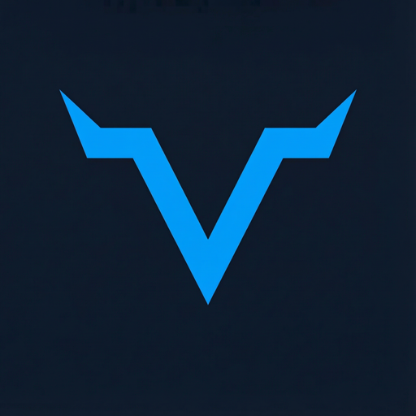

<p align="center">
  
</p>
<h1 align="center">
  
</h1>
<h3 align="center">
  Your AI agents forget everything. VelesDB fixes that.
</h3>
<p align="center">
  <strong>One 6 MB binary. Three engines. One query language. Zero cloud dependency.</strong><br/>
  <em>Vector + Graph + ColumnStore — unified under <a href="docs/VELESQL_SPEC.md">VelesQL</a></em>
</p>
<p align="center">
  <a href="https://github.com/cyberlife-coder/VelesDB/actions/workflows/ci.yml"></a>
  <a href="https://app.codacy.com/gh/cyberlife-coder/VelesDB/dashboard?utm_source=gh&utm_medium=referral&utm_content=&utm_campaign=Badge_grade"></a>
  <a href="https://crates.io/crates/velesdb-core"></a>
  <a href="https://crates.io/crates/velesdb-core"></a>
  <a href="https://pypi.org/project/velesdb/"></a>
  <a href="https://www.npmjs.com/package/@wiscale/velesdb-sdk"></a>
  <a href="https://app.codacy.com/gh/cyberlife-coder/VelesDB/dashboard"></a>
  
  <a href="https://github.com/cyberlife-coder/VelesDB/blob/main/LICENSE"></a>
  <a href="https://github.com/cyberlife-coder/VelesDB"></a>
  <a href="https://img.shields.io/badge/contributors-welcome-brightgreen"></a>
</p>
<p align="center">
  <a href="https://github.com/cyberlife-coder/VelesDB/releases/tag/v1.11.1">Download v1.11.1</a> &bull;
  <a href="#getting-started-in-60-seconds">Quick Start</a> &bull;
  <a href="https://velesdb.com/en/">Documentation</a> &bull;
  <a href="https://deepwiki.com/cyberlife-coder/VelesDB">DeepWiki</a>
</p>

<!-- TODO: Uncomment when GIF demo is ready
<p align="center">
  
</p>
-->

---

> **Every AI agent today stitches together 3 databases for memory — vectors for "what feels similar", a graph for "what is connected", and SQL for "what I know for sure". That's 3 deployments, 3 configs, 3 query languages, and a pile of glue code.**
>
> **VelesDB replaces all of that with a single Rust binary that fits on a floppy disk.**

---

## The Story Behind VelesDB

VelesDB was born in France out of a simple observation: **EU data sovereignty is an architectural problem, not a legal one.**

The US Cloud Act, FISA 702, and PATRIOT Act give US authorities multiple legal paths to reach data held by any US company — regardless of where the servers are. Hosting on AWS `eu-west-1` is a latency decision, not a sovereignty decision. The EU's Data Privacy Framework has been invalidated twice (Schrems I, Schrems II), and a third challenge is pending.

For European developers building AI agents that handle health data, legal documents, or financial records, the typical 2026 stack sends embeddings to Pinecone (US), graphs to Neo4j Aura (US), and metadata to PostgreSQL on AWS (US provider). Every one of these is reachable by a FISA warrant.

VelesDB removes the US provider from the chain entirely. One Rust binary, local-first by design. No API key, no cloud account, no data processor. Your data stays in a directory you control — on your laptop, your server, your jurisdiction.

> [Read the full story: "I built a database in France because the Cloud Act makes EU data sovereignty impossible"](https://dev.to/wiscale-fr/i-built-a-database-in-france-because-the-cloud-act-makes-eu-data-sovereignty-impossible-5325)

---

## Why VelesDB?

| Today (3 systems to maintain) | With VelesDB (1 binary) |
|-------------------------------|------------------------|
| pgvector for embeddings | **Vector Engine** — 47us HNSW search (768D) |
| Neo4j for knowledge graphs | **Graph Engine** — MATCH clause, BFS/DFS |
| PostgreSQL/DuckDB for metadata | **ColumnStore** — 130x faster than JSON at 100K rows |
| Custom glue code + 3 query languages | **VelesQL** — one language for everything |
| 3 deployments, 3 configs, 3 backups | **6 MB binary** — works offline, air-gapped |

---
## What is VelesDB?

VelesDB is a **local-first database for AI agents** that fuses three engines into a single 6 MB binary:

| Engine | What it does | Performance |
|--------|-------------|-------------|
| **Vector** | Semantic similarity search (HNSW + AVX2/NEON SIMD) | **450us** p50 end-to-end (384D, WAL ON, recall>=96%) |
| **Graph** | Knowledge relationships (BFS/DFS, edge properties) | Native **MATCH** clause |
| **ColumnStore** | Structured metadata filtering (typed columns) | **130x** faster than JSON scanning |

All three are queried through **VelesQL** — a single SQL-like language with vector, graph, and columnar extensions:

```sql
MATCH (doc:Document)-[:AUTHORED_BY]->(author:Person)
WHERE similarity(doc.embedding, $question) > 0.8
  AND author.department = 'Engineering'
RETURN author.name, doc.title
ORDER BY similarity() DESC LIMIT 5
```

**Built-in Agent Memory SDK** provides semantic, episodic, and procedural memory for AI agents — no external services needed.

> **One binary. No cloud. No glue code. Runs on server, browser, mobile, and desktop.**

---

## Agent Memory SDK

Built-in memory for AI agents — semantic, episodic, and procedural. No external services needed.

```python
from velesdb import Database, AgentMemory

db = Database("./agent_data")
memory = AgentMemory(db, dimension=384)

memory.semantic.store(1, "Paris is the capital of France", embedding)
memory.episodic.record(1, "User asked about geography", timestamp, embedding)
memory.procedural.learn(1, "answer_geography", steps, embedding, confidence=0.8)
```

| Feature | API |
|---------|-----|
| TTL / Auto-expiration | `store_with_ttl()`, `auto_expire()` |
| Snapshots / Rollback | `snapshot()`, `load_latest_snapshot()` |
| Reinforcement | `reinforce(success=True)` — 4 strategies |

> **Full guide:** [docs/guides/AGENT_MEMORY.md](docs/guides/AGENT_MEMORY.md) | [Source code](crates/velesdb-core/src/agent/)

---

## Quick Comparison

| | **VelesDB** | Chroma | Qdrant | pgvector |
|---|---|---|---|---|
| **Architecture** | Unified vector + graph + columnar | Vector only | Vector + payload | Vector extension for PostgreSQL |
| **Metadata filtering** | **ColumnStore (130x vs JSON)** | JSON scan | JSON payload | SQL (PostgreSQL) |
| **Deployment** | Embedded / Server / WASM / Mobile | Server (Python) | Server (Rust) | Requires PostgreSQL |
| **Binary size** | 6 MB | ~500 MB (with deps) | ~50 MB | N/A (PG extension) |
| **Search latency** | **450us** p50 (10K/384D, WAL ON, recall>=96%) | ~1-5ms | ~1-5ms (in-memory) | ~5-20ms |
| **Graph support** | Native (MATCH clause) | No | No | No |
| **Query language** | VelesQL (SQL + NEAR + MATCH) | Python API | JSON API / gRPC | SQL + operators |
| **Browser (WASM)** | Yes | No | No | No |
| **Mobile (iOS/Android)** | Yes | No | No | No |
| **Offline / Local-first** | Yes | Partial | No | No |

> *Competitor latencies are typical ranges from public benchmarks and vendor documentation. Direct comparison is approximate — architectures differ (embedded vs client-server, durable vs in-memory, recall levels). Run your own benchmarks for accurate comparison.*

> **VelesDB's sweet spot:** When you need vector + graph + structured filtering in a single engine, local-first deployment, or a lightweight binary that runs anywhere.
>
> **Not the best fit (yet):** If you need a managed cloud service with a multi-node distributed cluster.

---

## Getting Started in 60 Seconds

### Install

**Cargo (Rust):**
```bash
cargo install velesdb-server velesdb-cli
```

**Python:**
```bash
pip install velesdb
```

**Docker:**
```bash
# Build the image locally
git clone https://github.com/cyberlife-coder/VelesDB.git && cd VelesDB
docker build -t velesdb .

# Run with persistent data (named volume)
docker run -d -p 8080:8080 -v velesdb_data:/data --name velesdb velesdb

# Verify it's running
curl http://localhost:8080/health
```
Data is stored in the `/data` directory inside the container. The named volume `velesdb_data` persists data across container restarts. The built-in health check polls `GET /health` every 30 seconds.

<details>
<summary>More install options (Docker Compose, WASM, install scripts)</summary>

**Docker Compose:**
```bash
git clone https://github.com/cyberlife-coder/VelesDB.git && cd VelesDB
docker-compose up -d
```

| Environment variable | Default | Description |
|---|---|---|
| `VELESDB_DATA_DIR` | `/data` | Data storage directory |
| `VELESDB_HOST` | `0.0.0.0` | Bind address |
| `VELESDB_PORT` | `8080` | HTTP port |
| `RUST_LOG` | `info` | Log level (`debug`, `info`, `warn`, `error`) |

**WASM (Browser):**
```bash
npm install @wiscale/velesdb-wasm
```

**Install script (Linux/macOS):**
```bash
curl -fsSL https://raw.githubusercontent.com/cyberlife-coder/VelesDB/main/scripts/install.sh | bash
```

**Install script (Windows PowerShell):**
```powershell
irm https://raw.githubusercontent.com/cyberlife-coder/VelesDB/main/scripts/install.ps1 | iex
```

</details>

### First search in 30 seconds

```bash
velesdb-server --data-dir ./my_data &

# Create collection + insert + search
curl -X POST http://localhost:8080/collections \
  -d '{"name": "docs", "dimension": 4, "metric": "cosine"}' -H "Content-Type: application/json"

curl -X POST http://localhost:8080/collections/docs/points \
  -d '{"points": [
    {"id": 1, "vector": [1.0, 0.0, 0.0, 0.0], "payload": {"title": "AI Intro", "category": "tech"}},
    {"id": 2, "vector": [0.0, 1.0, 0.0, 0.0], "payload": {"title": "ML Basics", "category": "tech"}},
    {"id": 3, "vector": [0.0, 0.0, 1.0, 0.0], "payload": {"title": "History of Computing", "category": "history"}}
  ]}' -H "Content-Type: application/json"

curl -X POST http://localhost:8080/collections/docs/search \
  -d '{"vector": [0.9, 0.1, 0.0, 0.0], "top_k": 2}' -H "Content-Type: application/json"
# [{"id":1,"score":0.995,"payload":{"title":"AI Intro","category":"tech"}}, ...]
```

> Full installation guide: [docs/guides/INSTALLATION.md](docs/guides/INSTALLATION.md)

---

## Vector Engine

Native HNSW index with SIMD-accelerated distance kernels. Sub-millisecond search on commodity hardware.

| Metric | Value |
|--------|-------|
| Search p50 (10K, 384D, WAL ON) | **450 us** |
| SIMD Dot Product (768D, AVX2) | **21.7 ns** |
| Recall@10 (Balanced) | **98.8%** |
| Quantization | SQ8 (4x), PQ (32x), Binary (32x), RaBitQ (32x) |

5 search quality modes (Fast → Perfect), adaptive two-phase ef, AutoTune.

### Distance Metrics

5 metrics with SIMD acceleration (AVX-512, AVX2, NEON, WASM SIMD128):

| Metric | What it measures | Use case | SIMD perf (768D) |
|--------|-----------------|----------|------------------|
| **Cosine** | Angle between vectors (direction similarity) | Text embeddings (BERT, OpenAI, Cohere), normalized vectors | 33 ns |
| **Euclidean** | Straight-line distance (L2 norm) | Image features, spatial data, when magnitude matters | 20 ns |
| **Dot Product** | Inner product (projection) | Pre-normalized vectors, Maximum Inner Product Search (MIPS) | 22 ns |
| **Hamming** | Bit differences in binary vectors | Binary embeddings, locality-sensitive hashing (LSH), fingerprints | 36 ns |
| **Jaccard** | Set overlap (intersection / union) | Sparse vectors, tag similarity, set membership | 35 ns |

```sql
-- Choose metric at collection creation
CREATE COLLECTION docs (dimension = 768, metric = 'cosine');
CREATE COLLECTION images (dimension = 512, metric = 'euclidean');
CREATE COLLECTION fingerprints (dimension = 256, metric = 'hamming');
```

```sql
SELECT * FROM docs WHERE vector NEAR $v AND category = 'tech' LIMIT 5
```

> **Full benchmarks and methodology:** [docs/BENCHMARKS.md](docs/BENCHMARKS.md) | [velesdb-benchmarks repo](https://github.com/cyberlife-coder/velesdb-benchmarks) | **Quantization guide:** [docs/guides/QUANTIZATION.md](docs/guides/QUANTIZATION.md)

---

## Graph Engine

Property graph with BFS/DFS traversal, edge labels, and Cypher-inspired MATCH queries — integrated with vector search.

```sql
-- Vector + Graph fusion in ONE statement
MATCH (doc:Document)-[:AUTHORED_BY]->(author:Person)
WHERE similarity(doc.embedding, $question) > 0.8
RETURN author.name, doc.title
ORDER BY similarity() DESC LIMIT 5
```

Cross-collection MATCH with `@collection` annotation:

```sql
MATCH (p:Product@products)-[:STORED_IN]->(inv:Inventory@inventory)
RETURN p.name, inv.price, inv.stock
LIMIT 20
```

> **Graph patterns guide:** [docs/guides/GRAPH_PATTERNS.md](docs/guides/GRAPH_PATTERNS.md)

---

## ColumnStore Engine

Typed columnar storage — the same approach DuckDB and ClickHouse use. **130x faster** than JSON scanning at 100K rows.

```
JSON scan: 3.84 ms @ 100K    →    ColumnStore: 29.5 us @ 100K (130x faster)
```

```sql
SELECT * FROM products
WHERE vector NEAR $query AND in_stock = true AND price < 50.0
LIMIT 10
```

Pre-filter or post-filter automatically optimized by the query planner.

---

## Use Cases

### AI Agent Memory

Your agent needs to remember conversations, learn from mistakes, and recall relevant knowledge. VelesDB provides all three memory types in a single embedded database — no Redis, no Pinecone, no Neo4j.

```python
memory = AgentMemory(db, dimension=384)
memory.semantic.store(1, "User prefers dark mode", embedding)
memory.episodic.record(2, "User asked about billing", timestamp, embedding)
memory.procedural.learn(3, "handle_refund", steps, embedding, confidence=0.9)
```

### RAG with Metadata Filtering

Vector search alone returns noise. VelesDB's ColumnStore filters eliminate irrelevant results 130x faster than JSON scanning.

```sql
SELECT * FROM docs
WHERE vector NEAR $query AND department = 'engineering' AND updated_at > NOW() - INTERVAL '30 days'
LIMIT 10
```

### E-commerce: Vector + Graph + Filters in One Query

Find products similar to a query, filter by price/stock, and traverse co-purchase relationships — all in a single VelesQL statement.

```sql
MATCH (product)-[:BOUGHT_TOGETHER]->(related)
WHERE similarity(product.embedding, $query) > 0.7
  AND related.price < 200 AND related.in_stock = true
RETURN related.name, related.price
ORDER BY similarity() DESC LIMIT 20
```

### Desktop & Mobile AI

Ship AI features without a server. VelesDB embeds directly into Tauri, iOS, and Android apps.

| Platform | Integration | Binary size |
|----------|-------------|-------------|
| Desktop (Tauri) | `tauri-plugin-velesdb` | 6 MB |
| iOS (Swift) | UniFFI bindings | ~4 MB |
| Android (Kotlin) | UniFFI bindings | ~4 MB |
| Browser | WASM module | ~50 KB gzipped |

---

## Roadmap

| Milestone | Status |
|-----------|--------|
| v1.0 — Core engine (vector + graph + VelesQL) | ✅ Shipped |
| v1.5 — Python SDK, WASM, Mobile bindings | ✅ Shipped |
| v1.10 — Agent Memory SDK, hybrid search, quantization | ✅ Shipped |
| v1.11 — Cross-collection MATCH, bitmap pre-filter, CSR graph | ✅ Shipped |

> VelesDB Core is open-source. Enterprise features (distributed replication, managed cloud, RBAC) are available separately via [VelesDB Premium](https://velesdb.com).

> We ship weekly. [Full changelog](CHANGELOG.md) | [Contributing guide](CONTRIBUTING.md)

---

## Full Ecosystem

| Domain | Component | Install |
|--------|-----------|---------|
| **Core** | [velesdb-core](crates/velesdb-core) — Vector + Graph + ColumnStore + VelesQL | `cargo add velesdb-core` |
| **Server** | [velesdb-server](crates/velesdb-server) — REST API (37 endpoints, OpenAPI) | `cargo install velesdb-server` |
| **CLI** | [velesdb-cli](crates/velesdb-cli) — Interactive VelesQL REPL | `cargo install velesdb-cli` |
| **Python** | [velesdb-python](crates/velesdb-python) — PyO3 bindings + NumPy | `pip install velesdb` |
| **TypeScript** | [typescript-sdk](sdks/typescript) — Node.js & Browser SDK | `npm install @wiscale/velesdb-sdk` |
| **WASM** | [velesdb-wasm](crates/velesdb-wasm) — Browser-side vector search | `npm install @wiscale/velesdb-wasm` |
| **Mobile** | [velesdb-mobile](crates/velesdb-mobile) — iOS (Swift) & Android (Kotlin) | [Build instructions](docs/guides/INSTALLATION.md#-mobile-iosandroid) |
| **Desktop** | [tauri-plugin](crates/tauri-plugin-velesdb) — Tauri v2 AI-powered apps | `cargo add tauri-plugin-velesdb` |
| **LangChain** | [langchain-velesdb](integrations/langchain) — Official VectorStore | [From source](integrations/langchain/README.md) |
| **LlamaIndex** | [llamaindex-velesdb](integrations/llamaindex) — Document indexing | [From source](integrations/llamaindex/README.md) |
| **Migration** | [velesdb-migrate](crates/velesdb-migrate) — From Qdrant, Pinecone, Supabase | `cargo install velesdb-migrate` |

---

## How VelesDB Works

```
INSERT                      INDEX                       SEARCH
┌──────────┐  upsert   ┌──────────────┐  build   ┌──────────────┐
│ Your App │──────────> │ WAL (append) │────────> │  HNSW Graph  │
│          │           │ + mmap store │         │  (in-memory) │
└──────────┘           └──────┬───────┘         └──────┬───────┘
                              │                        │
                       ┌──────▼───────┐                │ search
                       │  ColumnStore  │  filter   ┌────▼─────────┐
                       │ (typed cols)  │────────> │ SIMD Distance│
                       └──────────────┘          │(AVX-512/NEON)│
                        RESULT                    └──────┬───────┘
┌──────────┐  top-k    ┌──────────────┐  rank           │
│ Your App │<──────────│   Payload    │<────────────────┘
│          │           │  Hydration   │
└──────────┘           └──────────────┘
```

**Key design choices:**
- **Local-first**: In-process or single binary — no network hops, no cloud dependency
- **Memory-mapped storage**: OS manages paging between RAM and disk
- **WAL durability**: Every write is journaled. Crash-safe by default (`fsync` mode). Deferred sync during bulk insert for throughput
- **ColumnStore**: Typed columns with string interning, RoaringBitmap tombstones, PostgreSQL-inspired auto-vacuum

<details>
<summary>Docker deployment</summary>

```bash
# Build and run locally
docker build -t velesdb .
docker run -d -p 8080:8080 -v velesdb_data:/data --name velesdb velesdb
curl http://localhost:8080/health

# Or with docker-compose (builds + auto-restart)
docker-compose up -d
```

| Variable | Default | Description |
|---|---|---|
| `VELESDB_DATA_DIR` | `/data` | Data storage directory |
| `VELESDB_HOST` | `0.0.0.0` | Bind address |
| `VELESDB_PORT` | `8080` | HTTP port |
| `RUST_LOG` | `info` | Log level |

The container runs as a non-root `velesdb` user. Data persists via the named volume `velesdb_data`. A built-in health check (`GET /health`) is configured with a 30-second interval.

</details>

<details>
<summary>API Reference (37 REST endpoints)</summary>

| Category | Key Endpoints |
|----------|--------------|
| **Collections** | `POST /collections`, `GET /collections`, `GET/DELETE /collections/{name}` |
| **Points** | `/collections/{name}/points`, `/collections/{name}/stream/insert` |
| **Search** | `/collections/{name}/search`, `/collections/{name}/search/batch`, `/collections/{name}/search/hybrid`, `/collections/{name}/search/text`, `/collections/{name}/search/multi`, `/collections/{name}/search/ids`, `/collections/{name}/match` |
| **Graph** | `/collections/{name}/graph/edges`, `/collections/{name}/graph/edges/{id}`, `/collections/{name}/graph/edges/count`, `/collections/{name}/graph/traverse`, `/collections/{name}/graph/traverse/stream`, `/collections/{name}/graph/traverse/parallel`, `/collections/{name}/graph/nodes`, `/collections/{name}/graph/nodes/{id}/degree`, `/collections/{name}/graph/nodes/{id}/edges`, `/collections/{name}/graph/nodes/{id}/payload`, `/collections/{name}/graph/search` |
| **Indexes** | `GET/POST /collections/{name}/indexes`, `DELETE /collections/{name}/indexes/{label}/{property}` |
| **VelesQL** | `/query`, `/aggregate`, `/query/explain` |
| **Admin** | `/health`, `/ready`, `/metrics`, `/guardrails`, `/collections/{name}/stats`, `/collections/{name}/config`, `/collections/{name}/flush`, `/collections/{name}/analyze`, `/collections/{name}/empty`, `/collections/{name}/sanity` |

> **Full API reference:** [docs/reference/api-reference.md](docs/reference/api-reference.md) | **OpenAPI spec:** [docs/openapi.yaml](docs/openapi.yaml)

</details>

<details>
<summary>Security</summary>

- **API Key Authentication** — Bearer token auth via `VELESDB_API_KEYS` env var
- **TLS (HTTPS)** — Built-in via rustls (`VELESDB_TLS_CERT` / `VELESDB_TLS_KEY`)
- **Graceful Shutdown** — SIGTERM triggers connection drain + WAL flush. Zero data loss
- **Health Endpoints** — `GET /health` and `GET /ready` always public

> [docs/guides/SERVER_SECURITY.md](docs/guides/SERVER_SECURITY.md)

</details>

---

## Demos & Examples

```bash
cd examples/ecommerce_recommendation && cargo run --release
```

| Demo | Description | Tech |
|------|-------------|------|
| [ecommerce_recommendation](examples/ecommerce_recommendation/) | Vector + Graph + ColumnStore (5K products) | Rust |
| [rag-pdf-demo](demos/rag-pdf-demo/) | PDF document Q&A with RAG | Python, FastAPI |
| [tauri-rag-app](demos/tauri-rag-app/) | Desktop RAG application | Tauri v2, React |
| [wasm-browser-demo](examples/wasm-browser-demo/) | In-browser vector search | WASM, vanilla JS |
| [mini_recommender](examples/mini_recommender/) | Product recommendations | Rust |

---

<details>
<summary>Research Foundations</summary>

VelesDB's performance is built on peer-reviewed research — every technique is implemented and production-active.

| Technique | Paper |
|-----------|-------|
| HNSW | [Malkov & Yashunin, 2016](https://arxiv.org/abs/1603.09320) |
| VAMANA / DiskANN | [Subramanya et al., 2019](https://arxiv.org/abs/1907.05024) |
| RaBitQ | [Gao & Long, 2024](https://arxiv.org/abs/2405.12497) |
| Dual-Precision (VSAG) | [Xu et al., 2025](https://arxiv.org/abs/2503.17911) |
| Software Pipelining | [Jiang et al., 2025](https://arxiv.org/abs/2505.07621) |
| PDX Layout | [Pirk et al., 2025](https://arxiv.org/abs/2503.04422) |

</details>

## Contributing

```bash
git clone https://github.com/cyberlife-coder/VelesDB.git && cd VelesDB
cargo test --workspace --features persistence,gpu,update-check --exclude velesdb-python -- --test-threads=1
```

Looking for a place to start? Check out issues labeled [`good first issue`](https://github.com/cyberlife-coder/VelesDB/labels/good%20first%20issue).

---

## Using VelesDB?

[](https://github.com/cyberlife-coder/VelesDB)

Tell us about your project and get featured on the [**"Powered by VelesDB"** showcase on velesdb.com](https://velesdb.com). We highlight companies and projects that build with VelesDB — from RAG pipelines to sovereign AI agents.

How to get listed:
- Open a [GitHub Discussion](https://github.com/cyberlife-coder/VelesDB/discussions) describing your use case
- Or email [contact@wiscale.fr](mailto:contact@wiscale.fr) with your project name, logo, and a one-liner

Your feedback shapes the roadmap.

---

## License

VelesDB Core License 1.0 (based on ELv2). Free for production use, including commercial applications. Two restrictions: no offering VelesDB as a hosted/managed database service, and no building a competing database product. [Read the full license](LICENSE).

---

<p align="center">
  <strong>VelesDB</strong> &mdash; The Local Knowledge Engine for AI Agents<br/>
  <a href="https://velesdb.com">velesdb.com</a> &bull; <a href="https://github.com/cyberlife-coder/VelesDB">GitHub</a>
</p>
