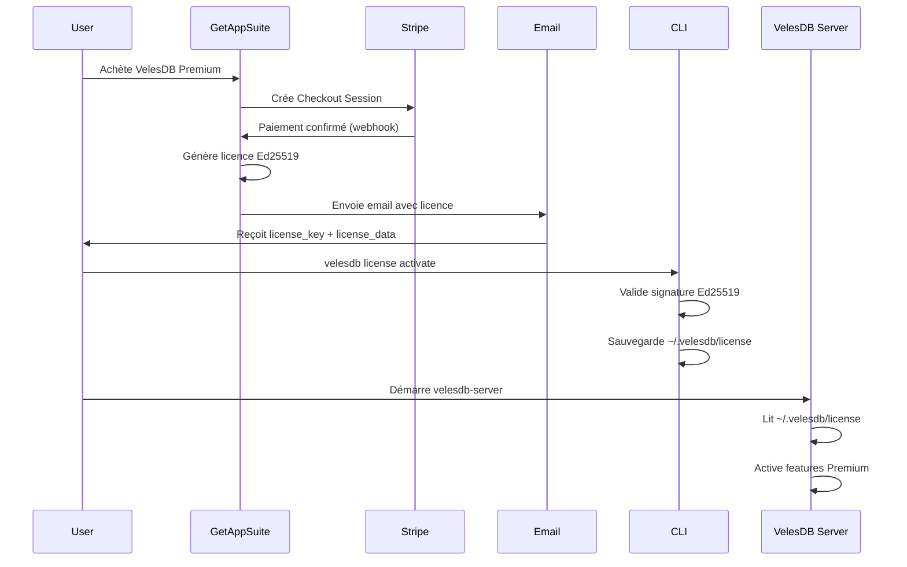

# VelesDB CLI - License Management

Guide complet pour gérer les licences VelesDB Premium via le CLI.

## 📋 Vue d'ensemble

Le CLI VelesDB intègre des commandes pour activer, vérifier et afficher les licences VelesDB Premium. Les licences utilisent des signatures cryptographiques **Ed25519** pour garantir leur authenticité.

### Architecture de validation

```
┌─────────────────────────────────────────────────────────────┐
│                  VelesDB License Validation                  │
├─────────────────────────────────────────────────────────────┤
│  1. GetAppSuite génère la licence (Ed25519 signature)       │
│  2. Licence envoyée par email (license_key + license_data)  │
│  3. CLI valide la signature avec clé publique               │
│  4. Licence stockée dans ~/.velesdb/license                 │
│  5. Serveur VelesDB lit la licence au démarrage             │
└─────────────────────────────────────────────────────────────┘
```

**Compatibilité** : Les algorithmes de validation sont **identiques** à ceux de `velesdb-premium` pour garantir l'interopérabilité.

---

## 🚀 Commandes disponibles

### 1. Activer une licence

Active une licence reçue par email après achat sur GetAppSuite.

```bash
velesdb license activate "eyJrZXkiOiJWRUxFUy1QUk8tMjAyNjAxLUExQjJDM0Q0Ii...base64_signature"
```

**Comportement** :
- ✅ Valide la signature cryptographique Ed25519
- ✅ Vérifie que la licence n'a pas expiré
- ✅ Sauvegarde la licence dans `~/.velesdb/license`
- ✅ Affiche les détails de la licence (tier, organisation, features)

**Variables d'environnement** :
```bash
# Clé publique pour validation (recommandé en production)
export VELESDB_LICENSE_PUBLIC_KEY="MCowBQYDK2VwAyEA..."
```

Si `VELESDB_LICENSE_PUBLIC_KEY` n'est pas définie, le CLI utilise une clé de développement par défaut.

---

### 2. Afficher la licence active

Affiche les informations de la licence actuellement activée.

```bash
velesdb license show
```

**Sortie exemple** :
```
License Information
============================================================
  Key: VELES-PRO-202601-A1B2C3D4
  Organization: Acme Corp
  Tier: Professional
  Max Instances: 1
  Expires: 2027-01-07
  Status: VALID

Enabled Features:
  ✓ Hybrid Search
  ✓ Advanced Filtering
  ✓ Encryption at Rest
  ✓ Snapshots & Backups
  ✓ RBAC
```

**Codes de sortie** :
- `0` : Licence valide
- `1` : Aucune licence trouvée ou licence invalide

---

### 3. Vérifier une licence

Vérifie une licence sans l'activer (utile pour tester avant activation).

```bash
velesdb license verify "eyJrZXkiOiJWRUxFUy1QUk8..." \
  --public-key "MCowBQYDK2VwAyEA..."
```

**Options** :
- `--public-key`, `-p` : Clé publique Ed25519 (base64) pour validation

**Cas d'usage** :
- Tester une licence avant activation
- Vérifier l'intégrité d'une licence
- Valider une licence avec une clé publique spécifique

---

## 📁 Stockage des licences

### Emplacement

Les licences sont stockées dans le répertoire de configuration utilisateur :

| OS | Chemin |
|----|--------|
| **Linux/macOS** | `~/.velesdb/license` |
| **Windows** | `C:\Users\<username>\.velesdb\license` |

### Format du fichier

Le fichier contient la licence complète au format :
```
<base64_payload>.<base64_signature>
```

**Exemple** :
```
eyJrZXkiOiJWRUxFUy1QUk8tMjAyNjAxLUExQjJDM0Q0IiwidGllciI6IlByb2Zlc3Npb25hbCIsIm9yZ2FuaXphdGlvbiI6IkFjbWUgQ29ycCIsImV4cGlyZXNfYXQiOjE3Njc4MTQ0MDAsIm1heF9pbnN0YW5jZXMiOjEsImZlYXR1cmVzIjpbIkh5YnJpZFNlYXJjaCIsIkFkdmFuY2VkRmlsdGVyaW5nIiwiRW5jcnlwdGlvbkF0UmVzdCIsIlNuYXBzaG90cyIsIlJCQUMiXX0=.SGVsbG9Xb3JsZFNpZ25hdHVyZUV4YW1wbGUxMjM0NTY3ODkwMTIzNDU2Nzg5MDEyMzQ1Njc4OTAxMjM0NTY3ODkwMTIzNDU2Nzg5MDEyMzQ1Njc4OTA=
```

---

## 🔐 Sécurité

### Validation cryptographique

Les licences utilisent **Ed25519** (courbe elliptique) pour garantir :
- ✅ **Authenticité** : Seul GetAppSuite peut générer des licences valides
- ✅ **Intégrité** : Toute modification invalide la signature
- ✅ **Non-répudiation** : La signature prouve l'origine

### Clé publique

La clé publique Ed25519 est nécessaire pour valider les licences :

**Production** (recommandé) :
```bash
export VELESDB_LICENSE_PUBLIC_KEY="<base64_public_key>"
```

**Développement** :
Le CLI utilise une clé de développement par défaut si `VELESDB_LICENSE_PUBLIC_KEY` n'est pas définie.

⚠️ **Important** : En production, configurez toujours `VELESDB_LICENSE_PUBLIC_KEY` avec la vraie clé publique VelesDB.

---

## 🔄 Workflow complet

### 1. Achat sur GetAppSuite

```
Utilisateur → GetAppSuite → Stripe Checkout → Webhook → Génération licence
```

### 2. Réception email

Vous recevez un email contenant :
- **License Key** : `VELES-PRO-202601-A1B2C3D4`
- **License Data** : `eyJrZXkiOi...` (payload + signature)

### 3. Activation via CLI

```bash
# Copier la license_data depuis l'email
velesdb license activate "eyJrZXkiOiJWRUxFUy1QUk8tMjAyNjAxLUExQjJDM0Q0Ii..."
```

### 4. Vérification

```bash
velesdb license show
```

### 5. Démarrage du serveur

```bash
# Le serveur lit automatiquement ~/.velesdb/license
velesdb-server --config config.toml
```

---

## 🐛 Dépannage

### Erreur : "License validation failed"

**Causes possibles** :
1. Signature invalide (licence modifiée)
2. Clé publique incorrecte
3. Licence expirée
4. Format de licence invalide

**Solution** :
```bash
# Vérifier la licence avec la clé publique
velesdb license verify "eyJrZXkiOi..." \
  --public-key "MCowBQYDK2VwAyEA..."

# Vérifier les variables d'environnement
echo $VELESDB_LICENSE_PUBLIC_KEY
```

---

### Erreur : "No license found"

**Cause** : Aucune licence activée.

**Solution** :
```bash
# Activer une licence
velesdb license activate "<license_from_email>"

# Vérifier l'emplacement
ls -la ~/.velesdb/license
```

---

### Erreur : "License has expired"

**Cause** : La licence a dépassé sa date d'expiration.

**Solution** :
1. Vérifier la date d'expiration : `velesdb license show`
2. Renouveler la licence sur GetAppSuite
3. Activer la nouvelle licence

---

## 📚 Exemples d'utilisation

### Activation simple

```bash
# Activer la licence reçue par email
velesdb license activate "eyJrZXkiOiJWRUxFUy1QUk8tMjAyNjAxLUExQjJDM0Q0Ii..."

# Vérifier l'activation
velesdb license show
```

### Validation avec clé publique personnalisée

```bash
# Définir la clé publique
export VELESDB_LICENSE_PUBLIC_KEY="MCowBQYDK2VwAyEAabcdef1234567890..."

# Activer la licence
velesdb license activate "eyJrZXkiOi..."
```

### Script d'automatisation

```bash
#!/bin/bash
# deploy-velesdb.sh

# 1. Configurer la clé publique
export VELESDB_LICENSE_PUBLIC_KEY="$VELESDB_PUBLIC_KEY"

# 2. Activer la licence
velesdb license activate "$VELESDB_LICENSE_KEY"

# 3. Vérifier l'activation
if velesdb license show; then
    echo "✅ License activated successfully"
    
    # 4. Démarrer le serveur
    velesdb-server --config /etc/velesdb/config.toml
else
    echo "❌ License activation failed"
    exit 1
fi
```

---

## 🔗 Intégration avec GetAppSuite

### Flow complet



### Format de licence GetAppSuite

**Payload JSON** (avant signature) :
```json
{
  "key": "VELES-PRO-202601-A1B2C3D4",
  "tier": "Professional",
  "organization": "Acme Corp",
  "expires_at": 1767814400,
  "max_instances": 1,
  "features": [
    "HybridSearch",
    "AdvancedFiltering",
    "EncryptionAtRest",
    "Snapshots",
    "RBAC"
  ]
}
```

**Licence signée** (envoyée par email) :
```
base64(payload).base64(ed25519_signature)
```

---

## 🎯 Tiers de licence

| Tier | Max Instances | Features |
|------|---------------|----------|
| **Professional** | 1 | Hybrid Search, Advanced Filtering, Encryption, Snapshots, RBAC |
| **Team** | 5 | Professional + Multi-Tenancy, Priority Support |
| **Enterprise** | Unlimited | Team + SSO, GPU Acceleration, Audit Logging, 24/7 Support |

---

## 📞 Support

- **Documentation** : https://docs.velesdb.com
- **Email** : contact@wiscale.fr
- **GitHub Issues** : https://github.com/cyberlife-coder/velesdb/issues

---

## ⚖️ Licence

VelesDB Core : Elastic License 2.0 (ELv2)  
VelesDB Premium : Commercial License

Pour plus d'informations : https://velesdb.com/pricing
