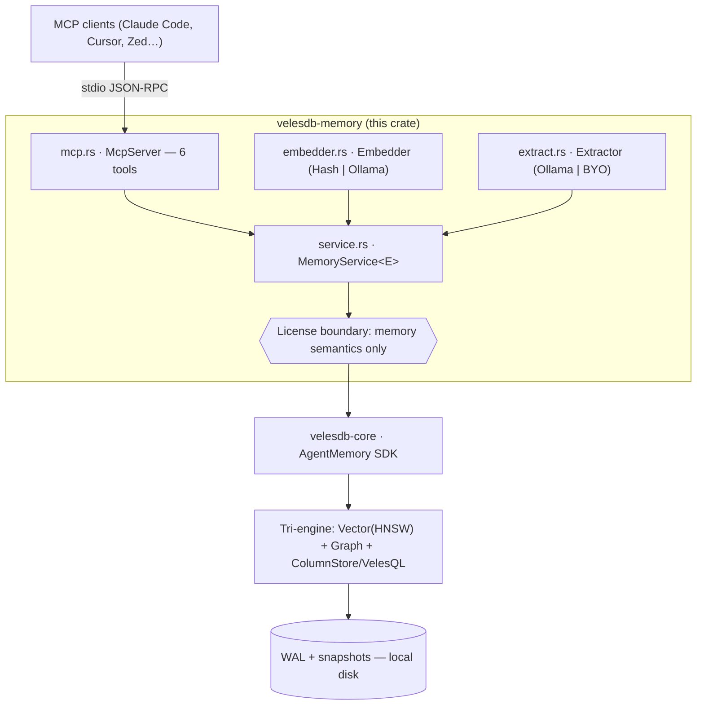

# velesdb-memory — Technical Architecture (high level)

Local-first **memory for AI agents**, exposed as a single MCP server. The
differentiator (the *wedge*) is `why()`: a vector seed followed by multi-hop
graph traversal that surfaces connected memories a pure similarity search is
blind to. This document is the high-level map — layers, data flows, and the
invariants that hold the design together.

---

## 1. System map

```
┌──────────────────────────────────────────────────────────────────────────┐
│  MCP clients  (Claude Code · Cursor · Cline · Zed · Codex · opencode)      │
└───────────────────────────────┬──────────────────────────────────────────┘
                                 │  MCP / JSON-RPC over stdio
                                 ▼
┌──────────────────────────────────────────────────────────────────────────┐
│  velesdb-memory  (this crate)                                              │
│                                                                            │
│   src/main.rs ── env config (store path, embedder, extractor) ──┐          │
│                                                                 ▼          │
│   src/mcp.rs ── McpServer: 6 tools                                         │
│     remember · recall · relate · forget · why · remember_extracted        │
│        │                                                                   │
│        ▼                                                                   │
│   src/service.rs ── MemoryService<E: Embedder>  (the domain core)         │
│     • remember / recall / relate / forget / why                           │
│     • remember_extracted ── auto-build the fact↔topic graph               │
│     • hub-exclusion · reserved-key guard · content-addressed ids          │
│        │                 ▲                          ▲                      │
│        │     src/embedder.rs (E)      src/extract.rs (Extractor)           │
│        │     HashEmbedder | Ollama    OllamaExtractor | bring-your-own     │
│        ▼                                                                   │
│   ┌────────────────────────────────────────────────────────────────────┐ │
│   │  License boundary: ONLY memory semantics cross it — never raw DB    │ │
│   │  (no query(velesql), create_collection, upsert, traverse)          │ │
│   └────────────────────────────────────────────────────────────────────┘ │
└───────────────────────────────┬──────────────────────────────────────────┘
                                 │  in-process Rust API
                                 ▼
┌──────────────────────────────────────────────────────────────────────────┐
│  velesdb-core ── Agent Memory SDK  (AgentMemory)                          │
│     SemanticMemory · EpisodicMemory · ProceduralMemory                    │
│        store/query/query_filtered/query_excluding · relate · relations    │
│                                 │                                          │
│                                 ▼                                          │
│  Tri-engine, one collection + WAL                                         │
│     ┌─────────────┐   ┌──────────────┐   ┌──────────────────────────┐     │
│     │  Vector     │   │  Graph       │   │  ColumnStore + VelesQL    │     │
│     │  (HNSW)     │   │  (typed      │   │  (metadata ranges /       │     │
│     │  similarity │   │   edges,     │   │   comparisons, NEAR,      │     │
│     │             │   │   traversal) │   │   bound params)           │     │
│     └─────────────┘   └──────────────┘   └──────────────────────────┘     │
└──────────────────────────────────────────────────────────────────────────┘
                                 │
                                 ▼
                    WAL + snapshots on local disk
                  (the data never leaves the machine)
```

Mermaid view (renders on GitHub):



---

## 2. Two layers (the keystone)

There are **two distinct memory layers**, exposed by different surfaces:

| Layer | Type | Operations | Exposed by |
|---|---|---|---|
| **Primitive** | `SemanticMemory` / `EpisodicMemory` / `ProceduralMemory` | store / query / record / learn / `relate` / `query_excluding` | Python SDK, TS SDK, WASM, core |
| **High-level** | `MemoryService` | remember / recall / recall_where / relate / forget / **why** / **remember_extracted** | MCP server, Python (PyO3), Node (napi) |

The high-level service maps these intent-level operations onto the primitive
SDK. The wedge (`why`) and auto-extraction ship in all three bindings: the MCP
server, the Python SDK (`velesdb-python`, `MemoryService` pyclass), and the
Node.js binding (`velesdb-node`, npm `@wiscale/velesdb-memory-node`).

---

## 3. Tri-engine fusion

`velesdb-core` fuses three engines behind **one collection and one WAL**, so a
single memory carries a vector, typed edges, and structured columns at once:

- **Vector (HNSW)** — semantic similarity; the entry point of `recall`/`why`.
- **Graph** — typed, directional edges (`about`, `mentions`, `decided_in`…);
  what `why` traverses.
- **ColumnStore + VelesQL** — range/comparison predicates over metadata, with
  values **bound as parameters** (no injection). Powers `recall_where`.

`why()` is where all three meet: a vector seed (optionally column-scoped),
expanded by graph traversal.

---

## 4. The wedge — `why()` data flow

```
why("why did we choose parking_lot", hops=2, filter?)
  │
  1. embed(query)                              [Vector]
  2. search top-1 seed, excluding entity hubs  [Vector + hub-exclusion]
  3. BFS outgoing edges up to `hops`           [Graph]
        seed ──about──► topic hub ──mentions──► sibling fact ──► …
  4. collect {nodes, typed edges} = connected subgraph
  ▼
Explanation { nodes[seed…], edges[…] }
```

A pure `recall` returns look-alike text; `why` returns the *connected* context
(the PR, the ticket, the benchmark) even when it shares no words with the query.

---

## 5. Auto-extraction — `remember_extracted` data flow

The core is **bring-your-own-links**: `remember` only stores the links you give
it. `remember_extracted` adds the missing commodity — it makes the graph
*self-build* from raw text:

```
remember_extracted(text, extractor, metadata?)
  │
  1. extractor.extract(text) → [ {fact, topics[]} … ]      [Extractor: LLM or BYO]
  2. for each fact:
       fact_id = remember(fact, metadata)                  [Vector + Column]
       for each topic:
         hub_id = hub(topic)   // salted id, reserved _veles_hub marker
         relate(fact_id, hub_id, "about")     ─┐ bidirectional,
         relate(hub_id, fact_id, "mentions")  ─┘ deduped vs persisted edges
  ▼
[fact_id …]   ·   facts sharing a topic are now reachable through its hub
```

**Topic hubs** are the mechanism that connects facts across passages
(content-addressed → the same topic is one hub everywhere). They are internal
scaffolding: marked with the reserved `_veles_hub` key and **excluded from
`recall` results and `why` seeds** via `SemanticMemory::query_excluding`.

---

## 6. Invariants (what keeps it correct)

- **License boundary** — only memory semantics cross the boundary; raw DB
  capabilities are never exposed (VelesDB Core License §1).
- **Bring-your-own-links core** — extraction is an *optional* layer on top;
  `remember` semantics are unchanged.
- **Content-addressed ids** — a fact's id is a stable hash of its content, so
  re-`remember` is idempotent. Hub ids are **salted** to keep their id space
  disjoint from natural facts.
- **Reserved namespace** — `content` and any `_veles_`-prefixed key are
  system-owned; callers cannot set or filter on them (`MemoryError::ReservedKey`).
- **Hub-exclusion never starves** — `query_excluding` grows its fetch window
  until `k` survivors or the collection is exhausted, so a dense band of hubs
  can't push real facts out of `recall`/`why`.
- **Idempotent ingestion** — `remember_extracted` folds already-persisted edges
  into its dedup set, so re-ingesting the same text doesn't duplicate edges.
- **Local-first** — embeddings/extraction call a model the user already runs
  (Ollama); memory and text never leave the machine.

---

## 7. Deployment & configuration

- **Binary**: one ~tiny static `velesdb-memory`, stdio MCP, fully offline by
  default (deterministic `HashEmbedder`, no network).
- **Feature gates** keep the default build tiny:
  - `ollama` → real semantic recall via a local embedding model.
  - `extract` → the `OllamaExtractor` backend for `remember_extracted` (HTTP).
- **Env config**: `VELESDB_MEMORY_PATH`, `VELESDB_MEMORY_EMBEDDER` (`hash`|`ollama`),
  `VELESDB_MEMORY_EXTRACTOR` (`ollama`) + model/URL vars. The `Extractor` trait
  is dependency-free, so the tool is always present and reports "not configured"
  when no backend is attached.

---

## 8. Roadmap edges (not yet built)

- ~~**P2** — expose the high-level `MemoryService` in the Python and npm SDKs.~~
  **DONE:** Python (`velesdb-python`, #1242) and Node (`velesdb-node` /
  `@wiscale/velesdb-memory-node`, #1245) both ship the full wedge surface.
- The `why` subgraph still includes intermediate topic-hub *nodes* (the
  connecting topic); collapsing them to direct fact→fact links is an optional
  presentation refinement.
```
