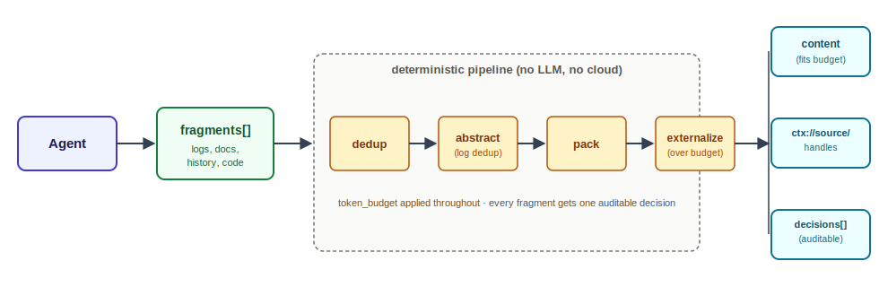
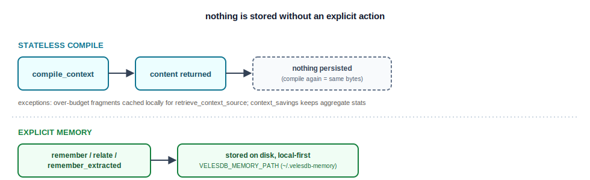
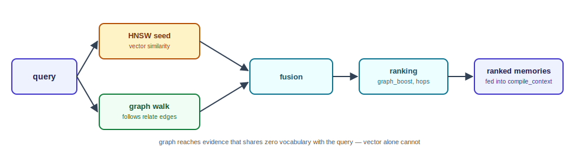
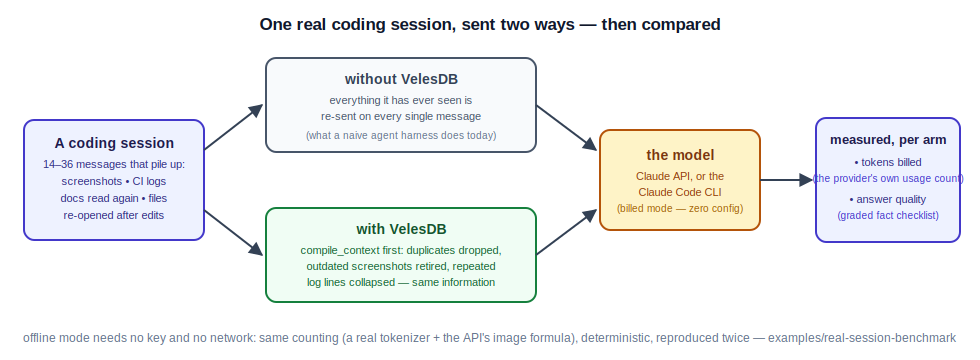
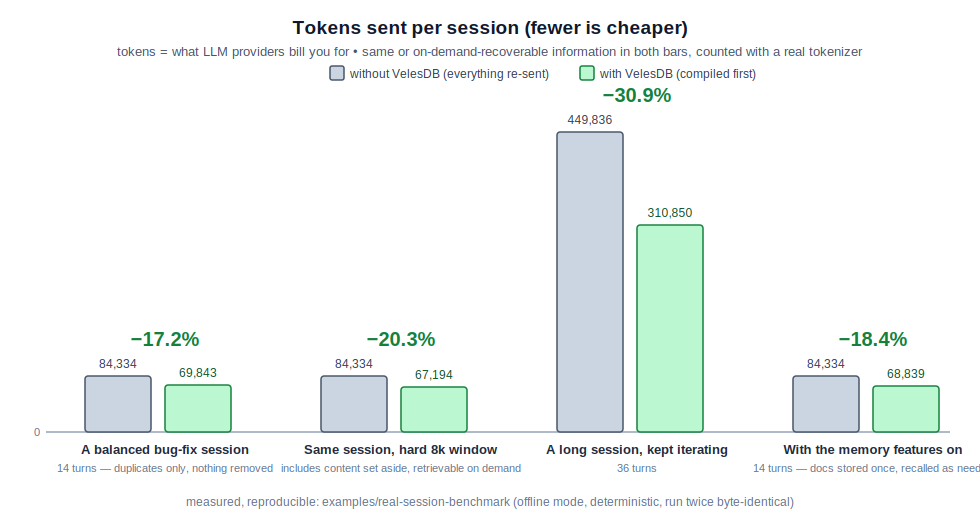
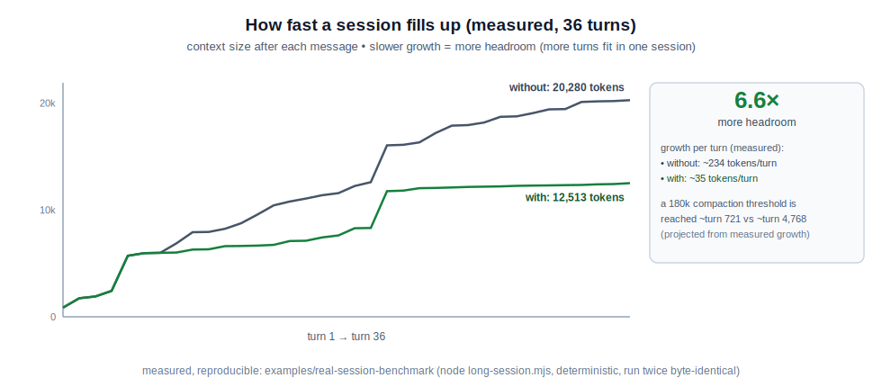

# velesdb-memory

[](https://crates.io/crates/velesdb-memory)
[](https://docs.rs/velesdb-memory)
[](https://www.npmjs.com/package/@wiscale/velesdb-memory-node)
[](https://pypi.org/project/velesdb/)
[](https://registry.modelcontextprotocol.io)
[-e8702a)](https://github.com/cyberlife-coder/VelesDB/blob/main/LICENSE)

**The explainable, local-first memory engine for AI agents — as a single MCP
server.** Give your coding agent durable memory that never leaves your machine:
it remembers decisions, recalls them semantically, and — the differentiator —
**connects** them so it can answer *why* a decision was made, not just retrieve
look-alike text. That auditable `why()` recall trail is the kind of
traceability the [EU AI Act](https://artificialintelligenceact.eu/implementation-timeline/)
(enforceable from Aug 2026) asks of AI systems; running fully local, it **helps
meet** those data-residency and explainability expectations rather than claiming
certified compliance.

> **Release 0.11.0** — multi-client memory: a single local `velesdb-memory
> --http` daemon (see "HTTP transport (multi-client)" below) now lets Claude
> Code, Claude Desktop, and Windsurf share the *same* memory instead of one
> client at a time, and serves **HTTPS by default** with a natively-generated
> local CA (no external `mkcert`/proxy) — some MCP clients refuse a
> non-`https://` URL even for `127.0.0.1`. `scripts/install-memory-daemon.sh`
> automates the whole setup, including trusting the CA. Every `remember` now
> auto-stamps a `_veles_date` field (`YYYYMMDD`, never overwritten if you set
> it yourself), so `recall_fused`'s `date_field` works with zero setup — this
> is the metadata-shape change that makes this a **minor**, not patch,
> release (a fact stored with no caller metadata no longer round-trips as
> `metadata: None`). Also fixes two independent deadlocks under concurrent
> `remember`/`recall` load found while building the daemon (rayon pool
> exhaustion + a lock-ordering inversion) — real risk for any consumer, not
> just the new HTTP transport, since both bugs lived in the shared storage
> layer. Published to the registries by the `velesdb-memory-v0.11.0`
> tag, so the links below may briefly lag right after merge. `velesdb-memory`
> ships on [crates.io](https://crates.io/crates/velesdb-memory) and on the
> [official MCP registry](https://registry.modelcontextprotocol.io)
> (`io.github.cyberlife-coder/velesdb-memory`, with **5 prebuilt `.mcpb` bundles**:
> macOS arm64/x64, Linux arm64/x64, Windows x64). Bindings: Node
> [`@wiscale/velesdb-memory-node`](https://www.npmjs.com/package/@wiscale/velesdb-memory-node) **0.11.0**
> and Python in [`velesdb`](https://pypi.org/project/velesdb/) **3.12.0**
> (memory API only — the context compiler is merged on `develop` but **the
> published 3.12.0 wheel predates it**; it ships with the next PyPI release,
> until then Python agents reach it through the MCP server).
> **`cargo install velesdb-memory` installs the latest published release.**

> **Bring your own reranker (Rust)**: `compile_context_reranked` hands the
> full fused candidate pool (vector + graph, pre-cutoff) to any
> [`Reranker`] you inject — a cross-encoder, an LLM judge — and its
> ordering decides which memories get compiled in. Never a default, and
> deliberately not on the wire: the shipped `DeterministicReranker` is
> lexical, and a lexical second stage demotes exactly the
> zero-vocabulary-overlap evidence the graph walk rescues (both behaviours
> pinned by tests). `recall_fused_reranked` is the same seam for plain
> recall.

Built on [VelesDB](https://velesdb.com)'s in-core Agent Memory SDK, which fuses
three engines behind its memory tools:

| Tool       | What it does                                               | Engines |
|------------|------------------------------------------------------------|---------|
| `remember` | store a fact, optionally linked + tagged with metadata, with an optional expiry (`ttl_seconds`); every fact is auto-stamped with today's date (`_veles_date`, a `YYYYMMDD` integer) unless you set it yourself, so temporal recall (`recall_fused`'s `date_field`) works with zero setup — see [Automatic dating](#automatic-dating-_veles_date) | Vector + Graph + ColumnStore |
| `recall`   | semantic retrieval, optional exact-match metadata filter   | Vector + ColumnStore |
| `relate`   | create a typed edge between two memories                   | Graph |
| `recall_fused` | recall with graph-aware re-ranking (vector + typed links fused); `date_field` (e.g. the automatic `_veles_date`) also returns a chronological `dated_context` timeline + `now` anchor | Vector + Graph |
| `recall_where` | recall filtered by typed column predicates (ranges, comparisons) | Vector + ColumnStore |
| `forget`   | delete a memory                                            | — |
| `why`      | recall a decision **+ its connected subgraph** (multi-hop) | Vector + Graph + ColumnStore |
| `feedback` | reinforce a recalled fact (**useful/noise**) — `recall` re-ranks by this learned confidence, so the memory **improves with use** without retraining | Vector |
| `remember_extracted` | extract facts from raw text + **auto-build the graph** (opt-in backend) | Vector + Graph |

`why` is the wedge: it surfaces related memories (the PR, the ticket, the
benchmark) reachable through typed links **even when they share no words** with
your question — exactly what a pure vector search is blind to.

By design the server exposes **memory semantics only** — never raw database
capabilities (`query`, `create_collection`, `upsert`, `traverse`). See
[License](#license).

### Automatic dating (`_veles_date`)

Every `remember`/`remember_extracted` call auto-stamps the fact's metadata with
`_veles_date` — today's date, read from the system clock, as a `YYYYMMDD`
integer — **unless the caller already set that key**, in which case it is
never overwritten. This used to be entirely the caller's job (write a numeric
date field yourself, e.g. `ts`/`occurred_at`, remember to keep it numeric);
now it's guaranteed by the server, with zero setup:

```jsonc
// no metadata at all — still gets a date
remember({ fact: "we chose parking_lot to avoid lock poisoning" })
// stored metadata: { "_veles_date": 20260723 }   (today, auto-stamped)

// recall_fused's date_field needs no caller-managed date field anymore
recall_fused({ query: "why parking_lot", date_field: "_veles_date" })
// → dated_context: "- [2026-07-23] we chose parking_lot ..."
//   now: "2026-07-23"
```

To date a fact **retroactively** (e.g. an incident that happened last month,
not today), set `_veles_date` explicitly in `metadata` — an explicit value is
always respected, never replaced:

```jsonc
remember({
  fact: "payment provider timeout set to 8s",
  metadata: { "_veles_date": 20260610 }   // when it actually happened
})
```

`_veles_date` behaves like ordinary metadata for every other purpose too — it
round-trips in `recall`/`recall_where`/`recall_fused` results and can be used
as a `recall_where` range filter (`{ field: "_veles_date", op: "ge", value:
20260101 }`) — it is the one metadata key namespaced under the internal
`_veles_` prefix that a caller MAY still set and see; every other `_veles_*`
key stays fully reserved (rejected on write, stripped from every read).

## See it (offline, one command)


```bash
cargo run -p velesdb-memory --example wow_offline
```

```text
recall("why we chose parking_lot")   [vector similarity only]
   0.47  we chose parking_lot to avoid lock poisoning after a panic
   0.18  PR #42 swaps the std Mutex for parking_lot
   └─ EPIC-317 is nowhere here — it shares no words with the question.

why("why we chose parking_lot")      [vector seed + graph traversal]
   hop 0  we chose parking_lot ...
   hop 1  PR #42 ...
   hop 2  EPIC-317: intermittent CI hang under load
   └─ the graph reached the very ticket the decision fixed.
```

A vector search ranks by resemblance; the ticket shares no words with the
question, so a pure similarity search is blind to it. `why()` follows the typed
links and reaches it. That gap is the product.

### Four runnable demos of the wedge

Each is a real run that shows what plain recall misses and `why()` recovers:

| Demo | What it shows |
|---|---|
| [`why_across_sessions.py`](../../examples/agent_memory/why_across_sessions.py) | the reason survives a process restart — recall of the top 5 of 16 memories stays blind, `why()` reaches it |
| [`why_magic_constant.py`](../../examples/agent_memory/why_magic_constant.py) | *why* a magic constant has its value — a business reason that shares no words with the code |
| [`memory_builds_its_own_graph.py`](../../examples/agent_memory/memory_builds_its_own_graph.py) | paste raw prose → a local model auto-wires the graph (no `relate()`), `why()` walks it to the root cause |
| [`why_magic_constant.mjs`](../velesdb-node/examples/why_magic_constant.mjs) (Node) | the same engine and wedge in the `@wiscale/velesdb-memory-node` binding |

> **Not a weak-embedder trick.** In each retrieval demo, recall stays blind to the
> reason **even under a real semantic embedder** (`ollama` / `all-minilm`), not just
> the offline `hash` default — the reason is connected by a *decision*, not by surface
> similarity, which is exactly what a vector store cannot follow.

## How it compares — and who it's for

velesdb-memory is **embedded memory, not a cloud memory service.** The
difference isn't a benchmark bar chart — it's three things no competitor
counters: an **evidence trail you can audit** (`why()` shows which facts an
answer came from), **zero AI calls to store a memory** (the incumbents run 2–3
AI-model calls per save — by default, paid cloud calls), and **published
retrieval numbers** — we measure, with no AI grader in the loop, how often the
memory finds the right information; to our knowledge, nobody else in this
market publishes that at all:

| | **velesdb-memory** | Mem0 | Zep / Graphiti |
|---|---|---|---|
| What it is | one embedded binary (vector + graph + column engines) | coordinator over separate services (Qdrant + Postgres) | coordinator, graph-centric (needs Neo4j/FalkorDB) |
| AI calls to store a memory | **zero required** (optional extraction runs on your local model) | AI-model calls on every write (cloud by default) | AI-model calls on every write (cloud by default) |
| Runs | **100% local / offline** | self-host still needs an AI service in the write path | Zep's self-hosted edition was discontinued; Graphiti needs a graph database + an AI service |
| Explains its answers | **yes** — `why()` returns the evidence trail | no — returns an answer only | no — returns an answer only |
| Publishes retrieval accuracy | **yes** — [+7.2pts multi-hop, +9.7pts time-scoped, no AI grader](BENCHMARK.md) | no | no |
| Time-related questions on LoCoMo | **55–61%** on a fully local model — floor = without the optional scaffold ([method + stats](BENCHMARK.md)) | 55.5% base / 58.1% graph-enhanced "Mem0g" (its own best score), both on cloud AI ([own paper](https://arxiv.org/abs/2504.19413)) | 49.3% on cloud AI — [as measured in Mem0's evaluation](https://arxiv.org/abs/2504.19413), which Zep disputes |

*Why no single "overall score" comparison row? Because overall scores from
different labs can't be fairly compared: the same product's score can swing
~21 points between two test setups, and vendor headlines often diverge widely
from what other labs measure. Our fully-local 56% aggregate comes with the
full method and statistics disclosed, and instead of a bar chart we publish
the complete sourced landscape — who measured what, with which AI models, and
which figures are disputed: [`BENCHMARK.md`](BENCHMARK.md).*

**Choose velesdb-memory when local-first is a requirement, not a preference:**
- **Regulated / sovereign data** (health, legal, finance, defense) — context can't transit a third-party LLM API; `why()` gives both data residency and an auditable recall trail.
- **Air-gapped / on-prem / edge** — a self-contained binary against a local model is the only shape that deploys with no outbound internet.
- **Cost-sensitive, high-volume agents** — running extraction + recall on a local stack removes the per-token cloud bill.

If you're cloud-native and want the largest community, Mem0 is the default reach. If your
data can't leave the box — or you need to *audit why* it recalled something — this is the
one that fits. (Deeper positioning: [`POSITIONING.md`](POSITIONING.md).)

### Benchmark

`cargo run --release -p velesdb-memory --example bench_multihop` isolates the
graph's contribution — 24 `decision → PR → problem` chains, the same embedder
throughout, only the graph toggled. Each question (`"why did we adopt <tech>"`)
has a 1-hop answer (the decision, shares words) and a 2-hop answer (the original
problem, shares none):

| embedder | direct recall | multi-hop, vector-only | multi-hop, **vector + graph** |
|----------|:-------------:|:----------------------:|:-----------------------------:|
| `hash` (deterministic) | 100% | 0% | **100%** |
| real model (Ollama `all-minilm`) | 100% | 33% | **100%** |

Read it this way: the **direct** control confirms the vector engine is healthy
(100% — it aces look-alike retrieval). On **multi-hop**, a real semantic embedder
still recovers only a third of the answers (the problem shares no words with the
question); the graph recovers all of them — **+67 pp** with a real model
(structurally +100 pp with the deterministic one). Run the real one yourself:

```bash
cargo build --release -p velesdb-memory --features ollama && ollama pull all-minilm
VELESDB_MEMORY_EMBEDDER=ollama \
  cargo run --release -p velesdb-memory --features ollama --example bench_multihop
```

> **Engine isolation, and extraction.** `bench_multihop` measures the *engine's*
> contribution on controlled data with the graph pre-wired, so the numbers
> reflect retrieval, not an LLM. For end-to-end *extraction* (turning raw text
> into the graph automatically), the server ships an opt-in layer — the
> `remember_extracted` tool / `MemoryService::remember_extracted`, backed by the
> dependency-free `Extractor` trait (bring your own LLM) or the built-in
> `OllamaExtractor` behind `--features extract`. The apples-to-apples comparison
> on the real [LoCoMo](https://github.com/snap-research/locomo) dataset lives in
> [`examples/locomo/`](examples/locomo/README.md): it builds a fact↔entity graph
> from the conversations and scores the graph's QA contribution with a hybrid
> LLM-judge + deterministic metric. The core stays bring-your-own-links;
> extraction is a commodity on top.

### On public benchmarks — each engine, measured

The controlled demo above proves the *idea*; these run the same engines on
**public, third-party datasets** with **generation-free** metrics (pure retrieval
recall — no LLM in the scoring loop, so the number is the memory, not a model).
Each engine is isolated against a pure-vector baseline. Full method, tables and
honest limits in [`BENCHMARK.md`](BENCHMARK.md) and [`POSITIONING.md`](POSITIONING.md);
every figure reproduces from the bundled examples.

| Engine | Public benchmark | What it measures | Vector → fused |
|---|---|---|---|
| **Graph** (`why()` BFS) | HotpotQA (3 000 dev, distractor) | retrieving *both* bridge facts of a multi-hop question | **+7.2pp** both-facts on bridge questions (+5.6pp all types) |
| **Graph** — *replicated* | 2WikiMultiHopQA (1 000 dev) | supporting-fact recall, second independently built dataset | **+2.6 to +3.1pp** on its three bridged types (+2.1pp overall) |
| **ColumnStore** (`recall_where`) | TimeQA (real Wikipedia bios) | time-scoped recall a year-range filter can do and cosine can't | **+9.7pp** gold-sentence recall |
| **Tri-engine** (compound) | synthetic, multi-hop **and** time-scoped | do the engines *stack*? | **+29pp** together — more than the sum of each alone |

Read it straight: the graph helps exactly where a second hop is required — and the
lift survives moving to a *different* multi-hop dataset (more modest there, +2.1pp
overall, stated as measured — not a one-dataset fluke). The ColumnStore wins where
the answer hinges on a number cosine cannot rank. And on a task that needs *both*,
they compound rather than merely coexist. A pure vector store / RAG orchestrator
has none of these — it ranks by similarity and stops.

## Install

**One command (recommended, with a Rust toolchain present):**

```bash
cargo install velesdb-memory
# → installs the `velesdb-memory` MCP server binary onto your PATH
```

The binary is tiny, zero-dependency, and fully offline. It speaks MCP over
**stdio**, so client and server run on the same machine and the memory never
leaves it.

**From the workspace (for hacking on the server itself):**

```bash
cargo build --release -p velesdb-memory   # → target/release/velesdb-memory
```

> **In an MCP client (no Rust toolchain needed):** velesdb-memory is listed on the
> [official MCP registry](https://registry.modelcontextprotocol.io) as
> `io.github.cyberlife-coder/velesdb-memory`. Registry-aware clients can install it
> straight from the per-platform `.mcpb` bundles attached to each
> [GitHub release](https://github.com/cyberlife-coder/VelesDB/releases). A
> `curl | sh` / Homebrew installer is a tracked follow-up; with a Rust toolchain,
> `cargo install velesdb-memory` is the supported one-liner.

## Configure your client

All clients use the same stdio shape — point `command` at the built binary.
`cargo install velesdb-memory` puts it at `~/.cargo/bin/velesdb-memory`
(or the path of your local build, `target/release/velesdb-memory`).
JSON/TOML configs spawn the binary without a shell, so `~` is **not**
expanded there — use an absolute path (shown below as
`/home/you/.cargo/bin/velesdb-memory`; adjust to your home directory).

**Claude Code** — the one command most people need:

```bash
claude mcp add velesdb-memory \
  --env VELESDB_MEMORY_PATH="$HOME/.velesdb-memory" \
  -- ~/.cargo/bin/velesdb-memory
```

That's it — jump straight to [teach your agent the flow](#teach-your-agent-the-flow-skill)
below. Using a different client instead? Expand for its config:

> **macOS, and want several clients sharing one memory?** Skip everything
> below and run `./scripts/install-memory-daemon.sh` instead — it builds,
> runs, and wires Claude Code / Claude Desktop / Windsurf / Devin CLI to a
> single shared daemon in one command (see "HTTP transport" further down).

<details>
<summary><strong>Cursor, Cline, Zed, Codex CLI, opencode, Claude Desktop, Windsurf, Devin CLI</strong></summary>

**Cursor** — `~/.cursor/mcp.json` (global) or `.cursor/mcp.json` (per project)

```json
{ "mcpServers": { "velesdb-memory": {
  "command": "/home/you/.cargo/bin/velesdb-memory",
  "env": { "VELESDB_MEMORY_PATH": "/home/you/.velesdb-memory" }
} } }
```

**Cline** — `cline_mcp_settings.json` — same `mcpServers` block as Cursor.

**Zed** — `settings.json`

```json
{ "context_servers": { "velesdb-memory": {
  "command": { "path": "/home/you/.cargo/bin/velesdb-memory", "args": [],
    "env": { "VELESDB_MEMORY_PATH": "/home/you/.velesdb-memory" } }
} } }
```

**Codex CLI** — `codex mcp add`, or a `[mcp_servers.*]` table in `~/.codex/config.toml`

```bash
codex mcp add velesdb-memory \
  --env VELESDB_MEMORY_PATH="$HOME/.velesdb-memory" \
  -- ~/.cargo/bin/velesdb-memory
```

```toml
# equivalent ~/.codex/config.toml entry
[mcp_servers.velesdb-memory]
command = "/home/you/.cargo/bin/velesdb-memory"
args = []
env = { VELESDB_MEMORY_PATH = "/home/you/.velesdb-memory" }
```

**opencode** — `opencode.json` (per project) or `~/.config/opencode/opencode.json` (global)

```json
{ "mcp": { "velesdb-memory": {
  "type": "local",
  "command": ["/home/you/.cargo/bin/velesdb-memory"],
  "enabled": true,
  "environment": { "VELESDB_MEMORY_PATH": "/home/you/.velesdb-memory" }
} } }
```

**Claude Desktop** — `claude_desktop_config.json` (macOS:
`~/Library/Application Support/Claude/claude_desktop_config.json`)

```json
{ "mcpServers": { "velesdb-memory": {
  "command": "/home/you/.cargo/bin/velesdb-memory",
  "env": { "VELESDB_MEMORY_PATH": "/home/you/.velesdb-memory" }
} } }
```

**Windsurf** — `~/.codeium/windsurf/mcp_config.json`

```json
{ "mcpServers": { "velesdb-memory": {
  "command": "/home/you/.cargo/bin/velesdb-memory",
  "env": { "VELESDB_MEMORY_PATH": "/home/you/.velesdb-memory" }
} } }
```

**Devin CLI** — `~/.config/devin/config.json` (its `mcpServers` block sits
inside a top-level `{"version": 1, ...}` envelope, unlike the clients above)

```json
{ "version": 1, "mcpServers": { "velesdb-memory": {
  "command": "/home/you/.cargo/bin/velesdb-memory",
  "env": { "VELESDB_MEMORY_PATH": "/home/you/.velesdb-memory" }
} } }
```

</details>

## Teach your agent the flow (skill)

Wiring the MCP server gives your agent the *tools*; it doesn't tell it *when* to
use them — and the differentiator (`why`) only pays off if the agent builds the
graph as it works. Ship it the flow with the bundled **agent skill**:

```bash
# Claude Code / opencode: copy the skill into your skills directory
cp -r crates/velesdb-memory/skill/velesdb-memory ~/.claude/skills/
```

[`skill/velesdb-memory/SKILL.md`](skill/velesdb-memory/SKILL.md) teaches the agent
the loop — *recall before acting → remember decisions with metadata **and** links →
`relate` facts as relationships appear → `why` to explain → `feedback` to reinforce* —
with concrete scenarios (incident→decision→"why?", onboarding, cross-session
continuity). Without it, an agent will call `recall` at best and never build the
graph that makes `why` shine.

A second bundled skill, **`velesdb-context-optimizer`**, teaches the compiler
workflow below (when/what to compress, how to read `risk`). Install it the
same way:

```bash
cp -r skills/velesdb-context-optimizer ~/.claude/skills/
```

[`skills/velesdb-context-optimizer/SKILL.md`](https://github.com/cyberlife-coder/VelesDB/blob/main/skills/velesdb-context-optimizer/SKILL.md)
— see [The context compiler tools](#the-context-compiler-tools) below.

**No repo clone needed:** every [GitHub Release](https://github.com/cyberlife-coder/VelesDB/releases/latest)
attaches `velesdb-skills.tar.gz` — both skills, one folder per skill at the
archive root — so a one-liner installs them straight from the release:

```bash
curl -L https://github.com/cyberlife-coder/VelesDB/releases/latest/download/velesdb-skills.tar.gz \
  | tar -xz -C ~/.claude/skills/
```

**Skills teach an agent what to do; they don't make it remember to do it.**
[`integrations/agent-hooks/`](https://github.com/cyberlife-coder/VelesDB/tree/develop/integrations/agent-hooks)
closes that gap for Claude Code with real `SessionStart`/`Stop`/`PreCompact`
hooks that nudge `load_working_context`/`save_working_context` automatically
— install once **globally** (`~/.claude/hooks/`) to get continuous memory
across every project, or per-project if you'd rather vendor the scripts into
one repo. Codex CLI has no hook mechanism yet; the same directory documents
an `AGENTS.md`-based convention for it.

## HTTP transport (multi-client)

**You don't need this to get started** — it's for later, once you're already
using velesdb-memory and want more than one client (say, Claude Code *and*
Claude Desktop) sharing the same memory at the same time instead of one at a time.

Every config above spawns its own `velesdb-memory` process over stdio — and
the store's single-writer `flock` means only ONE of those processes can hold
it open at a time, so only one client can actually use memory at once.
Switching a client mid-session, or running two clients side by side, fails
with an opaque `Storage(DatabaseLocked)`.

The fix: build with `--features http` and run ONE `velesdb-memory --http`
daemon that every client connects to instead of spawning its own process.
The hash/ollama embedder choice stays a pure runtime switch either way — only
the transport changes.

The daemon serves **HTTPS by default**, terminated with a CA + leaf
certificate it generates itself — no `mkcert`/`openssl`/reverse proxy to
install. Some MCP clients (e.g. Claude Desktop's "Add custom connector" UI)
refuse any URL that isn't `https://`, even for `127.0.0.1`, so plain HTTP is
no longer viable as the default.

```bash
cargo install velesdb-memory --features http,ollama
# → still opt into `ollama` at BUILD time only if you want that embedder available;
#   VELESDB_MEMORY_EMBEDDER stays a runtime choice regardless (see "Embedding backend" below)
velesdb-memory --http
# [velesdb-memory] HTTPS server listening on https://127.0.0.1:18090/mcp
# [velesdb-memory] Local CA: /home/you/.velesdb-memory-tls/ca-cert.pem — a client only needs to
# trust this once (see ./scripts/install-memory-daemon.sh, which does this automatically on
# macOS); every future leaf certificate this daemon issues is signed by the same CA and is
# trusted automatically after that.
```

- `--http` / `VELESDB_MEMORY_HTTP=1` — serve over streamable-HTTP instead of stdio.
- `--http-port <PORT>` / `VELESDB_MEMORY_HTTP_BIND=<host:port>` — override the
  bind address (default `127.0.0.1:18090`; `--http-port` overrides just the
  port on top of `VELESDB_MEMORY_HTTP_BIND`).
- `--http-insecure` / `VELESDB_MEMORY_HTTP_INSECURE=1` — opt OUT of HTTPS and
  serve plain HTTP instead, printing a loud warning at startup. For local
  debugging, or when a trusted TLS-terminating proxy already sits in front —
  not for normal use.
- The transport has **no authentication** — anyone who can reach the socket
  gets full `remember`/`recall`/`relate` access to the store. HTTPS-by-default
  protects the bytes on the wire from anyone else on the same machine reading
  them, but it is not access control: that's still the default loopback-only
  bind (only processes on the same machine can reach it at all), so a
  non-loopback `VELESDB_MEMORY_HTTP_BIND` host is refused at startup unless
  you also set `VELESDB_MEMORY_HTTP_ALLOW_REMOTE=1`. Only set that if you're
  putting an authenticating reverse proxy in front — never point the bare
  daemon at a network-reachable address.

### The local CA

On first start, the daemon generates a self-signed root CA and caches it at
`$VELESDB_MEMORY_TLS_DIR` (default `~/.velesdb-memory-tls`, a sibling of the
default store — deliberately not nested inside it, since wiping the store to
reset your memory shouldn't also invalidate a CA your OS has been told to
trust). **The CA is never regenerated once it exists** — that's the entire
point of caching it: trust it once, and every leaf certificate it signs
afterwards (including ones re-issued across restarts) is automatically
trusted with no further action. The leaf certificate itself (for
`localhost`/`127.0.0.1`/`::1`) is short-lived (30 days) and silently re-issued
— re-signed by the same CA, no new trust required — on every daemon start.

The CA's private key is written with `0600` permissions (owner-read/write
only) and its directory with `0700`; only the certificate itself
(`ca-cert.pem`) is meant to be handed to a trust store or another machine.

`scripts/install-memory-daemon.sh` adds the CA to your macOS **login**
keychain (not the system one — no `sudo` needed) as a trusted root for SSL,
so a strict HTTPS client (a browser, plain `curl`) connects with no warning.
macOS may show a system prompt (Touch ID / password) to confirm this — the
installer waits up to 60s for it; if it times out or you'd rather do it by
hand, it prints the exact command:

```bash
security add-trusted-cert -r trustRoot -p ssl \
  -k ~/Library/Keychains/login.keychain-db \
  ~/.velesdb-memory-tls/ca-cert.pem
```

Node-based tools (Claude Code's CLI, Electron apps like Claude Desktop) don't
always consult the OS keychain for TLS trust the way `curl`/Safari do. If one
of them still reports a certificate error after the keychain step above,
point it at the CA directly:

```bash
export NODE_EXTRA_CA_CERTS="$HOME/.velesdb-memory-tls/ca-cert.pem"
```

- `GET /health` — plain 200 OK liveness probe (no MCP handshake needed) —
  what the installer script and CI use to confirm the daemon is up (over
  HTTPS too, once TLS is the transport).
- `VELESDB_MEMORY_HTTP_MAX_BODY_BYTES` — max size of a single `/mcp` request
  body, in bytes (default 16 MiB). A misbehaving or hostile client sending an
  oversized request is rejected instead of having its body buffered into
  memory unbounded.
- `VELESDB_MEMORY_HTTP_MAX_SESSIONS` — max number of concurrent MCP sessions
  (default 64). Each session holds a worker task and a couple of small
  bounded channels — cheap individually, but with no ceiling on the *count* a
  client that opens sessions without closing them (malicious, or just buggy)
  could otherwise grow that without bound. 64 is generous headroom for this
  daemon's actual shape: a handful of local, cooperating clients, not a
  public service.
- The store's `flock` is unchanged: a *second* `velesdb-memory --http` (or a
  stray stdio process) against the same store still fails fast with the same
  actionable lock message — the daemon is the ONE process that opens the
  store; every client just connects to it over the network.

Point each client's config at the daemon instead of a local binary:

**Claude Code**

```bash
claude mcp add --transport http velesdb-memory https://127.0.0.1:18090/mcp
```

**Cursor** / **Cline** — same `mcpServers` files as above, `type: "http"` instead of `command`:

```json
{ "mcpServers": { "velesdb-memory": {
  "type": "http",
  "url": "https://127.0.0.1:18090/mcp"
} } }
```

**Claude Desktop** — a different mechanism than every other client above.

Desktop's local config file (`claude_desktop_config.json`) only recognizes
stdio (`command`) entries — a `url`/`type: "http"` block there is silently
ignored (confirmed: it does not even try to connect). Use Desktop's own UI
instead: **Settings → Connectors → Add custom connector**, paste the daemon
URL directly:

```
https://127.0.0.1:18090/mcp
```

No API key/OAuth secret needed — the daemon binds to loopback only. This
requires HTTPS specifically (Desktop's connector dialog rejects a plain
`http://` URL outright, even for `127.0.0.1`), which is exactly what this
daemon serves by default — see "trusting the local CA" earlier in this
section if the connection fails with a certificate warning.

If you'd rather not use the Connectors UI, the stdio fallback still works —
same block as every other client above, but point `VELESDB_MEMORY_PATH` at a
**different** directory than the daemon's store: pointed at the same one, the
fallback process and the daemon would fight over the same `flock`,
reproducing the exact `DatabaseLocked` problem this section exists to avoid.
This gives Desktop its own separate memory, not shared with the daemon.

**Windsurf** — `~/.codeium/windsurf/mcp_config.json`

```json
{ "mcpServers": { "velesdb-memory": {
  "serverUrl": "https://127.0.0.1:18090/mcp"
} } }
```

**Devin CLI** — `~/.config/devin/config.json`

```json
{ "version": 1, "mcpServers": { "velesdb-memory": {
  "url": "https://127.0.0.1:18090/mcp",
  "transport": "http"
} } }
```

`scripts/install-memory-daemon.sh` automates all of this end to end: building
with the right features, running the daemon (as a macOS `launchd` agent),
trusting the local CA in your login keychain, and wiring Claude Code / Claude
Desktop / Windsurf / Devin CLI — see `--help` for flags (`--embedder`,
`--port`, `--store`, `--tls-dir`, `--ttl`, `--skip-client`, `--skip-ca-trust`,
`--uninstall`, …).

## Teach your agent the flow (skill)

Wiring the MCP server gives your agent the *tools*; it doesn't tell it *when* to
use them — and the differentiator (`why`) only pays off if the agent builds the
graph as it works. Ship it the flow with the bundled **agent skill**:

```bash
# Claude Code / opencode: copy the skill into your skills directory
cp -r crates/velesdb-memory/skill/velesdb-memory ~/.claude/skills/
```

[`skill/velesdb-memory/SKILL.md`](skill/velesdb-memory/SKILL.md) teaches the agent
the loop — *recall before acting → remember decisions with metadata **and** links →
`relate` facts as relationships appear → `why` to explain → `feedback` to reinforce* —
with concrete scenarios (incident→decision→"why?", onboarding, cross-session
continuity). Without it, an agent will call `recall` at best and never build the
graph that makes `why` shine.

A second bundled skill, **`velesdb-context-optimizer`**, teaches the compiler
workflow below (when/what to compress, how to read `risk`). Install it the
same way:

```bash
cp -r skills/velesdb-context-optimizer ~/.claude/skills/
```

[`skills/velesdb-context-optimizer/SKILL.md`](https://github.com/cyberlife-coder/VelesDB/blob/main/skills/velesdb-context-optimizer/SKILL.md)
— see [The context compiler tools](#the-context-compiler-tools) below.

**No repo clone needed:** every [GitHub Release](https://github.com/cyberlife-coder/VelesDB/releases/latest)
attaches `velesdb-skills.tar.gz` — both skills, one folder per skill at the
archive root — so a one-liner installs them straight from the release:

```bash
curl -L https://github.com/cyberlife-coder/VelesDB/releases/latest/download/velesdb-skills.tar.gz \
  | tar -xz -C ~/.claude/skills/
```

**Skills teach an agent what to do; they don't make it remember to do it.**
[`integrations/agent-hooks/`](https://github.com/cyberlife-coder/VelesDB/tree/develop/integrations/agent-hooks)
closes that gap for Claude Code with real `SessionStart`/`Stop`/`PreCompact`
hooks that nudge `load_working_context`/`save_working_context` automatically
— install once **globally** (`~/.claude/hooks/`) to get continuous memory
across every project, or per-project if you'd rather vendor the scripts into
one repo. Codex CLI has no hook mechanism yet; the same directory documents
an `AGENTS.md`-based convention for it.

## Using the tools

Once configured, your agent discovers the tools automatically (via MCP
`tools/list`). Each takes JSON and returns JSON:

```jsonc
// remember — store a fact; returns a stable, content-derived id
//            (re-remembering identical text is idempotent — same id, updated in place)
remember { "fact": "we chose parking_lot to avoid lock poisoning",
           "metadata": { "project": "checkout" },                  // optional → enables filtering
           "links":   [ { "target": 1234, "relation": "decided_in" } ],  // optional typed edges
           "ttl_seconds": 604800 }                                 // optional → expires in 7 days
→ { "id": 9876543210 }

// relate — add a typed edge between two existing memories
relate { "from": 9876543210, "to": 1234, "relation": "depends_on" }
→ { "edge_id": 42 }

// recall — semantic search; optional exact-match metadata filter (ColumnStore)
recall { "query": "billing retries", "limit": 5, "filter": { "project": "checkout" } }
→ { "memories": [ { "id": 9876543210, "score": 0.59, "content": "…" }, … ] }

// why — the differentiator: best match + its connected subgraph (multi-hop)
why { "decision": "why did we choose parking_lot", "max_hops": 2,
      "filter": { "project": "checkout" } }
→ { "nodes": [ { "id": …, "content": "…", "hop": 0 }, … ],
    "edges": [ { "from": …, "to": …, "relation": "decided_in" }, … ] }

// forget — delete a memory by id
forget { "id": 9876543210 } → { "id": 9876543210, "found": true }

// remember_extracted — extract facts from raw text and auto-wire the graph
//   (opt-in: needs a server built with --features extract + VELESDB_MEMORY_EXTRACTOR)
remember_extracted { "text": "Met Dana at the Rust meetup; she now leads the parser rewrite." }
→ { "ids": [ 11122233, 44455566 ] }   // stored facts; topics become shared graph hubs
```

`limit` defaults to 10 (capped at 1000); `max_hops` defaults to 2 (capped at 10);
`links`, `metadata`, and `filter` are optional.

### The context compiler tools

**Compiler surfaces today: MCP server and Rust** ship the full tool set
(`compile_context`, `retrieve_context_source`, `context_savings`,
`save_working_context`, `load_working_context`, `explain_compilation`;
`compile_context_reranked` is Rust-only). **Node**
(`@wiscale/velesdb-memory-node`) has `compileContext`, `retrieveContextSource`,
`save/loadWorkingContext`, and `feedback`, but not yet `context_savings` or
`explain_compilation`. **Python** (`from velesdb import MemoryService`) has
`compile_context`, `retrieve_context_source`, `context_savings`,
`save/load_working_context`, and `feedback` merged on `develop` (no
`explain_compilation` yet) — but the published PyPI wheel predates all of
it; until the next PyPI release, Python agents reach the compiler through
the MCP server. Any MCP-speaking client gets the full surface regardless of
language. **`compile_transcript` is MCP-only for now** — Rust callers get the
same building blocks directly (`context::segment_transcript` +
`ContextCompiler`/`MemoryService::compile_context`), but neither the Node nor
the Python binding exposes a one-call convenience method yet (tracked as a
follow-up, see `CHANGELOG.md`).

**Why:** agents spend most of their tokens re-reading redundant context.
`compile_context` compresses it **deterministically** — no LLM, no cloud, no
API key: same request, byte-identical output. What must survive verbatim
does (code fences, URLs, numbers/dates/ids, negative constraints, anything
marked `{"verbatim": true}`); duplicates drop; repeated log lines collapse
with counts (`ERROR timeout (x50)`); over-budget content becomes a
recoverable `ctx://source/` handle instead of a silent loss; and every
fragment gets one auditable decision (stable rule id, reason, relevance,
risk). Guarantees, per compilation:

- **Budget**: the assembled content never exceeds `token_budget`.
- **Provenance**: `sources` + per-decision `content_hash` identify the exact
  bytes; `retrieval_handles` list what was externalized.
- **Nothing critical silently lost**: losing preserve-classified content
  raises the compilation's `risk` to `"high"` — check it before use.

#### How it works



**Not a transparent proxy.** `compile_context` only touches what your agent
explicitly hands it as `fragments` — logs, retrieved docs, conversation
history you choose to route through the call. It never sees or compresses
the harness's system prompt or tool-call schemas; those stay outside the
compiler entirely. Knowing *when* and *what* to route through it is the
[`velesdb-context-optimizer`](https://github.com/cyberlife-coder/VelesDB/blob/main/skills/velesdb-context-optimizer/SKILL.md)
skill's job, not the compiler's — the compiler just compresses what it's
given, deterministically.

**No automatic repo indexing.** Nothing enters *recallable* memory — what
`recall` / `why` / `memory_scope` can surface — unless you call `remember` /
`relate` / `remember_extracted` explicitly. Compilation does write two things
to the local store under `VELESDB_MEMORY_PATH` (default `~/.velesdb-memory`):
**all** fragment sources are cached locally (content-addressed — not just the
over-budget ones) so every `ctx://source/` handle stays recoverable via
`retrieve_context_source`, and `context_savings` records aggregate stats
(tokens in/out/saved) per project. Both stay on disk — local-first, nothing
is ever sent off the machine.



```jsonc
// compile_context — minimal call: query + token_budget + fragments
compile_context { "query": "state of the canary deploy",
                  "token_budget": 500,
                  "fragments": [
                    { "content": "The canary is green: 2% traffic, zero errors in the last 10 minutes." },
                    { "content": "Rollback runbook: kubectl rollout undo deployment/canary." } ] }
→ { "content": "…both fragments packed…", "decisions": […2 entries, "action": "preserve"…],
    "insights": { "tokens_in": 44, "tokens_out": 45, "tokens_saved": 0 }, "risk": "low" }
```

Add `memory_scope`, `project`, and `metadata: {"cache": true}` once you need
stored-memory recall or provider prompt-cache alignment — the full request:

```jsonc
// compile_context — deterministic compression under a token budget
compile_context { "query": "state of the canary deploy",
                  "token_budget": 4000,
                  "project": "veles",
                  "memory_scope": { "k": 5 },                 // optional: pull relevant memories in
                  "fragments": [
                    { "content": "You are the deploy assistant.", "metadata": { "cache": true } },
                    { "content": "<600 lines of CI logs>", "kind": "log" },
                    { "content": "Never restart the primary during a rebalance." } ] }
→ { "content": "…", "sections": […], "decisions": […], "sources": […],
    "retrieval_handles": […], "insights": { "tokens_in": 2244, "tokens_out": 545,
    "tokens_saved": 1699, … }, "risk": "low" }

// retrieve_context_source — what was externalized is recoverable, byte for byte
retrieve_context_source { "handle": "ctx://source/1234567890" }
→ { "handle": "ctx://source/1234567890", "content": "…original bytes…" }

// explain_compilation — "why was this fragment dropped/shortened?" (stateless:
//   compilation is deterministic, so the request is re-compiled)
explain_compilation { "request": { …same request… }, "fragment_id": 1234567890 }
→ { "action": "drop", "rule_id": "drop.duplicate", "reason": "…", "risk": "low", … }

// explain_compilation — byte-identical fragments share a content-addressed
//   fragment_id, so a plain fragment_id lookup always resolves to the
//   deduplication survivor. Pass fragment_index (0-based position in
//   request.fragments) to target one specific fragment instead:
explain_compilation { "request": { …fragments: [a, a]… }, "fragment_id": 1234567890,
                       "fragment_index": 1 }
→ { "action": "drop", "rule_id": "drop.duplicate", … }   // the SECOND "a", not the survivor

// context_savings — aggregate recorded savings, optionally per project
context_savings { "project": "veles" }
→ { "events": 12, "tokens_in": …, "tokens_saved": …, "truncated": false }
```

> **JS clients talking raw MCP (no Node binding): watch `fragment_id` /
> `content_hash` / `memory_id` precision.** Every id in a `compile_context` or
> `explain_compilation` response is a `u64`. The [`@wiscale/velesdb-memory-node`
> binding](https://www.npmjs.com/package/@wiscale/velesdb-memory-node) always crosses ids as
> decimal strings, so it is unaffected — but a plain MCP client speaking JSON
> straight over stdio/SSE (no binding in between) gets a JSON *number*, and
> `JSON.parse` in JS represents that as an IEEE-754 double: ids above
> `2^53 − 1` (`9007199254740991`) silently lose precision. Set
> `"policy": { "ids_as_strings": true }` on the request to opt every id field
> of that response into decimal-string form instead (same rewrite the Node
> binding applies internally, reused — not reimplemented). Default `false`:
> existing clients keep today's numeric response unless they opt in.
> `fragments[].id` on the way IN already accepts either a JSON number or a
> decimal string, so a caller can resubmit an id it received stringified
> without converting it back.

Preservation rules (stable ids, first match wins): `preserve.marked_verbatim`,
`cache.stable_prefix` (cache-marked fragments form a stable prefix for
provider prompt caching), `preserve.code_fence`,
`preserve.negative_constraint`, `abstract.log_dedup`,
`preserve.exact_values`, `preserve.url`, `preserve.default`; the budget layer
adds `budget.externalize` and dedup adds `drop.duplicate` /
`drop.near_duplicate`. First-match-wins also means `media.atomic` is checked
*before* `cache.stable_prefix`: a media fragment marked `metadata: {"cache":
true}` still classifies `media.atomic` and packs in the Body section, never
the Cache prefix — the cache flag is ignored on media fragments.

`insights.tokens_saved` is a **local estimate**, calibrated against a real
BPE (cl100k) to deliberately over-count every measured content class
(+9.6 %…+63.8 %, per-class figures in the table below) — not the provider's
count, not billed tokens, not cache reads.
The reproducible benchmark ([`examples/context_savings`](examples/context_savings))
measures **82.5 % real (cl100k) token savings on a committed 12-turn agent-session benchmark** (sub-ms stateless compiles), 75–82 % estimated savings on its static corpus in ~2 ms compile, and — with `memory_scope`'s fused HNSW + graph-walk recall over `relate`-linked fact chains — **9/9 answer facts surfaced vs 3/9 for vector-only recall** on the committed tri-engine benchmark
latency. The committed
[`cache_prefix`](examples/context_savings/real_measures/cache_prefix.mjs)
harness measures the `cache: true` prefix's byte stability directly: across
10 consecutive compiles with changing volatile content, the cache section is
a byte-identical **100 % stable prefix on all 9 consecutive turn pairs**
(reproducible: two full 10-turn runs, byte-identical). That measurement
holds the query fixed across turns; the guarantee also holds when the query
*changes* ([issue #1455](https://github.com/cyberlife-coder/VelesDB/issues/1455),
fixed): a `cache: true` fragment's rank never consults relevance, so when a
budget is too tight for every cache-marked fragment, which ones survive is
decided by priority then input order alone — never by lexical relevance to
the query — so the Cache prefix stays byte-identical across a query change
at a fixed fragment set and budget. The accepted trade-off: a same-tier
non-cache fragment that is more relevant to the query can still lose that
tight-budget race to a cache-marked fragment (stability wins over relevance,
but only for cache-marked fragments). That tri-engine path — the one `memory_scope` drives inside `compile_context` — looks like this:



The [`velesdb-context-optimizer`](https://github.com/cyberlife-coder/VelesDB/blob/main/skills/velesdb-context-optimizer/SKILL.md)
skill teaches an agent the full workflow — including when *not* to compress.

#### Measured on a real coding session

Your AI coding assistant re-sends everything it has seen on every single
message — old screenshots, logs it already read, files it re-opened. VelesDB
compiles that context first: same information, fewer tokens (what LLM
providers bill you for), so each message costs less and your session lasts
longer before hitting the context limit.

To measure that, a committed benchmark replays a realistic multi-turn coding
session — screenshots, CI logs, documents the assistant reads again, code
files re-opened after edits — two ways: once sending everything raw, once
compiled through `compile_context`. Everything is counted with cl100k (a
real tokenizer — the same counting the API does) and the API's own
image-pricing formula. Every run is deterministic and was reproduced twice,
byte-identical:



| Scenario | Without VelesDB | With VelesDB | Saved |
|---|---|---|---|
| A balanced bug-fix session (14 turns) | 84,334 tokens | 69,843 tokens | **17.2 %** — duplicates and outdated screenshots only; nothing unique removed |
| The same session with a hard 8,000-token window | 84,334 tokens | 67,194 tokens | **20.3 %** — the extra points come from content set aside (retrievable on demand — never deleted), not from more duplicates |
| A long session where you keep iterating (36 turns) | 449,836 tokens | 310,850 tokens | **30.9 %** — savings compound as the session grows |
| With the memory features turned on (14 turns) | 84,334 tokens | 68,839 tokens | **18.4 %** — reference docs stored once, recalled per turn, out-of-the-box settings |



The long session also answers the endurance question: over the full
measured session (feature-building included) the raw context grows ~555
tokens per message versus ~333 compiled — **1.7× more headroom** (how many
more turns fit in one session before the context limit forces a
summarize-and-restart), and **up to 6.6×** in the verification/wrap-up
phase, where most turns are re-reads. Projections always use the
full-session rate:



Reproduce any of these in one command, no key and no network needed
(`node examples/real-session-benchmark/offline.mjs`, `long-session.mjs`,
`memory-enabled.mjs`). An opt-in billed mode measures the same session
against real provider usage — through your own Claude Code CLI account with
zero configuration, or an API key — and additionally grades real generated
answers in both arms against a committed fact checklist, so a token saving
that costs answer quality is reported, never hidden. Full protocol,
attribution details, and caveats →
[`examples/real-session-benchmark/`](https://github.com/cyberlife-coder/VelesDB/tree/main/examples/real-session-benchmark)
(repo root — commands above run from a repo checkout).

#### Exact token estimators

The default [`HeuristicEstimator`](https://docs.rs/velesdb-memory/latest/velesdb_memory/context/struct.HeuristicEstimator.html)
is a deterministic, dependency-free char-class approximation, calibrated to
**always over-count** a real BPE (never under, so packing never silently
overflows a provider's window) — measured margins from +9.6 % (CJK) to
+63.8 % (English prose) on the committed
[`exact_estimator`](examples/context_savings/real_measures/exact_estimator.mjs)
harness (numbers below are from its own runs, reproducible: two runs, byte-
and figure-identical). For an id-dense corpus against a tight budget, or
whenever you need the provider's real count instead of a safe
over-approximation, inject a model-exact
[`TokenEstimator`](https://docs.rs/velesdb-memory/latest/velesdb_memory/context/trait.TokenEstimator.html)
via `ContextCompiler::with_estimator` — the trait is two methods, one of
them defaulted:

```rust
use velesdb_memory::context::TokenEstimator;

/// OpenAI cl100k, via any tiktoken-style encoder you already depend on
/// (not a VelesDB dependency — bring your own, e.g. `tiktoken-rs`).
struct Cl100kEstimator(tiktoken_rs::CoreBPE);

impl TokenEstimator for Cl100kEstimator {
    fn estimate(&self, text: &str) -> u64 {
        self.0.encode_ordinary(text).len() as u64
    }
    // bytes_per_token_hint: default (3) is a fine sizing hint for cl100k prose.
}

// with_estimator takes a boxed trait object (DynTokenEstimator):
let compiler = ContextCompiler::new(CompilePolicy::default())
    .with_estimator(Box::new(Cl100kEstimator(bpe)));
```

Anthropic does not publish a tokenizer, so there is no exact-count
equivalent to plug in the same way; the closest honest option is to price
and pack against a cl100k estimator (Claude's real count runs close to it
for prose/code) or to keep the default heuristic's safe over-count, which
never claims to be exact. Injecting a custom estimator only changes
`estimate()`'s output — the pipeline (`chunk → classify → dedup → score →
pack → assemble`) and its determinism guarantee are unaffected either way.

Measured on the harness's per-category corpus (two runs, identical):

| Category | Default estimate | Real (cl100k) | Error | Direction |
|---|---:|---:|---:|---|
| English prose | 77 | 47 | +63.8 % | over (safe) |
| French prose | 90 | 59 | +52.5 % | over (safe) |
| Repetitive logs | 730 | 479 | +52.4 % | over (safe) |
| Rust code | 64 | 49 | +30.6 % | over (safe) |
| Digit-dense ids/dates | 89 | 68 | +30.9 % | over (safe) |
| Markdown | 78 | 69 | +13.0 % | over (safe) |
| JSON | 50 | 44 | +13.6 % | over (safe) |
| URLs | 57 | 51 | +11.8 % | over (safe) |
| CJK | 80 | 73 | +9.6 % | over (safe) |

#### Audit mode: a dry-run importance report

`compile_context` has no separate "audit" flag — pass a budget large enough
that nothing gets dropped, abstracted, or externalized (the request's own
hard ceiling, `MAX_TOKEN_BUDGET` = 10,000,000 tokens, always qualifies), and
the response *is* the audit: every fragment gets a full
[`ContextDecision`](https://docs.rs/velesdb-memory/latest/velesdb_memory/context/struct.ContextDecision.html)
(rule id, `relevance` in `[0, 1]`, reason, content hash) with `risk: "low"`
(nothing critical was lost — a dry run should never itself lose anything).
Sort `decisions` by `relevance` descending client-side for an at-a-glance
importance report of what the compiler *would* prioritize under a tighter
budget, without actually dropping anything:

```jsonc
compile_context { "query": "state of the canary deploy",
                   "token_budget": 10000000,               // MAX_TOKEN_BUDGET: dry-run, nothing lost
                   "fragments": [ /* … */ ] }
→ { "risk": "low", "decisions": [ /* one per fragment, every action + relevance + reason */ ], … }
```

#### Normalizing timestamped logs

By default, `abstract.log_dedup` collapses only **byte-identical** repeated
lines — real logs are usually timestamped, so a burst of otherwise-identical
lines survives as distinct entries and the fragment falls through to
whichever rule matches its literal bytes instead (see the skill's
"Timestamped logs" note). Set `policy.normalize_log_timestamps: true` to
opt in to a **deterministic, fixed-pattern** mask applied before grouping,
for `kind: "log"` fragments only:

- a leading timestamp — ISO-8601 (`2026-07-18T10:23:45.123Z`,
  `2026-07-18T10:23:45+02:00`) or the space/comma log4j variant
  (`2026-07-18 10:23:45,123`), or syslog (`Jul 18 10:23:45`);
- one or more immediately-following bracketed hex/decimal counters
  (`[a1b2c3]`, `[1234]`) — a bracket whose content is not purely hex/decimal
  (`[ERROR]`, `[shard-3]`) is left alone, so level tags and named ids never
  match.

Only the **grouping key** changes — the emitted line is still the first
occurrence's exact bytes, so nothing is rewritten into the output. The
patterns are fixed in the compiler (never a caller-supplied regex), so the
same request keeps producing the same collapse. When normalization actually
merged lines that would otherwise have stayed distinct, the fragment's
`decision.reason` says so (`"… — timestamps normalized before collapsing"`),
so an audit trail always shows *why* a log collapsed the way it did. Off by
default: it changes what "duplicate" means for logs, so existing callers
keep byte-exact grouping unless they opt in.

#### Media fragments

A fragment may carry an inline image alongside its text: set
`media: {"mime": "image/png", "bytes_b64": "<base64>"}` on a
`ContextFragment`; `content` stays the caption (often empty for a bare
screenshot).

- **Atomic packing**: a media fragment is never chunked — it packs whole
  under the budget or not at all, so an image can never be cut mid-stream.
- **Token cost from the image itself**, not its base64 text: PNG/JPEG
  dimensions are sniffed from the header (`ceil(width * height / 750)`, a
  published Claude image-token constant); an unsupported mime or an
  unreadable header falls back to a safe over-count of the base64 text.
- **Dedup on raw bytes**: two fragments with byte-identical decoded media
  are deduplicated regardless of their caption text (screenshots are often
  captionless, so caption-text dedup would false-positive on "" == "").
  Media is never near-duplicated.
- **Capped at 4 MiB of base64** (`limits::MAX_MEDIA_BYTES`, ≈3 MiB decoded),
  independent of the text-content cap; malformed base64 is rejected at
  validation.
- **Real retrieval, through the memory bridge.** A media fragment that does
  not fit the budget externalizes exactly like text: `decision.action ==
  "retrieve"`, `rule_id == "budget.externalize"`, and a `ctx://source/`
  handle. A media handle is content-addressed on the **raw decoded bytes**
  (the same identity dedup uses), never the caption — two different images
  always get two distinct, independently resolving handles even when both
  captions are blank (the common case), and byte-identical images share one
  handle. `MemoryService::compile_context` (with `policy.store_sources`,
  the default) persists the fragment's base64 payload alongside its caption
  — `MemoryService::retrieve_context_source(handle)` returns `{content,
  media?}`, `media` present whenever the original fragment carried one.
  Media is embedded with a deterministic placeholder vector derived from
  its raw bytes' hash, never through the text embedder: resolution is by
  content-addressed hash only, never by vector search. The bare
  `ContextCompiler` (no memory) still just *mints* the handle, exactly as
  it does for text — it never knows or cares whether a resolver is
  attached.
- **Screenshot supersession.** Fragments that share `media`, `kind:
  "screenshot"`, and the same `metadata.target` value form a succession
  series: only the LAST one in the request (input order — never a clock)
  stays inline; every earlier one is reclassified
  `retrieve.screenshot_superseded` and externalized behind a resolvable
  handle, regardless of budget — a stale screenshot never competes with the
  current one for space. `metadata.target` should identify the *subject*
  being screenshotted (a URL, a test name, a UI element id — the caller's
  choice); a screenshot with no `metadata.target` is never superseded, since
  there is no evidence it succeeds anything. Opt out per request with
  `policy.disabled_rules: ["retrieve.screenshot_superseded"]`.
- **Every surface carries media**: the MCP tools (`compile_context` /
  `retrieve_context_source`, schemas included — `fragments[].media` and the
  optional `media` on the retrieve result are both advertised, not just
  accepted), the Python binding, the Node binding (`compileContext` /
  `retrieveContextSource`, same `{handle, content, media?}` shape as the MCP
  tool — see the [Node README](../velesdb-node/README.md#media-fragments-retrievecontextsource)),
  and WASM's `compileContext` (media fragments compile, dedup, and cost
  correctly on the in-memory `WasmStore`; `retrieveContextSource` is not yet
  exposed on the WASM binding, so resolving a media handle back to bytes
  *within* a wasm session is Node/Python/MCP-only for now).

Minimal end-to-end example, over the MCP tools (the exact calls
`examples/context_savings/real_measures/mcp_e2e.py` makes against a real
`velesdb-memory` server over stdio):

```python
handle_req = {"query": "a screenshot of the failing build", "token_budget": 1,
              "fragments": [{"content": "the failing build, before the fix",
                             "media": {"mime": "image/png", "bytes_b64": png_b64}}]}
out = server.call("compile_context", handle_req)
handle = out["retrieval_handles"][0]["handle"]      # too big for budget=1, externalized

source = server.call("retrieve_context_source", {"handle": handle})
assert source["media"]["bytes_b64"] == png_b64      # byte-identical round trip
```

#### Ingesting files by reference (`path`)

A `compile_context` (or `explain_compilation`) fragment may set `path`
instead of inline `content`, to ingest a file straight off disk:

```jsonc
compile_context { "query": "review the failing test",
                   "token_budget": 4000,
                   "fragments": [ { "path": "/home/you/project/tests/failing_test.rs" } ] }
```

**Opt-in and allowlisted — off by default.** Nothing is readable until the
server is started with `VELESDB_MEMORY_INGEST_ROOTS` set to a `PATH`-list of
directories (`:`-separated on Unix, `;`-separated on Windows, parsed with
[`std::env::split_paths`](https://doc.rust-lang.org/std/env/fn.split_paths.html)):

```bash
VELESDB_MEMORY_INGEST_ROOTS="/home/you/project:/home/you/notes" \
  velesdb-memory
```

Each root is canonicalized **once, at startup** — an entry that does not
exist or is not a directory is a fail-fast configuration error (the server
refuses to start), never something discovered later on a caller's first
`path` fragment. An unset or empty variable leaves the allowlist empty, which
disables the field entirely — every `path` fragment then fails with
`IngestDisabled`, not silently ignored.

Every `path` fragment runs the same ordered, short-circuiting pipeline:

1. A fragment may set exactly one of `path`, non-empty `content`, or
   `media` — checked first, independent of whether ingestion is enabled.
2. The path must be **absolute** (an MCP server's working directory is not
   something a caller can rely on) — a relative path is rejected outright.
3. [`std::fs::canonicalize`](https://doc.rust-lang.org/std/fs/fn.canonicalize.html)
   resolves every symlink in one call.
4. The canonical path is checked against the canonical roots
   **component-wise** (`Path::starts_with`, never a string prefix — a
   sibling directory like `/root-evil` next to a root of `/root` is
   correctly rejected). On failure the error cites the path the caller
   **asked for**, never the resolved target, so a rejection never leaks
   where a symlink actually points.
5. The target must be a plain file (directories are rejected), no larger
   than **1 MiB** (`MAX_INGEST_FILE_BYTES`) — checked from metadata
   *before* any read.
6. The file is read, its length re-checked against the running total for
   the whole request — capped at **64 MiB** (`MAX_TOTAL_INGEST_BYTES`) — and
   decoded as UTF-8; non-UTF-8 content is **rejected, never lossily
   decoded** (a short hint is added when the leading bytes look like a
   PNG or JPEG, pointing toward a `media` fragment instead).

A request may reference at most **64 files** (`MAX_INGEST_FILES`) via
`path`. Symlinks are allowed as long as their canonical target lands under a
root — no special-casing needed, step 3 already resolves them.

**Typed errors** (`INVALID_PARAMS` on the wire): `IngestDisabled` (no root
configured), `IngestOutsideRoots` (the path escapes every root — carries the
requested path, never the resolved one), `IngestPath` (a relative path, an
unreadable/nonexistent/non-file path, a `path` combined with `content` or
`media`, or non-UTF-8 content), and `ContextOverLimit` for the file-count and
byte caps.

**WASM builds never ingest.** The `context::ingest` module is compiled only
under `#[cfg(not(target_arch = "wasm32"))]` — a `path` fragment reaching the
WASM binding's in-memory compiler is rejected with `IngestDisabled`, the same
error a native build reports with no roots configured; there is no adapter
in a wasm session to resolve a filesystem path against.

**Determinism caveat.** A file that changes between two calls compiles
whatever content was actually read at call time — the deterministic
contract is on the bytes read, not on the file as it exists at any other
instant (a documented, accepted TOCTOU non-goal: this is a local,
single-user server). `explain_compilation` re-reads the path when it
re-compiles, so its decision reflects the file's *current* content, not
necessarily what the original `compile_context` call saw.

#### compile_transcript: one-call transcript ingestion

`compile_transcript` is a shortcut over `compile_context` for a raw
agent-session transcript: it deterministically segments the transcript into
turns and sub-turns, then compiles the result exactly like `compile_context`
— an agent no longer has to hand-split a transcript into fragments first.

```jsonc
compile_transcript { "query": "what did we decide about the canary rollback",
                      "token_budget": 4000,
                      "transcript": "System: You are the deploy assistant.\nUser: …\nAssistant: …" }
→ { "context": { /* byte-compatible with compile_context's output */ },
    "segmentation": { "format_detected": "plain",
                       "segments": [ { "index": 0, "turn": 0, "role": "System", "kind": "body",
                                        "byte_start": 0, "byte_end": 34, "fragment_id": … }, … ],
                       "merged_segments": 2 } }
```

Exactly one of `transcript` (inline text) or `path` (an absolute filesystem
path) must be set. `path` goes through the **same
`VELESDB_MEMORY_INGEST_ROOTS` allowlist and security pipeline** as a
`compile_context` fragment's `path` (above), except capped at **8 MiB**
(`MAX_TRANSCRIPT_BYTES`) instead of the ordinary 1 MiB fragment ceiling — a
transcript is the one caller-facing shape allowed to read past that limit,
because it is immediately segmented into sub-1-MiB pieces before compilation
ever sees it as one oversized fragment.

**Format detection** (`segmentation.format`, default `auto`):

- **`jsonl`** — one line, one turn; each line must parse as a
  `{"role": …, "content": …}` JSON object. A blank line never opens a turn
  of its own (its bytes fold into the surrounding turn), so a JSONL
  transcript that merely uses blank lines as separators still parses.
- **`plain`** — turns are opened by the first match of a **CLOSED** table
  of markers at the start of a line, checked in order:
  `System:`, `User:`, `Human:`, `Assistant:`, `AI:`, `Tool:`,
  `### User`, `### Assistant`. A transcript with no marker at all is one
  turn with `role: null`. The table is fixed in the compiler, never a
  caller-supplied pattern — a `"User:"` cited in prose (a false positive)
  is a known, accepted trade-off: predictable, deterministic segmentation
  beats configurable-but-fragile marker matching. Force `plain` when a
  transcript's content would otherwise trip a false positive, or fall back
  to plain `compile_context` with hand-built fragments for full control.
- **`auto`** (default) — tries `jsonl` first, falls back to `plain` when the
  transcript does not parse as JSONL. A caller-forced format that fails to
  parse is a **hard error**, never a silent fallback to the other format.

Within each `plain` turn, content is further cut into sub-segments: a
fenced code block becomes an atomic `code` segment (never split, exactly
like `compile_context`'s own fence handling); a run of at least 8
consecutive log-like lines (a volatile timestamp/pid prefix, or a raw-text
repeat) becomes a `log` segment (so `abstract.log_dedup` can collapse it
exactly like a caller-declared `kind: "log"` fragment); everything else is
`body`, left for the ordinary classification rules to judge. Segments under
`segmentation.min_segment_bytes` (default 256) merge into an adjacent
segment of the *same turn and kind* — but merging never crosses
`MAX_FRAGMENT_BYTES` (1 MiB), the one invariant every normalization step
upholds. When `segmentation.cache_system_turn` is `true` (the default) and
the first turn's role is `"system"` (case-insensitive), every segment of
that turn is marked `metadata.cache = true` — the same signal
`cache.stable_prefix` reads — so a system-prompt turn becomes the compiled
output's stable, cache-friendly prefix without hand-annotating it.

The response's `segmentation.segments` field is the full audit trail (see
`SegmentInfo` in the crate docs): index, turn, role, kind, byte range, and
the `fragment_id` the segment carries into `context.decisions`. **Two
documented edge cases:**

- **Segmentation failures reuse `compile_context`'s error taxonomy.** An
  unsplittable fence over 1 MiB, a forced `jsonl` format that fails to
  parse, or too many fragments after merging all surface as
  `ContextOverLimit` with a segmentation-specific message — deliberately no
  new error variant for this PR; revisit if that makes a segmentation
  failure hard to tell apart from an ordinary budget error.
- **A single JSONL line whose decoded content alone exceeds 1 MiB** is
  re-split into several sub-1-MiB segments, but every child segment reports
  the **same** `byte_start`/`byte_end` (the original line's span) — a JSONL
  line's decoded text has no byte-aligned mapping back into the raw
  (JSON-escaped) source bytes. An extreme edge case; every other segment
  kind keeps a unique, non-overlapping range.

#### Source TTL & disk growth

`policy.source_ttl_seconds` (`None` by default) controls how long a
compiled fragment's cached original — the bytes behind its
`ctx://source/<hash>` handle — stays retrievable. **Default is permanent**:
every distinct fragment compiled through the memory bridge is kept until
explicitly forgotten, on purpose — a compiler that silently expired sources
would make `retrieve_context_source` unreliable exactly when an audit needs
it most (auditability over disk thrift). Set a TTL (seconds) when you
compile high-volume, low-value volatile content (e.g. per-turn logs in a
long-running agent) and do not need those sources recoverable past a
bounded window; `policy.event_ttl_seconds` applies the same trade-off to
`context_savings`' aggregated compilation events.

**Disk growth**: with the default permanent TTL, every distinct fragment's
source accumulates under `VELESDB_MEMORY_PATH` (default
`~/.velesdb-memory`) for as long as the process compiles new content — by
design, since sources are what makes retrieval and audit trustworthy. To
reclaim space:

- set `source_ttl_seconds` / `event_ttl_seconds` going forward so new
  compilations self-expire;
- or purge the whole store manually: stop every process using it, then
  delete the store directory at `VELESDB_MEMORY_PATH` (the same manual
  purge documented above for `remember`-stored facts) — there is no
  selective "purge sources older than N days" command today, only whole-
  store deletion or per-fact `forget`.

#### Usage-driven importance: RL confidence + recency in the same ranking

`memory_scope` selection composes one more engine pair: the learned RL
confidence that [`feedback`] trains, and a batch-relative recency term.
`policy.importance` drives the blend; per pulled memory the ranking key is

```text
score = fused_norm + confidence·(rl_confidence − 0.5)·2 + recency·recency_norm
```

```jsonc
"policy": { "importance": {
  "confidence": 0.2,          // default; 0.0 switches the term off
  "recency": 0.1,             // default; inert without recency_field
  "recency_field": "day"      // optional caller metadata key; no default
} }
```

- **Selection is untouched.** The blend re-ranks only the pool the fused
  vector+graph similarity already selected — confidence is *not* relevance,
  so an over-reinforced but off-topic fact can never buy its way in (pinned
  by an adversarial test).
- **Recency contract (strict).** `recency_field: null` disables the term —
  no implicit default key exists. When set, it must name a **numeric**
  caller metadata field on one monotone scale per batch (e.g. the automatic
  `_veles_date` `YYYYMMDD` field every `remember`-d fact already carries, per
  [Automatic dating](#automatic-dating-_veles_date), another `YYYYMMDD`
  field, or an epoch); the scale is documented, not verified. Values are
  min-max normalised **within the pulled batch**: the
  newest reads `1.0`, the oldest `0.0`, a memory without the key contributes
  `0` (never penalised), and a degenerate batch (`max == min`) contributes
  `0` for all. The compile pipeline never reads a clock — recency is
  relative to the batch, so compilation stays byte-deterministic.
- **Compat.** Both weights at `0.0` reproduce the 0.8.0 output byte for
  byte (golden-pinned); requests without `importance` parse unchanged.
  **Behavioral change on upgrade**: the defaults are active, so with an
  untouched policy RL-reinforced memories rank higher out of the box —
  zero the weights to restore the exact 0.8.0 ordering.
- **Weight range.** Recommended `[0, 1]` for both weights. Out-of-range
  values are accepted verbatim, never clamped: a negative weight inverts
  its term (e.g. demote reinforced facts), a weight above `1` lets the
  term dominate similarity; only the recorded decision `relevance` is
  clamped into `[0, 1]`.
- **Explainable.** Every pulled memory's decision `reason` ventilates all
  four signals, e.g. (from the committed tri-engine benchmark):
  `pulled from memory 1444253315203703248 (vector 0.00, graph 1.00,
  confidence 1.00, recency 0.00)` — a fact invisible to vector search,
  rescued by the graph walk, promoted by learned confidence.
- **Reranker seam.** The blend also composes with
  `compile_context_reranked` (Rust-only seam for a semantic cross-encoder
  or LLM judge): the reranker picks and orders the pool, then the same
  importance blend re-ranks inside it — one coherent, auditable ranking
  across HNSW seed, graph reach, fusion, reranker, confidence, and recency.

The committed [`tri_engine_rescue`](examples/context_savings/real_measures/tri_engine_rescue.mjs)
harness measures the synergy end-to-end: with zero weights the wordy
similar-only fact precedes the real fix (0.8.0 behaviour); with
`confidence: 0.8`, the fact the team reinforced via `feedback` **and** that
only the typed-edge walk reaches leads the compiled context — identical
across two runs.

[`feedback`]: https://docs.rs/velesdb-memory

**IDs & linking.** `remember` returns a stable id derived from the fact's
content. Pass it to `relate` / `forget`, or as a `links[].target` on a later
`remember` — that is how the graph gets built, and what `why` traverses.

**A natural agent pattern.** At the end of a task, `remember` the decision with
`metadata` (project, author, status) and a `link` to the PR or ticket. Days
later, `why("…")` recovers not just the decision but the PR, ticket, and
benchmark linked to it — where `recall` alone returns only look-alike text.

**Forgetting & expiry.** Facts are permanent by default. Delete one explicitly
with `forget { "id": … }`. To make a fact self-expire, pass `ttl_seconds` to
`remember` (a durable TTL persisted with the fact, so it survives a restart;
expired facts stop being recalled). Set `VELESDB_MEMORY_DEFAULT_TTL` (seconds) to
apply a default expiry to every fact that doesn't set its own. To wipe everything,
delete the store directory at `VELESDB_MEMORY_PATH`.

> **Embedding the library directly?** The same wedge is available without the
> MCP server: as a **Rust** API (`MemoryService::remember/recall/relate/forget/why`,
> see the rustdoc on [docs.rs](https://docs.rs/velesdb-memory)), in **Python**
> (`from velesdb import MemoryService`), and in **Node.js**
> (`npm install @wiscale/velesdb-memory-node`).

## Embedding backend

`remember` / `relate` / `why` / `forget` behave the same regardless of the
embedder — the graph is what makes `why` shine. Only `recall`'s semantic
quality (and `why`'s seed match) depend on it.

| `VELESDB_MEMORY_EMBEDDER` | Recall quality | Footprint | Needs |
|---------------------------|----------------|-----------|-------|
| `hash` (default)          | keyword-ish, deterministic | tiny, **fully offline, zero-dep** | nothing |
| `ollama`                  | real semantic  | tiny binary + your local model | a running Ollama; build `--features ollama` |

The default keeps the *single tiny offline binary* promise intact. For real
semantic recall, build with the `ollama` feature and point it at a local model
— the model runs in your own Ollama, so memory still never leaves the machine:

```bash
cargo build --release -p velesdb-memory --features ollama
ollama pull all-minilm
VELESDB_MEMORY_EMBEDDER=ollama \
VELESDB_MEMORY_OLLAMA_MODEL=all-minilm \
  /path/to/velesdb-memory
```

Env vars: `VELESDB_MEMORY_OLLAMA_URL` (default `http://localhost:11434`),
`VELESDB_MEMORY_OLLAMA_MODEL` (default `all-minilm`). The embedding dimension is
probed from the model, so a store is fixed to one embedder — don't switch
embedders on an existing store.

## Auto-extraction backend (opt-in)

By default the graph is **bring-your-own-links**: you wire edges with `relate`
or `links`. The `remember_extracted` tool turns that into a commodity — a local
LLM reads raw text and the server stores its facts + auto-builds the fact↔topic
graph. It is off by default (it pulls an HTTP dependency), so the standard
binary stays tiny and offline:

```bash
cargo build --release -p velesdb-memory --features extract
VELESDB_MEMORY_EXTRACTOR=ollama \
VELESDB_MEMORY_EXTRACTOR_MODEL=qwen3.6:35b-mlx \
  /path/to/velesdb-memory
```

Env vars: `VELESDB_MEMORY_EXTRACTOR` (`ollama` to enable), `VELESDB_MEMORY_EXTRACTOR_URL`
(default `http://localhost:11434`), `VELESDB_MEMORY_EXTRACTOR_MODEL` (required, a
generative model). Without a backend the tool returns a clear "not configured"
error. To plug a different model, implement the dependency-free `Extractor`
trait and pass it to `MemoryService::remember_extracted` from Rust.

## License

The distributed binary embeds `velesdb-core` and is therefore governed by the
**VelesDB Core License 1.0** (source-available): redistribution must keep the
license and notices, with [velesdb.com](https://velesdb.com) attribution for
public apps. The wrapper source in this crate is intentionally readable and
forkable.

**By design, this server exposes memory semantics only** —
`remember/recall/relate/forget/why`, which return *results*. It never exposes
raw database capabilities (`query`, `create_collection`, `upsert`, `traverse`).
Run locally over stdio, you operate the software for yourself: this is the
license's expressly-permitted **embedded, local-first use** — not a hosted
service to third parties.

### License FAQ

**Is this open source?** It is **source-available**: the full source is
readable, modifiable, and redistributable under the **VelesDB Core License 1.0**
(a derivative of the Elastic License 2.0). It is not an OSI-approved license.

**Can I use it at work / in a commercial product?** **Yes.** Running the server
locally, or embedding the library inside your own application where *your* users
only ever receive results (a memory, a `why()` subgraph), is expressly permitted
— the license's **embedded, local-first use** clause.

**What's actually forbidden?** Re-hosting VelesDB as a multi-tenant *service*
where third parties drive the database (run arbitrary queries, manage
collections/indexes/graph nodes). This server makes that impossible by design:
it exposes **memory semantics only** (`remember/recall/relate/forget/why`),
never raw `query` / `create_collection` / `upsert` / `traverse`.

**Why this license?** So that *you* can embed agent memory locally and freely,
while a third party cannot turn *our* engine into a memory-as-a-service and
resell it. The moat protects the project, not your usage.

**What do I owe when I redistribute?** Keep the LICENSE file and copyright
notices, and add a [velesdb.com](https://velesdb.com) attribution in any public
app that ships the binary. Internal, dev, and test use need no attribution.

> Full terms and the canonical FAQ: [LICENSE](https://github.com/cyberlife-coder/VelesDB/blob/main/LICENSE).
> Questions: contact@wiscale.fr.
