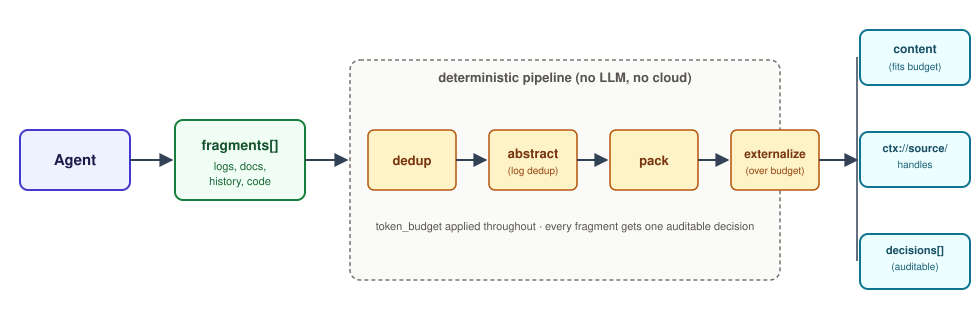
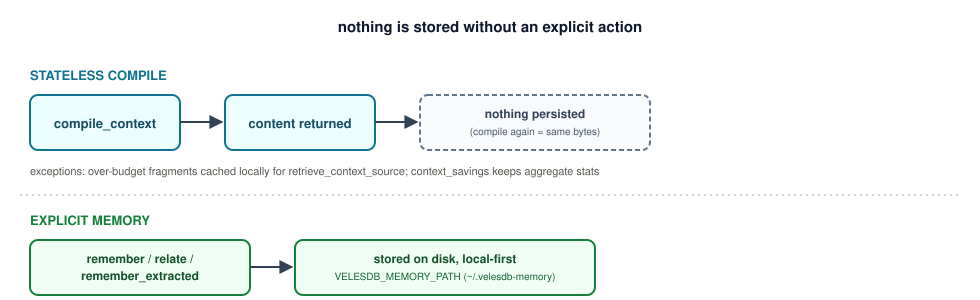
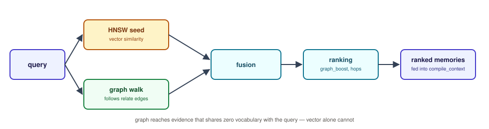
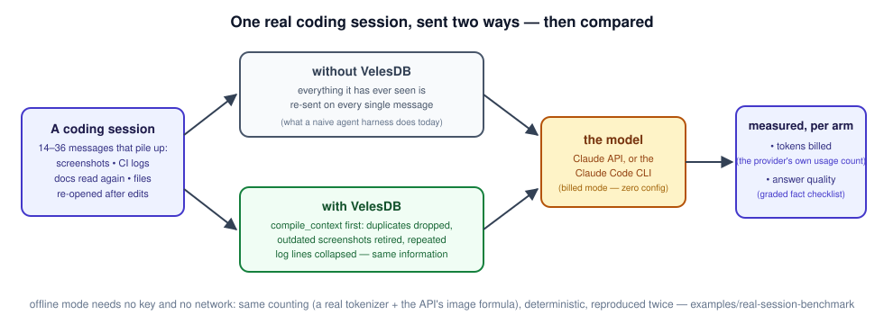
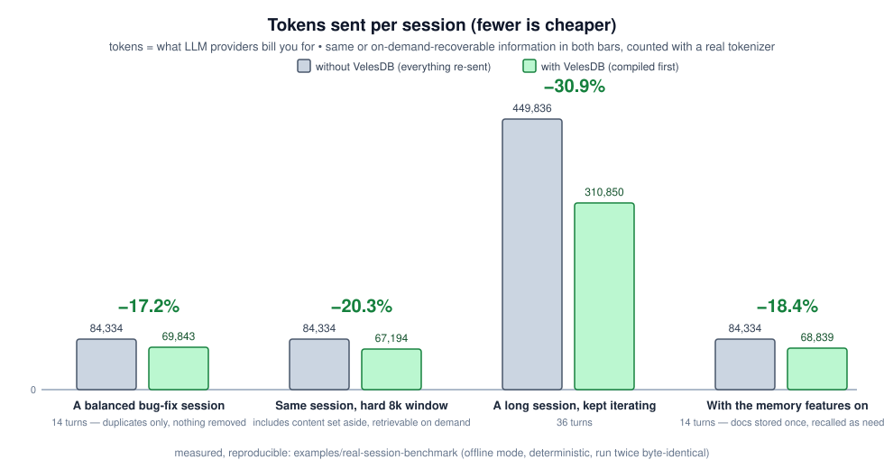
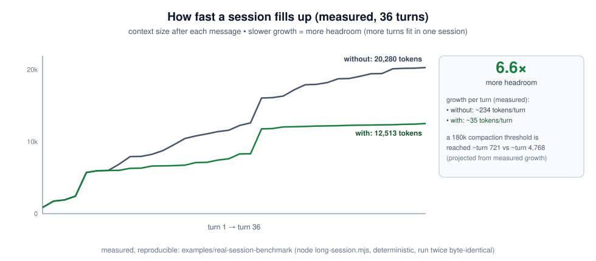

# Context compiler — deterministic prompt compression

> Compress an agent's prompt context under a hard token budget, with no LLM
> call, no cloud, no API key — and one auditable decision per fragment.

> **Portability**: ✅ every compiler tool (`compile_context`,
> `compile_transcript`, `explain_compilation`, `retrieve_context_source`,
> `context_savings`, `suggest_budget`) works in any MCP client, and
> `velesdb-memory compile-stdin` works with no MCP client at all · ⚠️ the
> [`PostToolUse` hook](#the-posttooluse-hook) below is Claude Code only,
> because tool-result replacement (`updatedToolOutput`) has no known
> equivalent elsewhere.

Agents spend most of their tokens re-reading redundant context. The context
compiler compresses it **deterministically**: the same request produces
byte-identical output, every time. What must survive verbatim does (code
fences, URLs, numbers, dates, ids, negative constraints, anything marked
`{"verbatim": true}`); duplicates drop; repeated log lines collapse with
counts (`ERROR timeout (x50)`); over-budget content becomes a recoverable
`ctx://source/` handle instead of a silent loss.

- Wire reference for each tool → [MCP tool reference](../reference/MCP_TOOLS.md#context-compiler-tools)
- Getting the server running → [MCP server setup](MCP_SERVER_SETUP.md)

## Contents

- [Guarantees](#guarantees)
- [Where the compiler is available](#where-the-compiler-is-available)
- [How it works](#how-it-works)
- [What it does not touch](#what-it-does-not-touch)
- [Preservation rules](#preservation-rules)
- [Reading `insights` and `risk`](#reading-insights-and-risk)
- [Token estimators](#token-estimators)
- [Audit mode: a dry-run importance report](#audit-mode-a-dry-run-importance-report)
- [Normalizing timestamped logs](#normalizing-timestamped-logs)
- [Media fragments](#media-fragments)
- [Ingesting files by reference (`path`)](#ingesting-files-by-reference-path)
- [`compile_transcript`: one-call transcript ingestion](#compile_transcript-one-call-transcript-ingestion)
- [Source TTL & disk growth](#source-ttl--disk-growth)
- [Usage-driven importance](#usage-driven-importance)
- [Bring your own reranker (Rust)](#bring-your-own-reranker-rust)
- [`compile-stdin`: the store-free CLI](#compile-stdin-the-store-free-cli)
- [The `PostToolUse` hook](#the-posttooluse-hook)
- [Measured savings](#measured-savings)

## Guarantees

Per compilation:

- **Budget** — the assembled content never exceeds `token_budget`.
- **Provenance** — `sources` plus a per-decision `content_hash` identify the
  exact bytes; `retrieval_handles` list what was externalized.
- **Nothing critical silently lost** — losing preserve-classified content
  raises the compilation's `risk` to `"high"`. Check it before use.
- **Determinism** — the pipeline never reads a clock and never calls a model,
  so the same request compiles to the same bytes.

## Where the compiler is available

| Surface | Tools |
|---|---|
| **MCP server** | the full set: `compile_context`, `compile_transcript`, `explain_compilation`, `retrieve_context_source`, `context_savings`, `suggest_budget`, `save_working_context`, `load_working_context`, `list_working_contexts` |
| **Rust** (`velesdb_memory::context`) | the full set, plus the Rust-only `compile_context_reranked`; `compile_transcript` is composed by hand from `context::segment_transcript` + `ContextCompiler` / `MemoryService::compile_context` |
| **Node** (`@wiscale/velesdb-memory-node`) | `compileContext`, `retrieveContextSource`, `save`/`loadWorkingContext`, `feedback` — no `context_savings`, no `explain_compilation`, no one-call `compileTranscript` yet |
| **Python** (`from velesdb import MemoryService`) | `compile_context`, `retrieve_context_source`, `context_savings`, `save`/`load_working_context`, `feedback` merged on `develop` (no `explain_compilation`, no one-call transcript helper) — **the published PyPI wheel predates all of it** |
| **WASM** | `compileContext` (media fragments compile, dedup, and cost correctly on the in-memory `WasmStore`); `retrieveContextSource` is not exposed, and `path` ingestion is compiled out entirely |

Until the next PyPI release, Python agents reach the compiler through the MCP
server. Any MCP-speaking client gets the full surface regardless of language.

## How it works



The pipeline is `chunk → classify → dedup → score → pack → assemble`. A
minimal call needs only a query, a budget, and fragments:

```jsonc
compile_context { "query": "state of the canary deploy",
                  "token_budget": 500,
                  "fragments": [
                    { "content": "The canary is green: 2% traffic, zero errors in the last 10 minutes." },
                    { "content": "Rollback runbook: kubectl rollout undo deployment/canary." } ] }
→ { "content": "…both fragments packed…", "decisions": [ /* 2 entries, "action": "preserve" */ ],
    "insights": { "tokens_in": 44, "tokens_out": 45, "tokens_saved": 0 }, "risk": "low" }
```

Add `memory_scope`, `project`, and `metadata: {"cache": true}` once you need
stored-memory recall or provider prompt-cache alignment:

```jsonc
compile_context { "query": "state of the canary deploy",
                  "token_budget": 4000,
                  "project": "veles",
                  "memory_scope": { "k": 5 },
                  "fragments": [
                    { "content": "You are the deploy assistant.", "metadata": { "cache": true } },
                    { "content": "<600 lines of CI logs>", "kind": "log" },
                    { "content": "Never restart the primary during a rebalance." } ] }
→ { "content": "…", "sections": [ /* … */ ], "decisions": [ /* … */ ], "sources": [ /* … */ ],
    "retrieval_handles": [ /* … */ ],
    "insights": { "tokens_in": 2244, "tokens_out": 545, "tokens_saved": 1699 },
    "risk": "low" }
```

Recovering what was set aside, and asking why:

```jsonc
// retrieve_context_source — what was externalized is recoverable, byte for byte
retrieve_context_source { "handle": "ctx://source/1234567890" }
→ { "handle": "ctx://source/1234567890", "content": "…original bytes…" }

// explain_compilation — "why was this fragment dropped or shortened?"
//   (stateless: compilation is deterministic, so the request is re-compiled)
explain_compilation { "request": { /* …the same request… */ }, "fragment_id": 1234567890 }
→ { "action": "drop", "rule_id": "drop.duplicate", "reason": "…", "risk": "low" }

// byte-identical fragments share a content-addressed fragment_id, so a plain
// lookup always resolves to the deduplication survivor. Pass fragment_index
// (0-based position in request.fragments) to target one specific fragment:
explain_compilation { "request": { /* …fragments: [a, a]… */ }, "fragment_id": 1234567890,
                      "fragment_index": 1 }
→ { "action": "drop", "rule_id": "drop.duplicate" }   // the SECOND "a", not the survivor

// context_savings — aggregate recorded savings, optionally per project
context_savings { "project": "veles" }
→ { "events": 12, "tokens_in": /* total */, "tokens_saved": /* total */, "truncated": false }
```

> **JS clients talking raw MCP: watch id precision.** Every id in a
> `compile_context` or `explain_compilation` response is a `u64`. The
> [`@wiscale/velesdb-memory-node`](https://www.npmjs.com/package/@wiscale/velesdb-memory-node)
> binding always crosses ids as decimal strings and is unaffected — but a
> plain MCP client speaking JSON straight over stdio/SSE gets a JSON *number*,
> and `JSON.parse` represents it as an IEEE-754 double: ids above 2^53 − 1
> (`9007199254740991`) silently lose precision. Set
> `"policy": { "ids_as_strings": true }` to opt every id field of that
> response into decimal-string form (the same rewrite the Node binding applies
> internally, reused — not reimplemented). Default `false`.
> `fragments[].id` on the way **in** already accepts a number or a decimal
> string, so a caller can resubmit a stringified id without converting it back.

## What it does not touch

**Not a transparent proxy.** `compile_context` only touches what your agent
explicitly hands it as `fragments` — logs, retrieved docs, conversation
history you choose to route through the call. It never sees or compresses the
harness's system prompt or tool-call schemas; those stay outside the compiler
entirely. Knowing *when* and *what* to route through it is the
[`velesdb-context-optimizer`](../../skills/velesdb-context-optimizer/SKILL.md)
skill's job, not the compiler's.

**No automatic repo indexing.** Nothing enters *recallable* memory — what
`recall` / `why` / `memory_scope` can surface — unless you call `remember`,
`relate`, or `remember_extracted` explicitly. Compilation does write two
things to the local store under `VELESDB_MEMORY_PATH` (default
`~/.velesdb-memory`): **all** fragment sources are cached, content-addressed
(not just the over-budget ones), so every `ctx://source/` handle stays
recoverable through `retrieve_context_source`; and `context_savings` records
aggregate stats (tokens in/out/saved) per project. Both stay on disk.



## Preservation rules

Stable rule ids, **first match wins**:

`preserve.marked_verbatim` · `cache.stable_prefix` · `preserve.code_fence` ·
`preserve.negative_constraint` · `abstract.log_dedup` ·
`preserve.exact_values` · `preserve.url` · `preserve.default`

The budget layer adds `budget.externalize`; deduplication adds
`drop.duplicate` and `drop.near_duplicate`; media adds `media.atomic` and
`retrieve.screenshot_superseded`.

First-match-wins has one consequence worth calling out: `media.atomic` is
checked **before** `cache.stable_prefix`, so a media fragment marked
`metadata: {"cache": true}` still classifies as `media.atomic` and packs in
the Body section, never in the Cache prefix — the cache flag is ignored on
media fragments.

Disable a rule per request with `policy.disabled_rules: ["abstract.log_dedup"]`;
its fragments then fall through to the next matching rule.

### The cache prefix

Fragments marked `metadata: {"cache": true}` are assembled into a stable
prefix, so a provider's prompt cache can hit it across turns. **A
cache-marked fragment's rank never consults relevance**: when the budget is
too tight for all of them, which ones survive is decided by priority and
input order alone. That is what keeps the prefix byte-identical when the
query changes ([issue #1455](https://github.com/cyberlife-coder/VelesDB/issues/1455),
fixed). The accepted trade-off: a same-tier non-cache fragment that is more
relevant to the query can still lose that tight-budget race to a cache-marked
fragment — stability wins over relevance, but only for cache-marked fragments.

## Reading `insights` and `risk`

`risk` is the maximum over every decision:

| `risk` | Meaning | What to do |
|---|---|---|
| `low` | Nothing was lost — everything fit, or only exact duplicates were dropped. | Use the output. |
| `medium` | Recoverable reductions: abstractions, or non-critical fragments externalized behind handles. | Fine for most uses; `retrieve_context_source` recovers anything you miss. |
| `high` | Preserve-classified content could not be packed. | Raise the budget, or retrieve the handles before using the output. |

`warnings` is a mechanical, low-noise shortlist over `decisions`: every
externalized fragment relevant enough to the query that it is worth a second
look. Reading `decisions` by hand is only needed when `warnings` is non-empty
and still ambiguous.

`insights.tokens_saved` is a **local estimate**. It is calibrated against a
real BPE (cl100k) to deliberately over-count every measured content class
(+9.6 % … +63.8 %, per class below) — it is not the provider's count, not
billed tokens, and not cache reads.

`policy.slim_response: true` empties `sections` and `decisions` from the
response; `content`, `insights`, `risk`, `warnings`, `sources`, and
`retrieval_handles` are unaffected. The audit trail stays recoverable — just
re-compile the same request without the flag.

## Token estimators

The default
[`HeuristicEstimator`](https://docs.rs/velesdb-memory/latest/velesdb_memory/context/struct.HeuristicEstimator.html)
is a deterministic, dependency-free char-class approximation calibrated to
**always over-count** a real BPE, so packing never silently overflows a
provider's window. Measured on the committed
[`exact_estimator`](../../crates/velesdb-memory/examples/context_savings/real_measures/exact_estimator.mjs)
harness (two runs, byte- and figure-identical):

| Category | Default estimate | Real (cl100k) | Error | Direction |
|---|---:|---:|---:|---|
| English prose | 77 | 47 | +63.8 % | over (safe) |
| French prose | 90 | 59 | +52.5 % | over (safe) |
| Repetitive logs | 730 | 479 | +52.4 % | over (safe) |
| Rust code | 64 | 49 | +30.6 % | over (safe) |
| Digit-dense ids/dates | 89 | 68 | +30.9 % | over (safe) |
| Markdown | 78 | 69 | +13.0 % | over (safe) |
| JSON | 50 | 44 | +13.6 % | over (safe) |
| URLs | 57 | 51 | +11.8 % | over (safe) |
| CJK | 80 | 73 | +9.6 % | over (safe) |

For an id-dense corpus against a tight budget — or whenever you need the
provider's real count instead of a safe over-approximation — inject a
model-exact
[`TokenEstimator`](https://docs.rs/velesdb-memory/latest/velesdb_memory/context/trait.TokenEstimator.html)
via `ContextCompiler::with_estimator`. The trait is two methods, one of them
defaulted:

```rust
use velesdb_memory::context::TokenEstimator;

/// OpenAI cl100k, via any tiktoken-style encoder you already depend on
/// (not a VelesDB dependency — bring your own, e.g. `tiktoken-rs`).
struct Cl100kEstimator(tiktoken_rs::CoreBPE);

impl TokenEstimator for Cl100kEstimator {
    fn estimate(&self, text: &str) -> u64 {
        self.0.encode_ordinary(text).len() as u64
    }
    // bytes_per_token_hint: default (3) is a fine sizing hint for cl100k prose.
}

// with_estimator takes a boxed trait object (DynTokenEstimator):
let compiler = ContextCompiler::new(CompilePolicy::default())
    .with_estimator(Box::new(Cl100kEstimator(bpe)));
```

Anthropic does not publish a tokenizer, so there is no exact-count equivalent
to plug in the same way. The closest honest option is to price and pack
against a cl100k estimator (Claude's real count runs close to it for prose and
code), or to keep the default heuristic's safe over-count, which never claims
to be exact. Injecting an estimator only changes `estimate()`'s output — the
pipeline and its determinism guarantee are unaffected.

`suggest_budget` covers the other half of the sizing question: it maps a model
name to its context window from a **static, committed** table (never a network
call) and subtracts `reserve_tokens`. An unlisted model returns `null` for
both fields rather than a guess.

## Audit mode: a dry-run importance report

There is no separate "audit" flag. Pass a budget large enough that nothing is
dropped, abstracted, or externalized — the request's own hard ceiling,
`MAX_TOKEN_BUDGET` = 10,000,000 tokens, always qualifies — and the response
*is* the audit: every fragment gets a full
[`ContextDecision`](https://docs.rs/velesdb-memory/latest/velesdb_memory/context/struct.ContextDecision.html)
(rule id, `relevance` in `[0, 1]`, reason, content hash) with `risk: "low"`.

Sort `decisions` by `relevance` descending client-side for an at-a-glance
report of what the compiler *would* prioritize under a tighter budget, without
dropping anything:

```jsonc
compile_context { "query": "state of the canary deploy",
                  "token_budget": 10000000,
                  "fragments": [ /* … */ ] }
→ { "risk": "low", "decisions": [ /* one per fragment: action + relevance + reason */ ] }
```

## Normalizing timestamped logs

By default `abstract.log_dedup` collapses only **byte-identical** repeated
lines. Real logs are usually timestamped, so a burst of otherwise-identical
lines survives as distinct entries and the fragment falls through to whichever
rule matches its literal bytes.

Set `policy.normalize_log_timestamps: true` to opt in to a **deterministic,
fixed-pattern** mask applied before grouping, for `kind: "log"` fragments only:

- a leading timestamp — ISO-8601 (`2026-07-18T10:23:45.123Z`,
  `2026-07-18T10:23:45+02:00`), the space/comma log4j variant
  (`2026-07-18 10:23:45,123`), or syslog (`Jul 18 10:23:45`);
- one or more immediately-following bracketed hex/decimal counters
  (`[a1b2c3]`, `[1234]`). A bracket whose content is not purely hex or decimal
  (`[ERROR]`, `[shard-3]`) is left alone, so level tags and named ids never
  match.

Only the **grouping key** changes — the emitted line is still the first
occurrence's exact bytes, so nothing is rewritten into the output. The
patterns are fixed in the compiler, never a caller-supplied regex, so the same
request keeps producing the same collapse. When normalization actually merged
lines that would otherwise have stayed distinct, the fragment's
`decision.reason` says so (`"… — timestamps normalized before collapsing"`).

Off by default: it changes what "duplicate" means for logs, so existing callers
keep byte-exact grouping unless they opt in.

## Media fragments

A fragment may carry an inline image alongside its text: set
`media: {"mime": "image/png", "bytes_b64": "<base64>"}`. `content` stays the
caption, often empty for a bare screenshot.

- **Atomic packing** — a media fragment is never chunked. It packs whole under
  the budget or not at all, so an image can never be cut mid-stream.
- **Token cost from the image itself**, not its base64 text: PNG/JPEG
  dimensions are sniffed from the header (`ceil(width * height / 750)`, a
  published Claude image-token constant). An unsupported mime or an unreadable
  header falls back to a safe over-count of the base64 text.
- **Dedup on raw bytes** — two fragments with byte-identical decoded media are
  deduplicated regardless of caption text (screenshots are often captionless,
  so caption-text dedup would false-positive on `"" == ""`). Media is never
  near-duplicated.
- **Capped at 4 MiB of base64** (`MAX_MEDIA_BYTES`, ≈3 MiB decoded),
  independent of the text-content cap. Malformed base64 is rejected at
  validation.
- **Real retrieval.** A media fragment that does not fit externalizes exactly
  like text: `decision.action == "retrieve"`, `rule_id ==
  "budget.externalize"`, and a `ctx://source/` handle. The handle is
  content-addressed on the **raw decoded bytes** — the same identity dedup uses
  — never the caption, so two different images always get two distinct,
  independently resolving handles even when both captions are blank, and
  byte-identical images share one handle. With `policy.store_sources` (the
  default), `retrieve_context_source(handle)` returns `{content, media?}` with
  `media` present whenever the original fragment carried one. Media is embedded
  with a deterministic placeholder vector derived from its bytes' hash, never
  through the text embedder: resolution is by content-addressed hash only,
  never by vector search. The bare `ContextCompiler` (no memory attached) still
  just *mints* the handle, exactly as it does for text.
- **Screenshot supersession.** Fragments sharing `media`, `kind: "screenshot"`,
  and the same `metadata.target` value form a succession series: only the LAST
  one in the request (input order — never a clock) stays inline. Every earlier
  one is reclassified `retrieve.screenshot_superseded` and externalized behind
  a resolvable handle, regardless of budget, so a stale screenshot never
  competes with the current one for space. `metadata.target` should identify
  the *subject* being screenshotted (a URL, a test name, a UI element id); a
  screenshot with no `metadata.target` is never superseded, since there is no
  evidence it succeeds anything. Opt out per request with
  `policy.disabled_rules: ["retrieve.screenshot_superseded"]`.
- **Every surface carries media** — the MCP tools (`fragments[].media` and the
  optional `media` on the retrieve result are both *advertised* in the schemas,
  not merely accepted), the Python binding, the Node binding
  ([`compileContext` / `retrieveContextSource`](../../crates/velesdb-node/README.md),
  same `{handle, content, media?}` shape), and WASM's `compileContext`
  (`retrieveContextSource` is not exposed on WASM, so resolving a media handle
  back to bytes *within* a wasm session is Node/Python/MCP-only for now).

Minimal end-to-end example — the exact calls
[`mcp_e2e.py`](../../crates/velesdb-memory/examples/context_savings/real_measures/mcp_e2e.py)
makes against a real `velesdb-memory` server over stdio:

```python
handle_req = {"query": "a screenshot of the failing build", "token_budget": 1,
              "fragments": [{"content": "the failing build, before the fix",
                             "media": {"mime": "image/png", "bytes_b64": png_b64}}]}
out = server.call("compile_context", handle_req)
handle = out["retrieval_handles"][0]["handle"]      # too big for budget=1, externalized

source = server.call("retrieve_context_source", {"handle": handle})
assert source["media"]["bytes_b64"] == png_b64      # byte-identical round trip
```

## Ingesting files by reference (`path`)

A `compile_context` (or `explain_compilation`) fragment may set `path` instead
of inline `content`, to ingest a file straight off disk:

```jsonc
compile_context { "query": "review the failing test",
                  "token_budget": 4000,
                  "fragments": [ { "path": "/home/you/project/tests/failing_test.rs" } ] }
```

**Opt-in and allowlisted — off by default.** Nothing is readable until the
server is started with `VELESDB_MEMORY_INGEST_ROOTS` set to a `PATH`-list of
directories (`:`-separated on Unix, `;`-separated on Windows, parsed with
[`std::env::split_paths`](https://doc.rust-lang.org/std/env/fn.split_paths.html)):

```bash
VELESDB_MEMORY_INGEST_ROOTS="/home/you/project:/home/you/notes" \
  velesdb-memory
```

Each root is canonicalized **once, at startup**. An entry that does not exist
or is not a directory is a fail-fast configuration error — the server refuses
to start — never something discovered later on a caller's first `path`
fragment. An unset or empty variable leaves the allowlist empty, which
disables the field entirely: every `path` fragment then fails with
`IngestDisabled`, never silently ignored.

Every `path` fragment runs the same ordered, short-circuiting pipeline:

1. A fragment may set exactly one of `path`, non-empty `content`, or `media` —
   checked first, independent of whether ingestion is enabled.
2. The path must be **absolute**; an MCP server's working directory is not
   something a caller can rely on. A relative path is rejected outright.
3. [`std::fs::canonicalize`](https://doc.rust-lang.org/std/fs/fn.canonicalize.html)
   resolves every symlink in one call.
4. The canonical path is checked against the canonical roots **component-wise**
   (`Path::starts_with`, never a string prefix — a sibling directory like
   `/root-evil` next to a root of `/root` is correctly rejected). On failure
   the error cites the path the caller **asked for**, never the resolved
   target, so a rejection never leaks where a symlink actually points.
5. The target must be a plain file (directories are rejected), no larger than
   **1 MiB** (`MAX_INGEST_FILE_BYTES`) — checked from metadata *before* any
   read.
6. The file is read, its length re-checked against the running total for the
   whole request — capped at **64 MiB** (`MAX_TOTAL_INGEST_BYTES`) — and
   decoded as UTF-8. Non-UTF-8 content is **rejected, never lossily decoded**;
   a short hint is added when the leading bytes look like a PNG or JPEG,
   pointing toward a `media` fragment instead.

A request may reference at most **64 files** (`MAX_INGEST_FILES`) via `path`.
Symlinks are allowed as long as their canonical target lands under a root —
step 3 already resolves them.

**Typed errors** (`INVALID_PARAMS` on the wire): `IngestDisabled` (no root
configured), `IngestOutsideRoots` (the path escapes every root — carries the
requested path, never the resolved one), `IngestPath` (a relative path, an
unreadable/nonexistent/non-file path, a `path` combined with `content` or
`media`, or non-UTF-8 content), and `ContextOverLimit` for the file-count and
byte caps.

**WASM builds never ingest.** The `context::ingest` module is compiled only
under `#[cfg(not(target_arch = "wasm32"))]` — a `path` fragment reaching the
WASM binding's in-memory compiler is rejected with `IngestDisabled`, the same
error a native build reports with no roots configured.

**Determinism caveat.** A file that changes between two calls compiles
whatever content was actually read at call time: the deterministic contract is
on the bytes read, not on the file as it exists at any other instant (a
documented, accepted TOCTOU non-goal — this is a local, single-user server).
`explain_compilation` re-reads the path when it re-compiles, so its decision
reflects the file's *current* content, not necessarily what the original
`compile_context` call saw.

## `compile_transcript`: one-call transcript ingestion

`compile_transcript` is a shortcut over `compile_context` for a raw
agent-session transcript: it deterministically segments the transcript into
turns and sub-turns, then compiles the result exactly like `compile_context`,
so an agent no longer has to hand-split a transcript into fragments.

```jsonc
compile_transcript { "query": "what did we decide about the canary rollback",
                     "token_budget": 4000,
                     "transcript": "System: You are the deploy assistant.\nUser: …\nAssistant: …" }
→ { "context": { /* byte-compatible with compile_context's output */ },
    "segmentation": { "format_detected": "plain",
                      "segments": [ { "index": 0, "turn": 0, "role": "System", "kind": "body",
                                      "byte_start": 0, "byte_end": 34,
                                      "fragment_id": /* content-addressed u64 */ } ],
                      "merged_segments": 2 } }
```

Exactly one of `transcript` (inline text) or `path` (an absolute filesystem
path) must be set. `path` goes through the **same `VELESDB_MEMORY_INGEST_ROOTS`
allowlist and security pipeline** as a `compile_context` fragment's `path`,
except capped at **8 MiB** (`MAX_TRANSCRIPT_BYTES`) instead of the ordinary
1 MiB fragment ceiling — a transcript is the one caller-facing shape allowed to
read past that limit, because it is immediately segmented into sub-1-MiB pieces
before compilation ever sees it as one oversized fragment.

**Format detection** (`segmentation.format`, default `auto`):

- **`jsonl`** — one line, one turn; each line must parse as a
  `{"role": …, "content": …}` JSON object. A blank line never opens a turn of
  its own (its bytes fold into the surrounding turn), so a JSONL transcript
  that merely uses blank lines as separators still parses.
- **`plain`** — turns are opened by the first match of a **closed** table of
  markers at the start of a line, checked in order: `System:`, `User:`,
  `Human:`, `Assistant:`, `AI:`, `Tool:`, `### User`, `### Assistant`. A
  transcript with no marker at all is one turn with `role: null`. The table is
  fixed in the compiler, never caller-supplied — a `"User:"` cited in prose (a
  false positive) is a known, accepted trade-off: predictable, deterministic
  segmentation beats configurable-but-fragile marker matching. Force `plain`
  when a transcript would otherwise trip a false positive, or fall back to
  `compile_context` with hand-built fragments for full control.
- **`auto`** (default) — tries `jsonl` first, falls back to `plain` when the
  transcript does not parse as JSONL. A caller-forced format that fails to
  parse is a **hard error**, never a silent fallback to the other format.

Within each `plain` turn, content is cut into sub-segments: a fenced code
block becomes an atomic `code` segment (never split, exactly like
`compile_context`'s own fence handling); a run of at least 8 consecutive
log-like lines (a volatile timestamp/pid prefix, or a raw-text repeat) becomes
a `log` segment, so `abstract.log_dedup` can collapse it exactly like a
caller-declared `kind: "log"` fragment; everything else is `body`. Segments
under `segmentation.min_segment_bytes` (default 256) merge into an adjacent
segment of the *same turn and kind* — but merging never crosses
`MAX_FRAGMENT_BYTES` (1 MiB), the one invariant every normalization step
upholds.

When `segmentation.cache_system_turn` is `true` (the default) and the first
turn's role is `"system"` (case-insensitive), every segment of that turn is
marked `metadata.cache = true` — the same signal `cache.stable_prefix` reads —
so a system-prompt turn becomes the compiled output's stable, cache-friendly
prefix without hand-annotating it.

`segmentation.segments` is the full audit trail: index, turn, role, kind, byte
range, and the `fragment_id` the segment carries into `context.decisions`.
**Two documented edge cases:**

- **Segmentation failures reuse `compile_context`'s error taxonomy.** An
  unsplittable fence over 1 MiB, a forced `jsonl` format that fails to parse,
  or too many fragments after merging all surface as `ContextOverLimit` with a
  segmentation-specific message — deliberately no new error variant.
- **A single JSONL line whose decoded content alone exceeds 1 MiB** is
  re-split into several sub-1-MiB segments, but every child segment reports a
  proportional, non-overlapping share of the original line's raw span rather
  than a byte-exact one: a JSONL line's decoded text has no byte-aligned
  mapping back into the raw (JSON-escaped) source bytes. An extreme edge case;
  every segment still keeps a distinct, non-overlapping range.

## Source TTL & disk growth

`policy.source_ttl_seconds` (`None` by default) controls how long a compiled
fragment's cached original — the bytes behind its `ctx://source/<hash>` handle
— stays retrievable. **The default is permanent**: every distinct fragment
compiled through the memory bridge is kept until explicitly forgotten, on
purpose. A compiler that silently expired sources would make
`retrieve_context_source` unreliable exactly when an audit needs it most
(auditability over disk thrift).

Set a TTL in seconds when you compile high-volume, low-value volatile content
(per-turn logs in a long-running agent) and do not need those sources
recoverable past a bounded window. `policy.event_ttl_seconds` applies the same
trade-off to `context_savings`' aggregated compilation events.

**Disk growth**: with the default permanent TTL, every distinct fragment's
source accumulates under `VELESDB_MEMORY_PATH` (default `~/.velesdb-memory`)
for as long as the process compiles new content — by design, since sources are
what makes retrieval and audit trustworthy. To reclaim space:

- set `source_ttl_seconds` / `event_ttl_seconds` going forward, so new
  compilations self-expire; or
- purge the whole store manually: stop every process using it, then delete the
  store directory at `VELESDB_MEMORY_PATH`.

There is no selective "purge sources older than N days" command today — only
whole-store deletion or per-fact `forget`.

## Usage-driven importance

`memory_scope` selection composes one more engine pair: the learned RL
confidence that [`feedback`](../reference/MCP_TOOLS.md#feedback) trains, and a
batch-relative recency term. `policy.importance` drives the blend; per pulled
memory, the ranking key is

```text
score = fused_norm + confidence·(rl_confidence − 0.5)·2 + recency·recency_norm
```

```jsonc
"policy": { "importance": {
  "confidence": 0.2,          // default; 0.0 switches the term off
  "recency": 0.1,             // default; inert without recency_field
  "recency_field": "day"      // optional caller metadata key; no default
} }
```

- **Selection is untouched.** The blend re-ranks only the pool the fused
  vector+graph similarity already selected — confidence is *not* relevance, so
  an over-reinforced but off-topic fact can never buy its way in (pinned by an
  adversarial test).
- **Recency contract (strict).** `recency_field: null` disables the term; no
  implicit default key exists. When set, it must name a **numeric** caller
  metadata field on one monotone scale per batch (the automatic `_veles_date`
  `YYYYMMDD` field every remembered fact carries, another `YYYYMMDD` field, or
  an epoch); the scale is documented, not verified. Values are min-max
  normalised **within the pulled batch**: the newest reads `1.0`, the oldest
  `0.0`, a memory without the key contributes `0` (never penalised), and a
  degenerate batch (`max == min`) contributes `0` for all. The compile pipeline
  never reads a clock — recency is relative to the batch, so compilation stays
  byte-deterministic.
- **Compat.** Both weights at `0.0` reproduce the 0.8.0 output byte for byte
  (golden-pinned); requests without `importance` parse unchanged.
  **Behavioral change on upgrade**: the defaults are active, so with an
  untouched policy RL-reinforced memories rank higher out of the box — zero the
  weights to restore the exact 0.8.0 ordering.
- **Weight range.** Recommended `[0, 1]` for both. Out-of-range values are
  accepted verbatim, never clamped: a negative weight inverts its term (demote
  reinforced facts), a weight above `1` lets the term dominate similarity. Only
  the recorded decision `relevance` is clamped into `[0, 1]`.
- **Explainable.** Every pulled memory's decision `reason` ventilates all four
  signals, e.g. `pulled from memory 1444253315203703248 (vector 0.00, graph
  1.00, confidence 1.00, recency 0.00)` — a fact invisible to vector search,
  rescued by the graph walk, promoted by learned confidence.

The tri-engine path `memory_scope` drives inside `compile_context` looks like
this:



The committed
[`tri_engine_rescue`](../../crates/velesdb-memory/examples/context_savings/real_measures/tri_engine_rescue.mjs)
harness measures the synergy end to end: with zero weights the wordy
similar-only fact precedes the real fix (0.8.0 behaviour); with
`confidence: 0.8`, the fact the team reinforced via `feedback` **and** that
only the typed-edge walk reaches leads the compiled context — identical across
two runs.

## Bring your own reranker (Rust)

`compile_context_reranked` hands the full fused candidate pool (vector + graph,
pre-cutoff) to any `Reranker` you inject — a cross-encoder, an LLM judge — and
its ordering decides which memories get compiled in. `recall_fused_reranked`
is the same seam for plain recall.

It is never a default, and deliberately **not on the wire**: the shipped
`DeterministicReranker` is lexical, and a lexical second stage demotes exactly
the zero-vocabulary-overlap evidence the graph walk rescues. Both behaviours
are pinned by tests.

The seam composes with the importance blend above: the reranker picks and
orders the pool, then the same blend re-ranks inside it — one coherent,
auditable ranking across HNSW seed, graph reach, fusion, reranker, confidence,
and recency.

## `compile-stdin`: the store-free CLI

```bash
velesdb-memory compile-stdin [--budget <tokens>] [--query <text>]
```

Reads a document on **stdin**, segments it exactly like `compile_transcript`
(`segment_transcript` with the default `SegmentationPolicy`), compiles it with
the default `CompilePolicy`, and prints **one JSON object** on stdout:

```jsonc
{ "content": "…the compiled text…",
  "tokens_in":    /* u64, estimated */,
  "tokens_out":   /* u64, estimated */,
  "tokens_saved": /* u64, estimated */,
  "risk": "low" }   // "low" | "medium" | "high"
```

That is the field shape, not a measurement: the three counts are the compiler's
own local estimates for the input you piped in.

| Flag | Default | Effect |
|---|---|---|
| `--budget <n>` | `2000` | Token budget. Must be a positive integer; `0` is rejected. |
| `--query <text>` | empty | Relevance query, as in `compile_context`. |

Two properties make this the hook-facing surface:

- **It never opens the store.** The compiler
  (`ContextCompiler::compile`) is pure — no store, no index, no clock — so
  `compile-stdin` short-circuits before the embedder probe and the store open.
  That matters because the agent's own MCP server already holds the store's
  single-writer `flock`.
- **An empty compilation is an error, not an empty string.** The compiler
  externalizes rather than truncates, so when no fragment fits the budget the
  assembled content is empty. That is a legitimate compilation but a useless
  *replacement* for real content, so the command exits with an error naming the
  budget and the input token count — the caller keeps the original.

`compile-stdin` requires a build with `--features context` (on by default);
otherwise it exits with an explicit message.

## The `PostToolUse` hook

[`integrations/agent-hooks/`](../../integrations/agent-hooks/README.md) ships
four Claude Code hooks. Three of them (`SessionStart`, `Stop`, `PreCompact`)
can only *nudge*: they hand the model a reason string and hope it calls the
right tool, so whether the context actually shrinks stays the model's
decision. See [Agent Memory → harness hooks](AGENT_MEMORY.md#agent-harness-hooks-mcp-server-path)
for the full table.

`PostToolUse` is different. Its output schema carries replacement content
(`hookSpecificOutput.updatedToolOutput`), so an oversized tool result is
compiled **once**, and the compiled view is what enters the transcript. The
bulky original is therefore never re-sent on any later turn.

Compilation runs in a separate, store-free process (`velesdb-memory
compile-stdin`, above). Three rules keep it safe on *every* tool call, each
covered by
[`integrations/agent-hooks/test/hooks.test.sh`](../../integrations/agent-hooks/test/hooks.test.sh):

- **Nothing is deleted.** The untouched original is archived under
  `$TMPDIR/velesdb-agent-hooks/tool-output/` and its path is quoted in the
  replacement, so the agent can `Read` it back whenever the compiled view is
  not enough.
- **Strict allowlist.** `Bash`, `Grep`, `WebFetch` by default. `Read` and
  `Edit` are deliberately excluded and must stay excluded — their value *is*
  the exact bytes.
- **Identity fallback everywhere.** Missing `jq`, a missing or too-old binary,
  a compilation error, an empty compiled result — each one leaves the tool
  result exactly as it was.

Tuning knobs:

| Variable | Default | Effect |
|---|---|---|
| `VELESDB_HOOK_COMPRESS_TOOLS` | `Bash,Grep,WebFetch` | Comma-separated tool allowlist. |
| `VELESDB_HOOK_MIN_BYTES` | `12000` | Below this, pass through — compiling would cost more than it saves. |
| `VELESDB_HOOK_TOKEN_BUDGET` | `2000` | Token budget handed to `compile-stdin`. |
| `VELESDB_HOOK_PROBE_TIMEOUT` | `10` | Seconds the capability probe may take. |

> **`updatedToolOutput` is Claude-Code-specific.** No other agent harness is
> known to expose an equivalent field — Windsurf's post-hooks cannot alter a
> result at all, and Codex, which does have lifecycle hooks, documents no
> replacement field (A VERIFIER). So this hook is a Claude Code *bonus*, not
> the portable core of velesdb-memory; the portable value stays the MCP tool
> surface itself, and `compile-stdin` stays usable from any script. What each
> harness has today is tabulated in
> [`integrations/agent-hooks/README.md`](../../integrations/agent-hooks/README.md#parity-across-harnesses).

Install steps and the full design rationale live in
[`integrations/agent-hooks/README.md`](../../integrations/agent-hooks/README.md).

## Measured savings

Every figure below comes from a committed harness that runs offline, with no
API key and no network. They are **estimates of tokens sent**, not a
provider's invoice.

### A real coding session

An AI coding assistant re-sends everything it has seen on every message — old
screenshots, logs it already read, files it re-opened. A committed benchmark
replays a realistic multi-turn coding session two ways: once sending
everything raw, once compiled through `compile_context`. Everything is counted
with cl100k (a real tokenizer) and the API's own image-pricing formula; every
run is deterministic and was reproduced twice, byte-identical.



| Scenario | Without VelesDB | With VelesDB | Saved |
|---|---|---|---|
| A balanced bug-fix session (14 turns) | 84,334 tokens | 69,843 tokens | **17.2 %** — duplicates and outdated screenshots only; nothing unique removed |
| The same session with a hard 8,000-token window | 84,334 tokens | 67,194 tokens | **20.3 %** — the extra points come from content set aside (retrievable, never deleted), not from more duplicates |
| A long session where you keep iterating (36 turns) | 449,836 tokens | 310,850 tokens | **30.9 %** — savings compound as the session grows |
| With the memory features turned on (14 turns) | 84,334 tokens | 68,839 tokens | **18.4 %** — reference docs stored once, recalled per turn, out-of-the-box settings |



The long session also answers the endurance question: over the full measured
session the raw context grows ~555 tokens per message versus ~333 compiled —
**1.7× more headroom** (how many more turns fit before the context limit forces
a summarize-and-restart), and **up to 6.6×** in the verification/wrap-up phase,
where most turns are re-reads. Projections always use the full-session rate.



Reproduce any of these in one command, from a repo checkout:

```bash
node examples/real-session-benchmark/offline.mjs
node examples/real-session-benchmark/long-session.mjs
node examples/real-session-benchmark/memory-enabled.mjs
```

An opt-in billed mode measures the same session against real provider usage —
through your own Claude Code CLI account with zero configuration, or an API key
— and additionally grades real generated answers in both arms against a
committed fact checklist, so a token saving that costs answer quality is
reported, never hidden. Full protocol, attribution details, and caveats:
[`examples/real-session-benchmark/`](../../examples/real-session-benchmark/README.md).

### The compiler's own corpus

The reproducible benchmark
[`examples/context_savings`](../../crates/velesdb-memory/examples/context_savings)
measures **82.5 % real (cl100k) token savings on a committed 12-turn
agent-session benchmark** (sub-millisecond stateless compiles) and 75–82 %
estimated savings on its static corpus in ~2 ms. With `memory_scope`'s fused
HNSW + graph walk over `relate`-linked fact chains, the committed tri-engine
benchmark surfaces **9/9 answer facts versus 3/9 for vector-only recall**.

The committed
[`cache_prefix`](../../crates/velesdb-memory/examples/context_savings/real_measures/cache_prefix.mjs)
harness measures the `cache: true` prefix's byte stability directly: across 10
consecutive compiles with changing volatile content, the cache section is a
byte-identical **100 % stable prefix on all 9 consecutive turn pairs**
(reproducible: two full 10-turn runs, byte-identical). That measurement holds
the query fixed across turns; the guarantee also holds when the query changes,
for the reason given under [the cache prefix](#the-cache-prefix).

---

The [`velesdb-context-optimizer`](../../skills/velesdb-context-optimizer/SKILL.md)
skill teaches an agent the full workflow — including when *not* to compress.

---

Last updated: 2026-07-25 · Applies to: velesdb-memory 0.12.0
