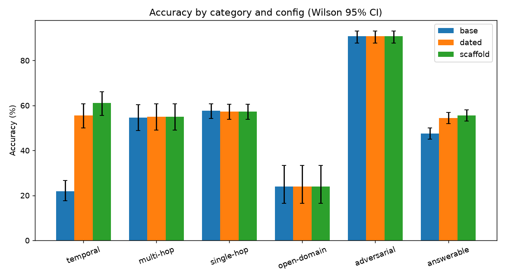
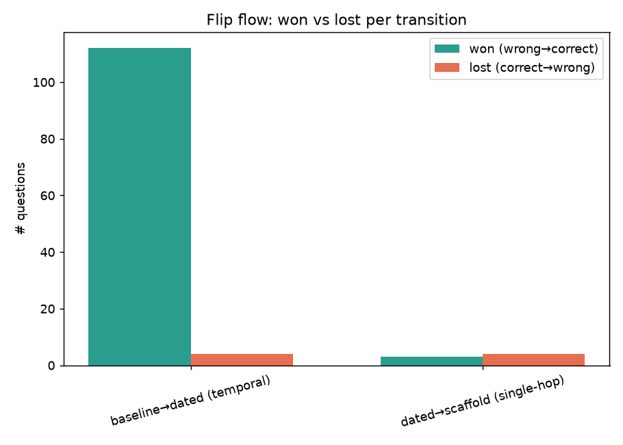
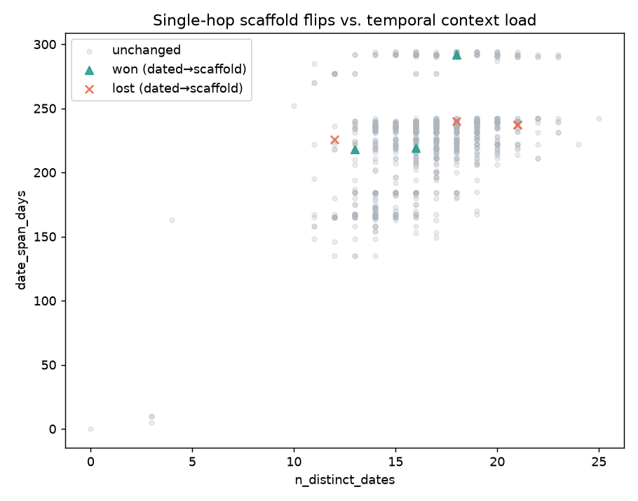

# LoCoMo temporal decomposition — statistical reproduction

Status: **closed** — 2026-07-02. Answers the question it was opened to answer; Phases D–I
of the original research plan were not run (see "What this does not cover" below).

**Data:** full 10-conversation LoCoMo, local `qwen3.6:35b-mlx` generation + Claude Opus
4.8 judge, `mxbai-embed-large` embedder, `k=32`, graph fusion on. Raw per-question JSONL
dumps (`--dump`, instrumentation merged in #1301) are **not committed** (~218MB × 3,
regenerable — see Reproducibility). Derived artifacts (summary stats, paired table,
charts) that this report is built from **are** committed alongside it in
`assets/locomo-decomp/`. Analysis code:
`crates/velesdb-memory/examples/locomo/analysis/{load,stats,charts,run_phase_c}.py`.

## Why this exists

`docs/guides/TEMPORAL_MEMORY.md` (commit `7a65398b`, "Ran the full 10-conversation
decomposition") published a temporal-decomposition table from an earlier full
10-conversation run (1,540 answerable / 321 temporal questions, 2,393 extracted facts):

| Config | Temporal | Answerable | Single-hop |
|---|---|---|---|
| Baseline | 17% | 42% | 54% |
| + dated recall | 53% (+36) | 53% (+11) | 60% (+6) |
| + temporal scaffold | 58% (+5) | 51% (−2) | **54% (−6)** |

That guide's own text states the −6pp single-hop drop is **"a real trade-off, not a
free upgrade"** and tells users to treat the scaffold as situational rather than a
strict improvement. That claim — a specific, falsifiable one — was made from a single
run with no significance testing: no per-question data was kept (the harness only
emitted aggregates), so there was no way to tell a real effect from sampling noise.
This report instruments the harness (`--dump`, #1301), re-runs the same 3 configs on a
**fresh 10-conversation pass**, and applies paired per-question statistics to find out
whether that trade-off holds up.

## Reproduction

Row counts match closely: 1,540 answerable / 321 temporal (identical) / 2,358 extracted
facts (vs. 2,393 in the earlier run — 1 hard extraction parse failure this time,
`conv-49`/session 17; a known, small, evenly-distributed gap, identical across all 3
configs, not investigated further). Both runs are genuine 10-conversation passes — the
absolute-accuracy gap between them (below) is run-to-run variance (LLM extraction/
generation isn't perfectly deterministic even at temperature 0, especially starting
from an empty cache), not a sample-size difference.

Recomputed aggregate accuracy from the dump (Wilson 95% CI —
[`assets/locomo-decomp/bar_ci.png`](assets/locomo-decomp/bar_ci.png)):

| Category | n | Baseline | Dated | Scaffold |
|---|---|---|---|---|
| Temporal | 321 | 22% [18,27] | 55% [50,61] | 61% [56,66] |
| Multi-hop | 282 | 55% [49,60] | 55% [49,61] | 55% [49,61] |
| Single-hop | 841 | 58% [54,61] | 57% [54,61] | 57% [54,61] |
| Open-domain | 96 | 24% [17,33] | 24% [17,33] | 24% [17,33] |
| **Answerable** | 1540 | 47% [45,50] | 54% [52,57] | 56% [53,58] |

Absolute levels sit ~5pp above the earlier published table (LLM extraction/generation
isn't perfectly deterministic run-to-run, especially starting from an empty cache), but
this run is internally consistent — extraction is content-addressed cached and
byte-identical across all 3 configs, so the **within-run deltas are the valid
comparison**, not the absolute levels against the earlier table.

## The statistics that matter

Paired per-question tests (McNemar exact) + a **cluster bootstrap over the 10
conversations** (10,000 resamples — LoCoMo questions correlate within a conversation, so
resampling questions directly would understate variance).

### 1. Temporal lift (baseline → dated) is real and large

McNemar: 112 questions flip wrong→correct vs. only 4 correct→wrong (n=116 discordant/321,
p = 1.8×10⁻²⁸). Cluster bootstrap: **+33.6pp, 95% CI [27.1, 41.0]**. Every flip (both
directions) occurs on a question already flagged `is_temporal_trigger=true`, and the
predicted answer always changes — this is dated context doing exactly what it's supposed
to. Matches the published +36pp closely. **Conclusion: robust, not in question.**

### 2. Single-hop cost of the scaffold (dated → scaffold) is NOT statistically real

This was the core question. Only **7 discordant pairs out of 841** single-hop questions
(4 lost correct→wrong, 3 won wrong→correct — nearly balanced). McNemar p = 1.0. Cluster
bootstrap: **−0.1pp, 95% CI [−0.9, +0.5]** — tightly straddles zero. Zero conversations
flagged as per-conversation outliers on this cell (IQR check —
[`assets/locomo-decomp/per_conv_delta.png`](assets/locomo-decomp/per_conv_delta.png)),
ruling out "one bad conversation drove it." **The −6pp finding from the earlier run does
not reproduce.** That run reported a single point estimate with no significance test;
this run's paired statistics show a −6pp (or any similarly-sized) single-hop swing is
well within the noise band for this category at this sample size — not a real,
repeatable scaffold cost.

### 3. Temporal gain of the scaffold over dated-alone is inconclusive

Point estimate +5.6pp (55.5%→61.1%). McNemar is significant at the per-question level
(p = 0.044, 72 discordant/321) but the **cluster-aware bootstrap CI crosses zero**
([−1.2, +12.1]pp) — the per-question test ignores that questions within a conversation
aren't independent, so it can overstate significance when a gain concentrates in a few
conversations. Same story at the answerable-aggregate level: scaffold vs. dated is
+1.1pp [−0.3, +2.6]pp — not statistically distinguishable from zero either.
**Conclusion: the scaffold's benefit over dated-alone is directionally positive but not
established at this sample size — treat as unproven, not "confirmed +5.6pp."**

## Bottom line

| Transition | Effect | Verdict |
|---|---|---|
| Baseline → dated (temporal) | +33.6pp [27.1, 41.0] | **Real, large** |
| Dated → scaffold (single-hop "cost") | −0.1pp [−0.9, +0.5] | **Not real — earlier run's finding doesn't hold up under significance testing** |
| Dated → scaffold (temporal "gain") | +5.6pp [−1.2, +12.1] | **Unproven at n=321** |
| Dated → scaffold (answerable aggregate) | +1.1pp [−0.3, +2.6] | **Unproven** |

The earlier guide's table implied a real trade-off (scaffold buys temporal accuracy by
spending single-hop accuracy) and stated it as fact, with no significance test behind
it. **That trade-off doesn't hold up under paired statistics.** Dated recall alone
captures nearly all of the temporal win (+33.6pp, ironclad), and the scaffold adds an
unproven, possibly-zero marginal gain on top — at zero proven cost, but also zero proven
benefit over the simpler dated-recall-only approach.

**Practical recommendation:** ship dated recall as the default (already the case per the
`metadata` field shipped in #1300, documented in `docs/guides/TEMPORAL_MEMORY.md`). The
temporal scaffold prompt technique isn't disproven, but the case for always applying it
is weaker than believed — and the case for *fearing* it (the single-hop cost) is gone. If
the scaffold's extra CoT tokens have a latency/cost impact, that now dominates the
decision more than any accuracy trade-off, since no accuracy trade-off is demonstrated at
this sample size. `docs/guides/TEMPORAL_MEMORY.md` itself states the single-hop cost as
settled fact ("a real trade-off, not a free upgrade") — updated alongside this report to
reflect the finding above.

## What this does *not* cover

The original research plan had further phases: an offline error taxonomy, a "why does
the scaffold regress single-hop" case study, a smart-routing chapter, retrieval/prompt
optimization catalogs, and an ROI-ranked experiment table. **Those phases were not run.**
The case study in particular was scoped around explaining a mechanism that this report
shows doesn't exist (7 flips is too few for any mechanism breakdown to mean anything) —
running it as originally scoped would manufacture a story for noise. If there's appetite
to continue, the honest next framing is different from the original one: e.g. a routing
chapter would be about *cost* (skip CoT tokens when they don't move accuracy) rather than
*protecting single-hop from a regression*, and would need its own justification, not
inherited from this report's premise.

## Reproducibility

- **Committed** (this directory): this report, `assets/locomo-decomp/{bar_ci,flip_flow,
  per_conv_delta,scaffold_scatter}.png`, `assets/locomo-decomp/phase_c_summary.json`
  (all stats), `assets/locomo-decomp/per_conversation.json`, `assets/locomo-decomp/
  paired_table.csv.gz` (the full joined per-question table minus raw/reranked fact
  arrays). Analysis code:
  `crates/velesdb-memory/examples/locomo/analysis/{load,stats,charts,run_phase_c}.py`.
- **Not committed** (regenerable, ~218MB × 3, hours of local generation + billed
  Claude-judge calls): the raw `--dump` JSONL. Regenerate with the Phase B commands in
  `docs/guides/TEMPORAL_MEMORY.md` / the LoCoMo harness README
  (`--dump out/{baseline,dated,scaffold}.jsonl`, `--k 32 --date-context --date-route
  [--temporal-scaffold]`), then `cd crates/velesdb-memory/examples/locomo/analysis &&
  python run_phase_c.py` (reads `../out/*.jsonl`, writes `out/*`).
