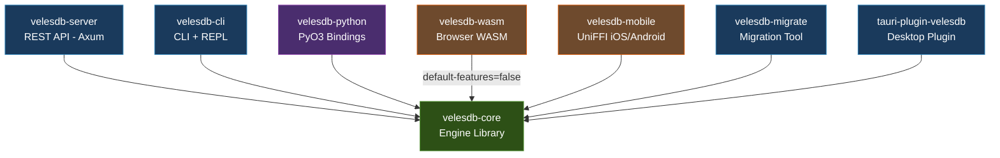
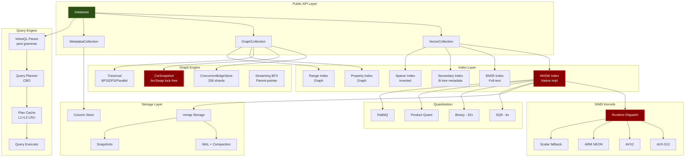
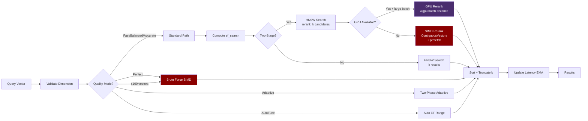
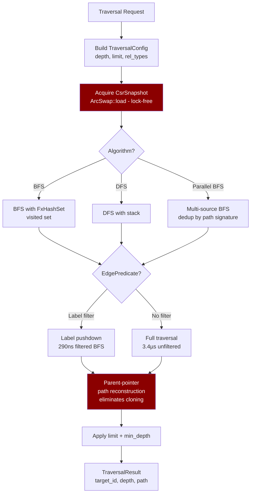
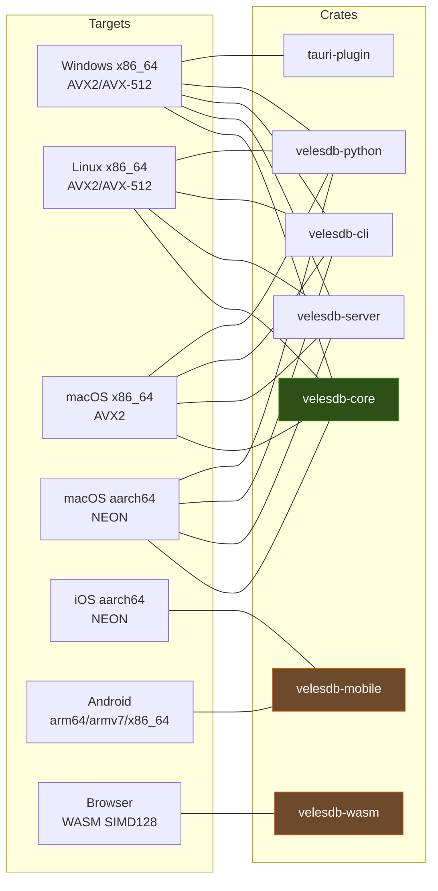

# VelesDB Architecture Diagrams — v1.11.1

## 1. Workspace Dependency Graph

## 2. velesdb-core Internal Architecture

## 3. HNSW Search Pipeline (Hot Path)

## 4. Graph Traversal Pipeline

## 5. Platform Target Matrix

## 6. Feature Propagation Matrix (v1.11.1)

```mermaid
graph TD
    subgraph "Core Features"
        F_VEC[Vector Search kNN]
        F_HYB[Hybrid Search]
        F_TXT[Text Search BM25]
        F_FILT[Filtered Search]
        F_BATCH[Batch Search]
        F_MQ[Multi-Query Fusion]
        F_SPARSE[Sparse Vectors]
        F_GRAPH[Graph Edges]
        F_TRAV[Graph Traversal]
        F_PTRAV[Parallel BFS]
        F_GSEARCH[Graph Search]
        F_VELESQL[VelesQL]
        F_IDX[Secondary Indexes]
        F_AGENT[Agent Memory]
        F_QUANT[Quantization]
        F_STREAM[Streaming Insert]
    end

    subgraph "Propagation"
        P_SERVER[server ✅ all]
        P_CLI[cli ✅ all]
        P_PYTHON[python ✅ all]
        P_WASM[wasm ⚠️ no persistence]
        P_MOBILE[mobile ✅ most]
        P_TAURI[tauri ✅ all]
        P_TS[ts-sdk ✅ via REST]
        P_LC[langchain ✅ RAG]
        P_LI[llamaindex ✅ RAG]
    end

    F_VEC --> P_SERVER
    F_VEC --> P_CLI
    F_VEC --> P_PYTHON
    F_VEC --> P_WASM
    F_VEC --> P_MOBILE
    F_VEC --> P_TAURI
    F_VEC --> P_TS
    F_VEC --> P_LC
    F_VEC --> P_LI

    style P_WASM fill:#6e4a2d,stroke:#d35400,color:#fff
```

## 7. NLOC Health Map (v1.11.1 — Post-Refactoring)

| Severity | Count | Files |
|----------|-------|-------|
| ✅ Compliant (<500) | ALL | All 39 previously non-compliant production files refactored to <500 NLOC |
| 🔵 Exempt (SIMD) | 2 | avx512.rs (1294), neon.rs (774) — hand-written SIMD kernels, exempt by design |

### Refactoring Summary (NLOC/CC Resolution Plan)
- P1: Collection god-object migration — 11 files, deprecated HashMap removed
- P2: Critical extractions — mobile/lib.rs 936→264, python/lib.rs 739→98, CLI 8MB→168B, lifecycle.rs 984→490, edge.rs 972→349, backend_adapter.rs 849→191, wasm/lib.rs 743→134
- P3: Parser CC fix, Tauri invoke handler macro, ~30 minor file extractions
- Total: 4675 tests (4447 lib + 228 BDD), 0 failures

### SIMD files (avx512.rs=1294, neon.rs=774) are exempt
These are hand-written SIMD kernels — splitting them would break instruction scheduling and cache locality. They are performance-critical hot paths that were specifically optimized. Codacy should be configured to exclude `simd_native/*.rs` from NLOC checks.

## 8. Quality Gate Status

| Gate | Status | Details |
|------|--------|---------|
| `cargo fmt --all --check` | ✅ | Zero diffs |
| `cargo clippy --workspace -- -D warnings` | ✅ | Zero warnings, 8 crates |
| `cargo check --workspace` | ✅ | All 8 crates compile |
| Production NLOC < 500 | ✅ | All 39 files refactored — 0 violations (2 SIMD exempt) |
| CC ≤ 8 | ✅ | Codacy gate — 0 issues |
| Tests | ✅ | 4675 tests pass (4447 lib + 228 BDD) |
| Recall ≥ 0.95 | ✅ | Contract tests pass |
